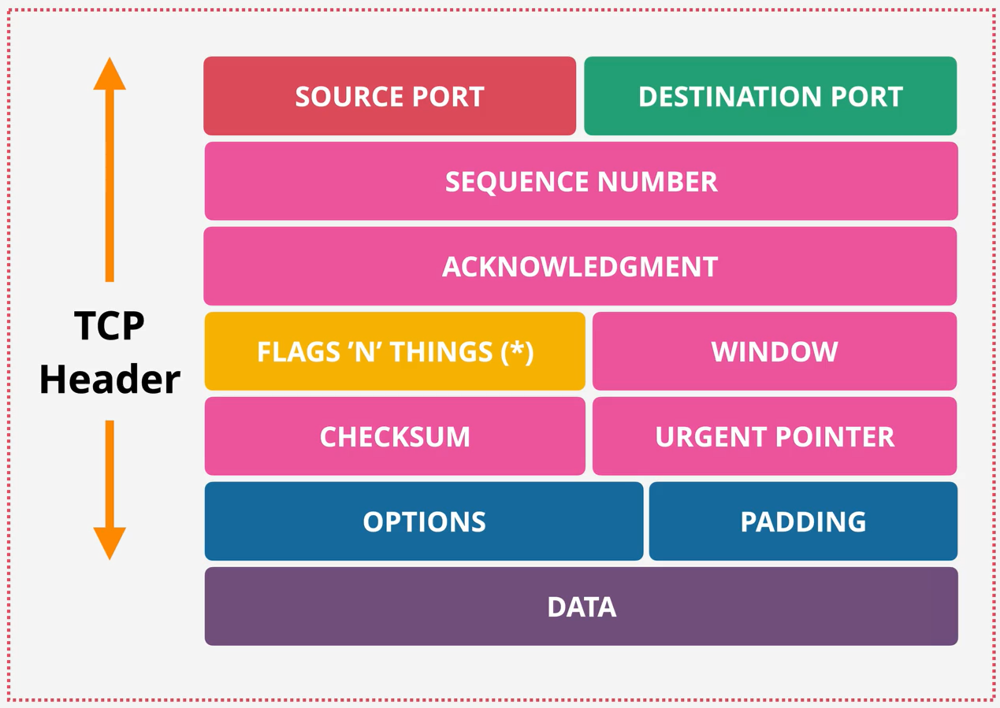
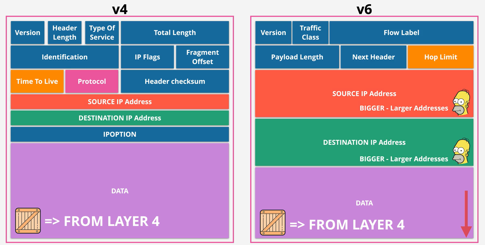
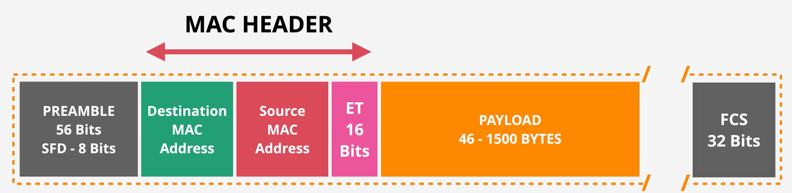
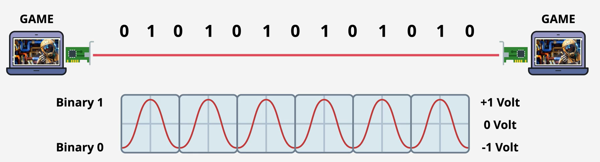

# OSI Model

|              |     | Layer        | Protocol data unit (PDU) |                                      | TCP/IP Protocols | Misc examples                | Function                                                                                                                                         |
| ------------ | --- | ------------ | ------------------------ | ------------------------------------ | ---------------- | ---------------------------- | ------------------------------------------------------------------------------------------------------------------------------------------------ |
| Host layers  | 7   | Application  | Data                     |                                      | HTTP/S           | WebSocket                    | High-level protocols such as for resource sharing or remote file access, e.g. HTTP.                                                              |
|              | 6   | Presentation |                          |                                      | SSL/TLS          |                              | Translation of data between a networking service and an application; including character encoding, data compression and encryption/decryption    |
|              | 5   | Session      |                          |                                      | Sockets          |                              | Managing communication sessions, i.e., continuous exchange of information in the form of multiple back-and-forth transmissions between two nodes |
|              | 4   | Transport    | Segment, Datagram        |  | TCP, UDP         |                              | Reliable transmission of data segments between points on a network, including segmentation, acknowledgement and multiplexing                     |
| Media layers | 3   | Network      | Packet                   |     | IP               |                              | Structuring and managing a multi-node network, including addressing, routing and traffic control                                                 |
|              | 2   | Data link    | Frame                    |       | PPP              | ARP, MAC, IEEE 802.1Q (VLAN) | Transmission of data frames between two nodes connected by a physical layer                                                                      |
|              | 1   | Physical     | Bit, Symbol              |           |                  | RS232, Ethernet, Bluetooth   | Transmission and reception of raw bit streams over a physical medium                                                                             |
