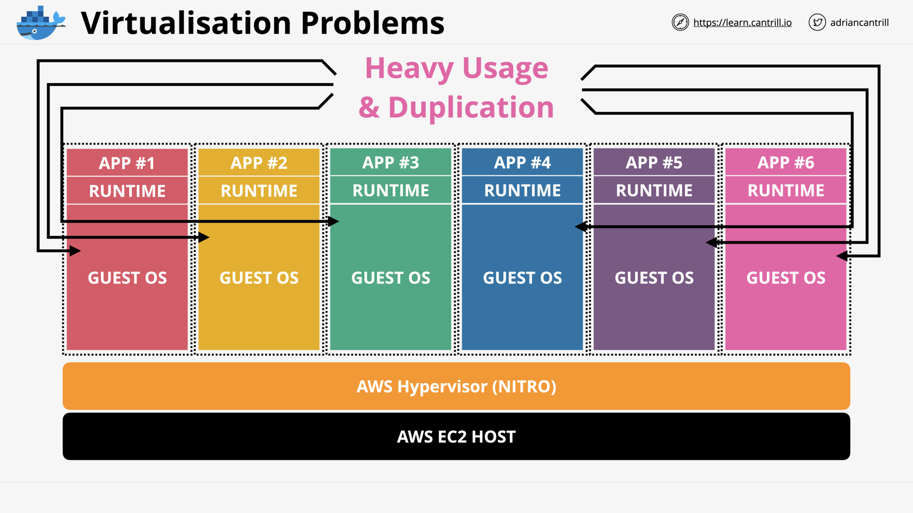
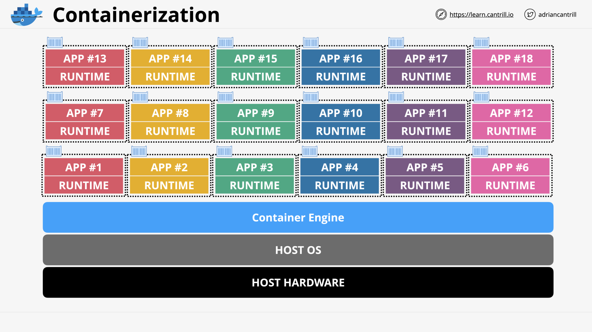
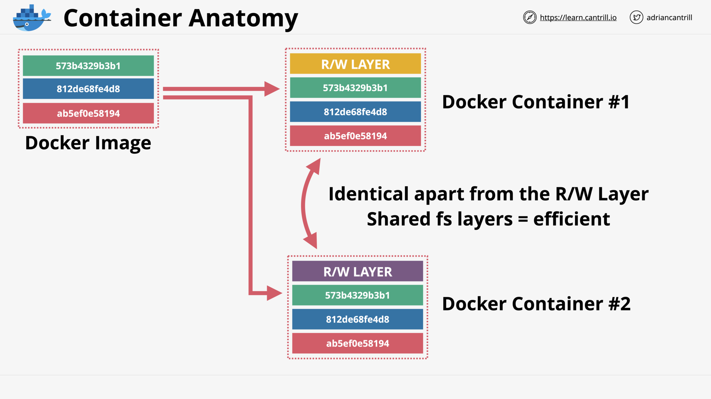
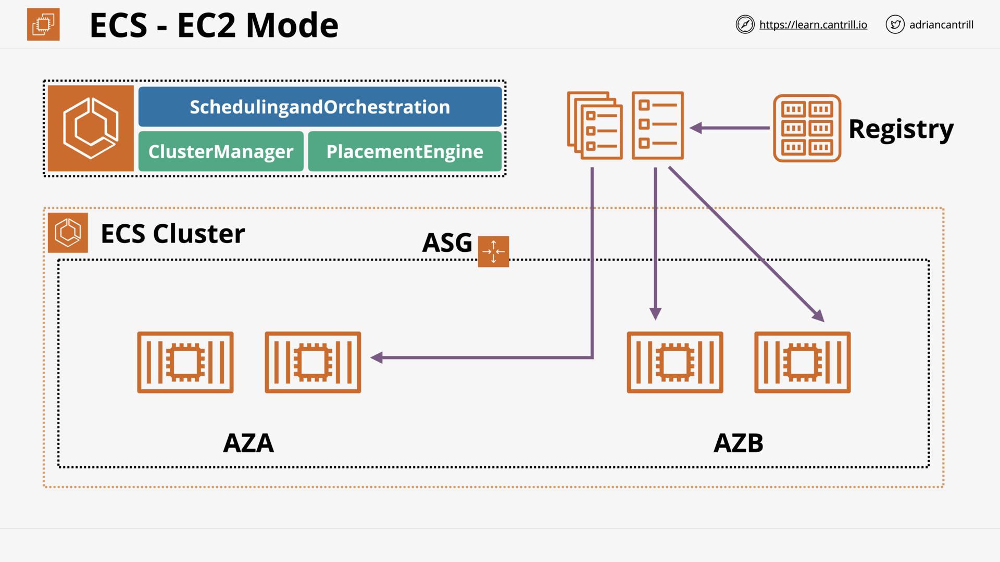
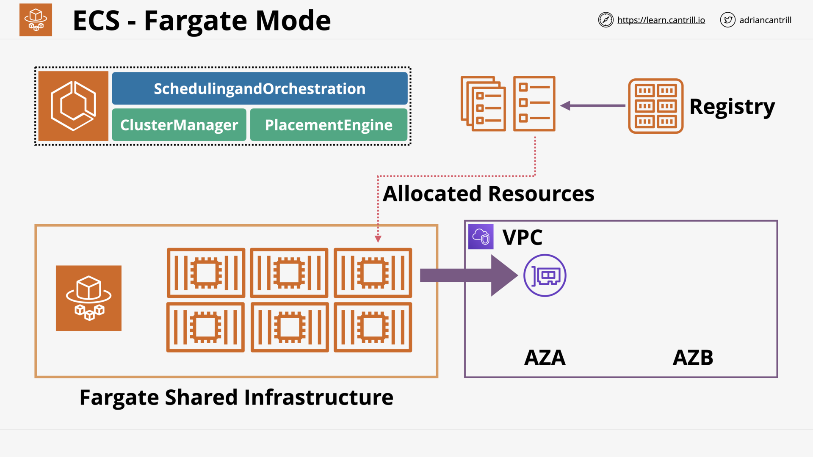

# CONTAINERS & ECS

## Introduction to Containers (17:13)

## [_DEMO_] Creating 'container of cats' Docker Image (18:15)

## ECS - Concepts (10:25)

## ECS - Cluster Mode (13:09)

## [_DEMO_] - Deploying 'container of cats' using Fargate (13:13)

## Elastic Container Registry (ECR) (4:14)

## Kubernetes 101 (11:27)

## Elastic Kubernetes Service (EKS) 101 (6:14)

## Containers Section Quiz
