# ADVANCED EC2

## Bootstrapping EC2 using User Data (10:25)

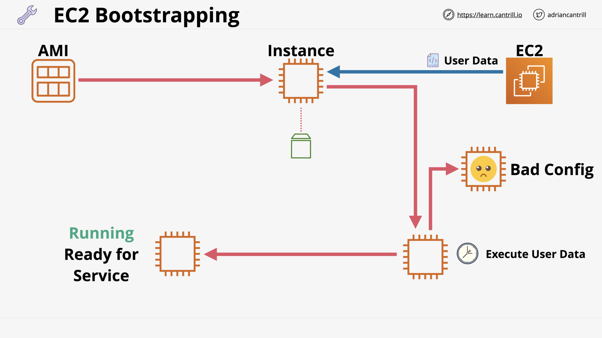

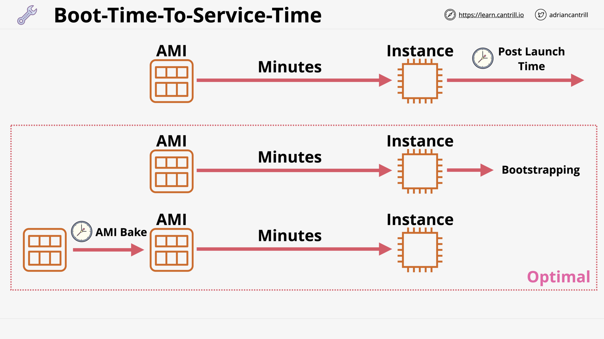

## [_DEMO_] Bootstrapping Wordpress Installation - PART1 (15:00)

## [_DEMO_] Bootstrapping Wordpress Installation - PART2 (6:45)

## Enhanced Bootstrapping with CFN-INIT (11:52)

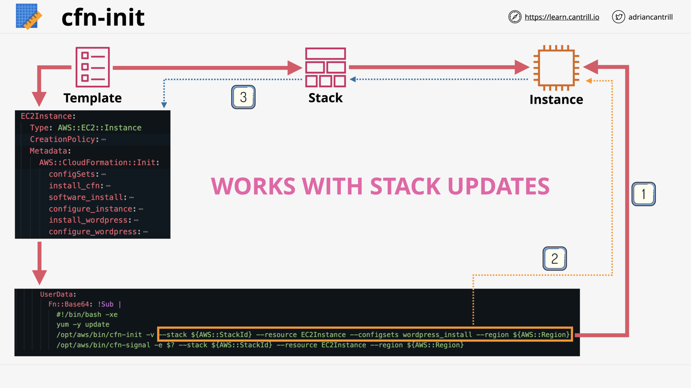

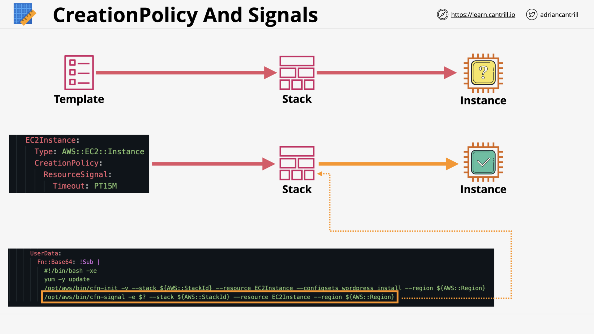

## [_DEMO_] CFN-INIT and CFN Creation Policies (12:29)

## EC2 Instance Roles & Profile (4:18)

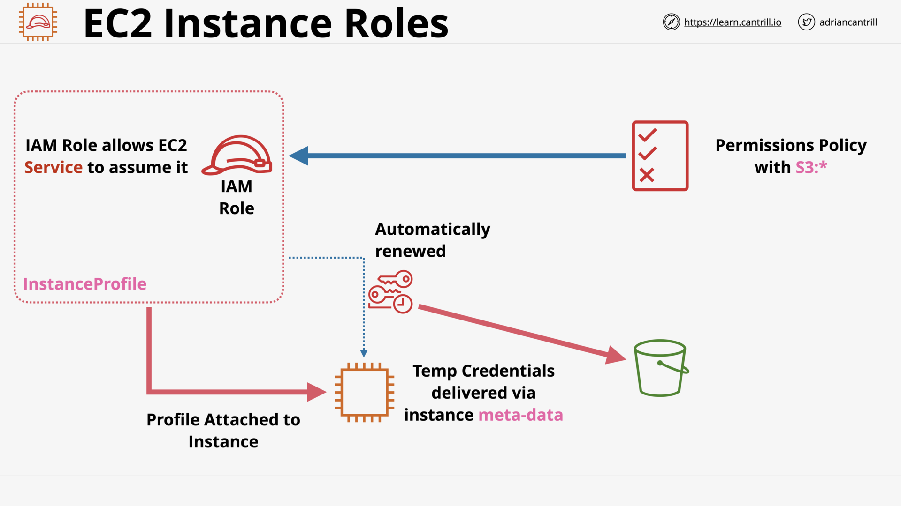

## [_DEMO_] Using EC2 Instance Roles (13:31)

## SSM Parameter Store (6:16)

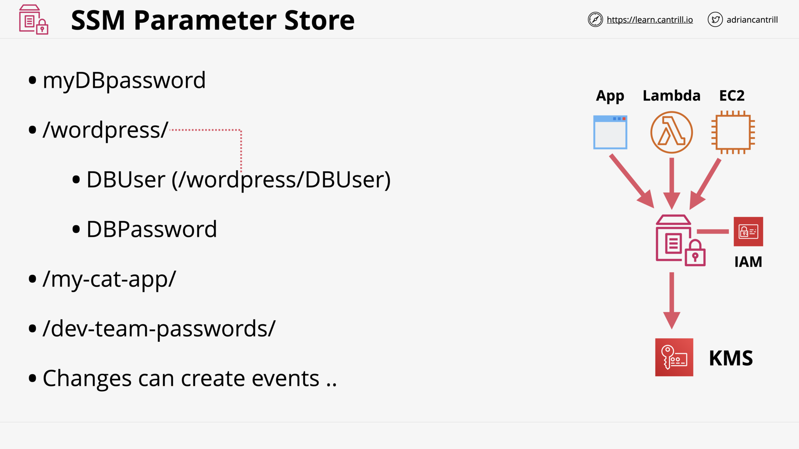

## [_DEMO_] Parameter Store (16:11)

## System and Application Logging on EC2 (6:15)

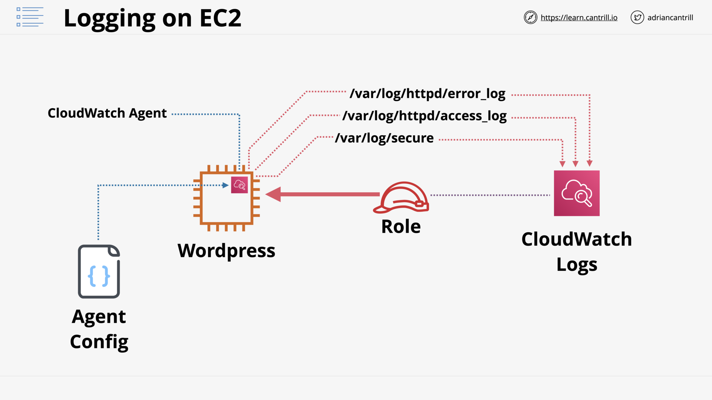

## [_DEMO_] Logging and Metrics with CloudWatch Agent-PART1 (11:51)

## [_DEMO_] Logging and Metrics with CloudWatch Agent-PART2 (8:08)

## EC2 Placement Groups (14:29)

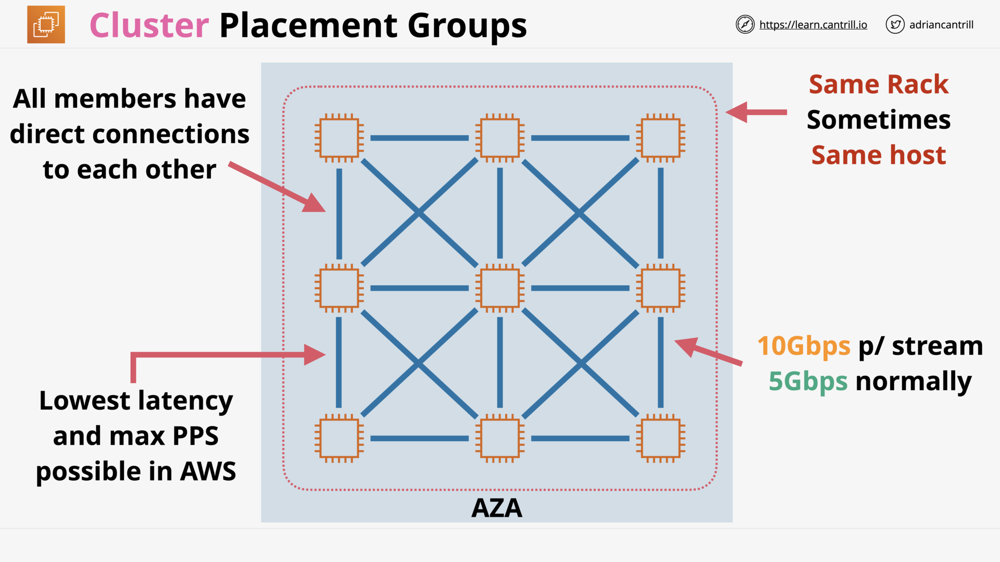

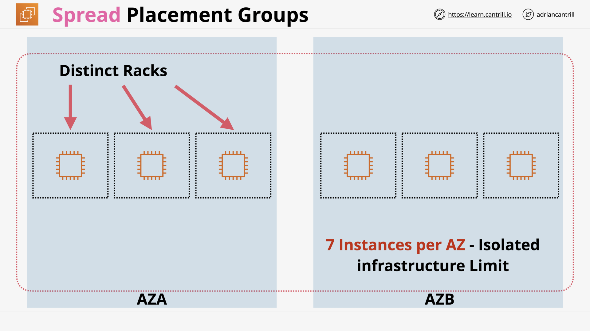

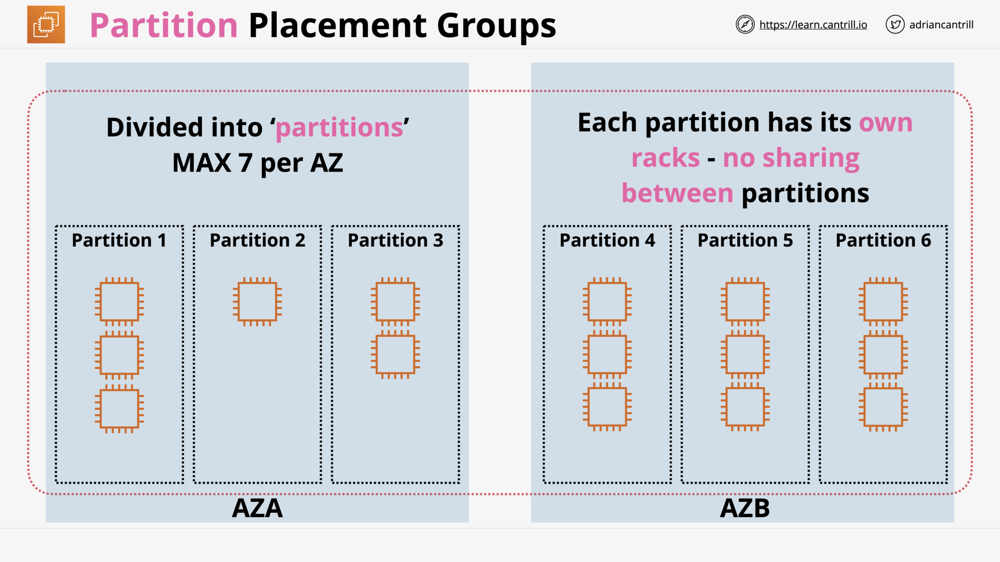

## Dedicated Hosts (8:56)

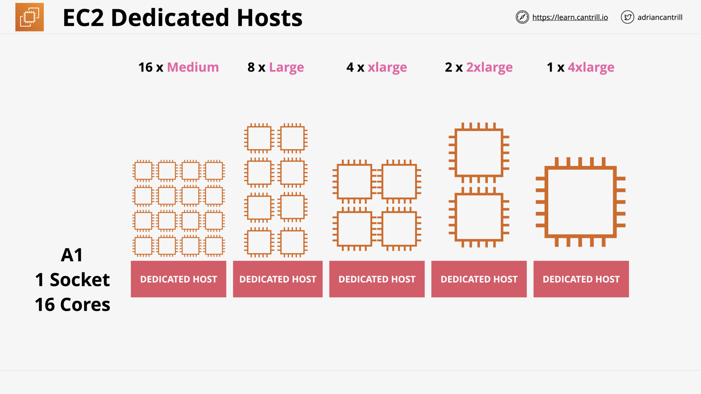

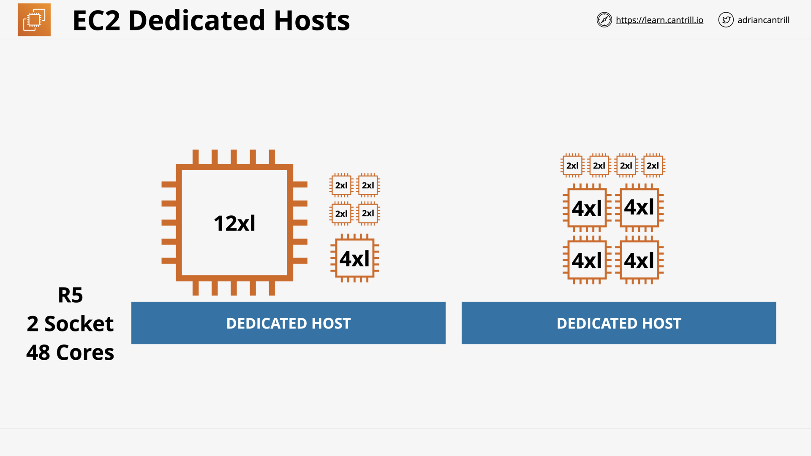

## Enhanced Networking & EBS Optimized (6:57)

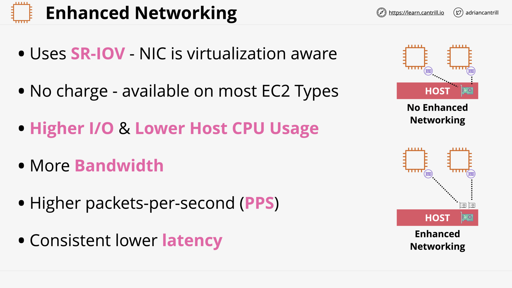

## Advanced EC2 Section Quiz
