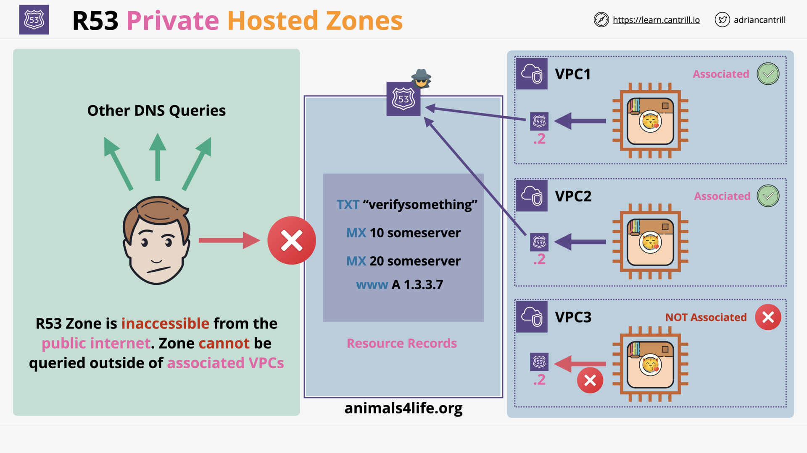
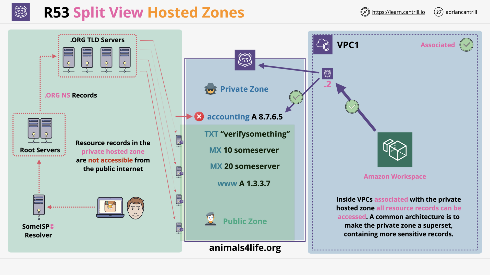
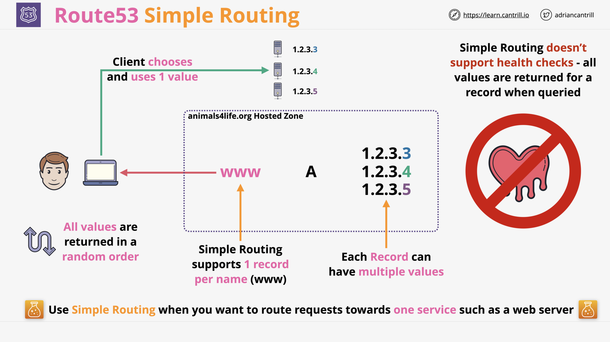
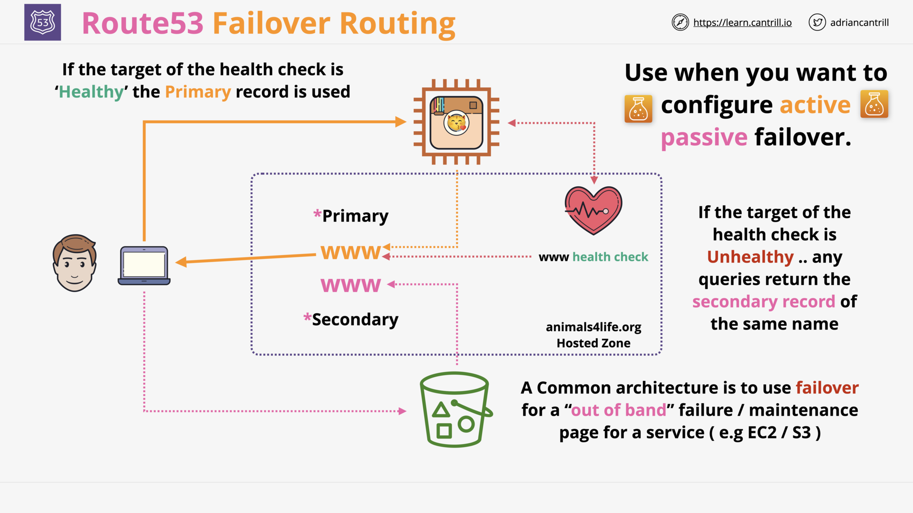
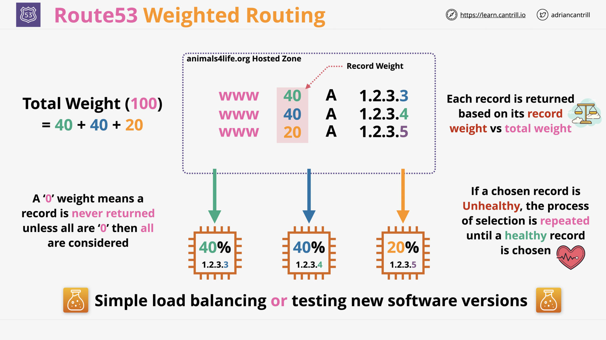

# ROUTE 53 - GLOBAL DNS

## R53 Public Hosted Zones (6:28)

## R53 Private Hosted Zones (5:10)

## CNAME vs R53 Alias (5:19)

## Simple Routing (2:17)

## R53 Health Checks (12:41)

## Failover Routing (1:53)

## [_DEMO_] Using R53 and Failover Routing-PART1 (16:41)

## [_DEMO_] Using R53 and Failover Routing-PART2 (6:28)

## Multi Value Routing (2:32)

## Weighted Routing (3:24)

## Latency Routing (2:44)

## Geolocation Routing (5:02)

## Geoproximity (4:50)

## R53 Interoperability (11:50)

## Implementing DNSSEC using Route53 (17:43)

## Route53 Section Quiz
