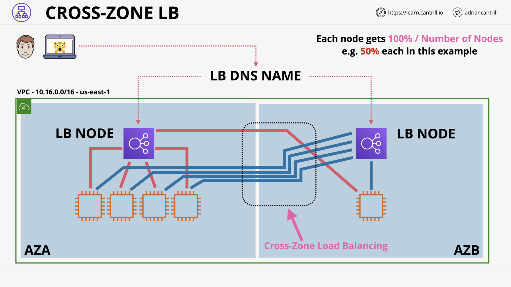

# HA & SCALING

## Regional and Global AWS Architecture (10:42)

Regional & Global AWS Architecture

The tiers (components) of an application

## Evolution of the Elastic Load Balancer (4:10)

Elastic Load Balancer (ELB) - Evolution

> What are the 3 types of load balancers in AWS?
>
> - v1:
>   - Classic Load Balancer (CLB): 2009
> - v2:
>   - Application Load Balancer (ALB): HTTP/s, gRPC 👈 Layer 4
>   - Network Load Balancer (NLB): TCP/UDP, TLS 👈 Layer 7
>   - ??? Gateway LB
>
> ([AWS ELB Comparisons](https://aws.amazon.com/elasticloadbalancing/features/?nc=sn&loc=2&dn=1#Product_comparisons))

## Elastic Load Balancer Architecture - PART1 (10:18)

ELB - Architecture

> What is the benefits of Load Balancer?
>
> - Distributing workloads across multiple compute resources 👉 HA & FT
> - Decoupling application tiers 👉 ↕️ compute resources without disrupting the overall flow of our app.
> - Or:
>   - Sending request only to healthy ones.
>   - Offloading encryption/decryption from computer resources to LB.
>
> ([Source](https://docs.aws.amazon.com/elasticloadbalancing/latest/userguide/what-is-load-balancing.html#load-balancer-benefits))

## Elastic Load Balancer Architecture - PART2 (12:32)

ELB - Without Cross-Zone LB

ELB - With Cross-Zone LB

ELB - Summary

ELB - Internet-facing LB & Internal LB

> What are 2 types [scheme](https://docs.aws.amazon.com/elasticloadbalancing/latest/userguide/how-elastic-load-balancing-works.html#load-balancer-scheme) of AWS ELB?
>
> - **Internet-facing LB**: the nodes have _public IP_ addresses.
> - **Internal LB**: the nodes have only _private IP_ addresses.

## Application Load balancing (ALB) vs Network Load Balancing (NLB) (16:20)

LB Consolidation 🏳️‍🌈

> Why AWS Classic Load Balancer don't scale?
>
> CLB don't support TLS [Server Name Indicator (SNI)](https://www.cloudflare.com/learning/ssl/what-is-sni/).
>
> 😭 Every unique host name requires an individual CLB.

> What is LB Consolidation?
>
> When multiple websites are hosted on one server (the LB) and share a single IP address.

> How does AWS v2 LBs allows consolidation?
>
> AWS v2 ALB support _rules_ and _target groups_.
>
> Using an ALB and its rules based on TLS SNI allows consolidation.

_vs_Ne.png>)
ALB

_vs_Ne.png>)
ALB - Rules

ALB - Rules Example

_vs_Ne.png>)
NLB

_vs_Ne.png>)
NLB vs ALB - Exam Tips

> Which type of ELB can have a static IP?
>
> Only NLB can have a _static_ IP.

## Launch Configuration and Templates (4:00)

Launch Configuration (LC) & Launch Template (LT)

LC & LT - Architecture

## Auto-Scaling Groups (16:01)

ASG - Automatic Scaling EC2 instances

ASG - Scaling Polices automatically adjust the Desired Capacity

ASG - Architecture

ASG - Scaling Polices

ASG + LBs

ASG - Scaling Processes

ASG - Summary

## ASG Scaling Policies (10:23)

ASG Scaling Policies

ASG Scaling Policies - Simple Scaling

ASG Scaling Policies - Step Scaling

## ASG Lifecycle Hooks (4:41)

ASG Lifecycle Hooks

ASG - Without Lifecycle Hooks

ASG - With Lifecycle Hooks

## ASG HealthCheck Comparison - EC2 vs ELB (3:38)

ASG - 3 types of HealthCheck

> What are 3 types of ASG HealthCheck?
>
> - EC2 (Default)
>
>   - Hardware issue of EC2 host
>   - Software issue of EC2 instance
>
> - ELB
>
>   More application aware (Layer 7).
>
> - Custom
>
>   Instances mark healthy/unhealthy by an external system.s

## SSL Offload & Session Stickiness (12:11)

ELB - SSL Offload

> What are 3 ways that ELB's can handle SSL?
>
> - Bridging (Default): HTTPS <-> HTTPS
> - Pass-through: TCP
> - Offload: HTTPS <-> HTTP

ELB - Connection Stickiness

## [_DEMO_] Seeing Session Stickiness in Action (12:57)

## [_ADVANCED_DEMO_] Architecture Evolution - STAGE1 - PART1 (14:24)

## [_ADVANCED_DEMO_] Architecture Evolution - STAGE1 - PART2 (10:43)

## [_ADVANCED_DEMO_] Architecture Evolution - STAGE2 (12:58)

## [_ADVANCED_DEMO_] Architecture Evolution - STAGE3 (19:30)

## [_ADVANCED_DEMO_] Architecture Evolution - STAGE4 (18:04)

## [_ADVANCED_DEMO_] Architecture Evolution - STAGE 5 - PART1 (11:31)

## [_ADVANCED_DEMO_] Architecture Evolution - STAGE 5 - PART2 (14:56)

## [_ADVANCED_DEMO_] Architecture Evolution - STAGE6 (5:48)

## Gateway Load Balancer (13:40)

Why GWLB?

What is GWLB?

How GWLB works?

GWLB - Architecture

## HA and Scaling Section Quiz
