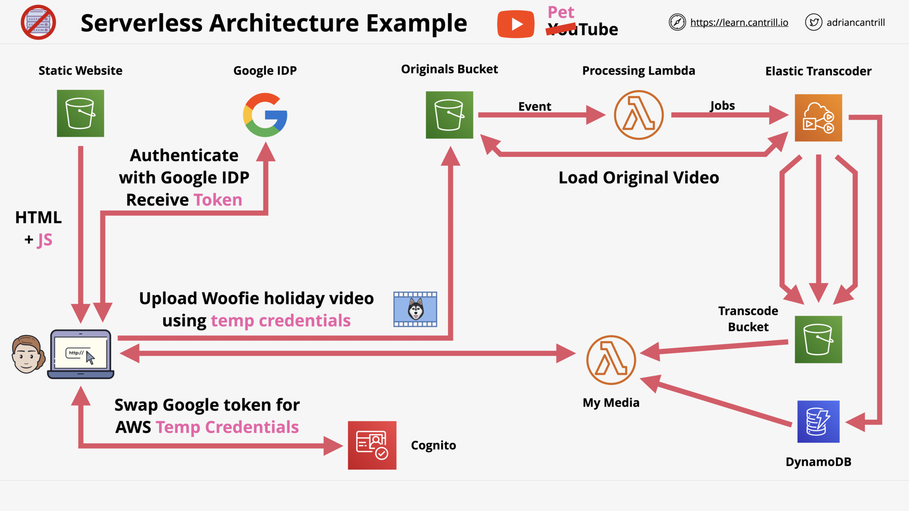

# SERVERLESS AND APPLICATION SERVICES

## Architecture Deep Dive - PART1 (8:52)

## Architecture Deep Dive - PART2 (13:09)

## AWS Lambda - PART1 (11:25)

## AWS Lambda - PART2 (13:59)

## AWS Lambda - PART3 (17:03)

## CloudWatchEvents and EventBridge (6:54)

## [_DEMO_] Automated EC2 Control using Lambda and Events - PART1 (13:44)

## [_DEMO_] Automated EC2 Control using Lambda and Events - PART2 (18:49)

## Serverless Architecture (12:56)

## Simple Notification Service (7:49)

## Step Functions (16:09)

## API Gateway 101 (16:27)

## [_MINI_PROJECT_] Build A Serverless App - Pet-Cuddle-o-Tron - PART1 (5:01)

## [_MINI_PROJECT_] Build A Serverless App - Pet-Cuddle-o-Tron - PART2 (8:24)

## [_MINI_PROJECT_] Build A Serverless App - Pet-Cuddle-o-Tron - PART3 (12:31)

## [_MINI_PROJECT_] Build A Serverless App - Pet-Cuddle-o-Tron - PART4 (13:31)

## [_MINI_PROJECT_] Build A Serverless App - Pet-Cuddle-o-Tron - PART5 (12:55)

## [_MINI_PROJECT_] Build A Serverless App - Pet-Cuddle-o-Tron - PART6 (2:39)

## Simple Queue Service (15:30)

## SQS Standard vs FIFO Queues (3:29)

## SQS Delay Queues (4:38)

## SQS Dead-Letter Queues (4:17)

## Kinesis Data Streams (7:52)

## Kinesis Data Firehose (9:11)

## Kinesis Data Analytics (8:51)

## Kinesis Video Streams (5:09)

## Amazon Cognito - User and Identity Pools (14:44)

## AWS Glue 101 (6:23)

## Amazon MQ 101 (8:15)

## Amazon AppFlow (3:30)

## Serverless and App Services Section Quiz
