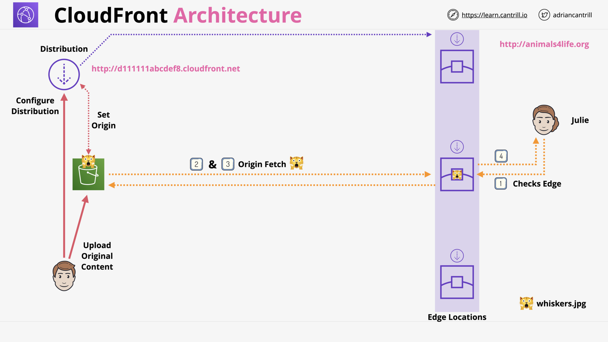
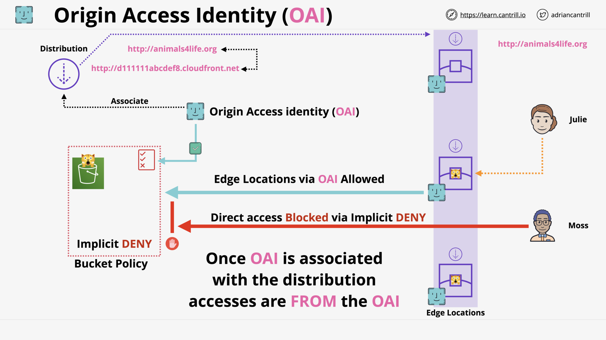
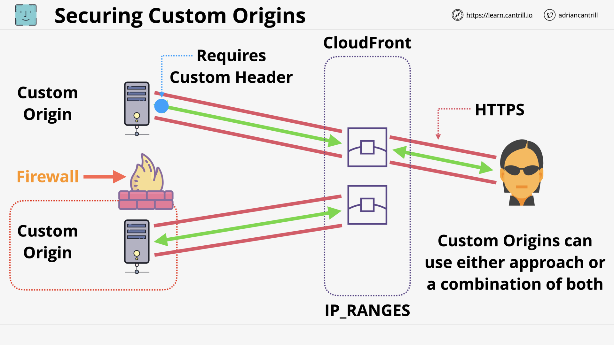
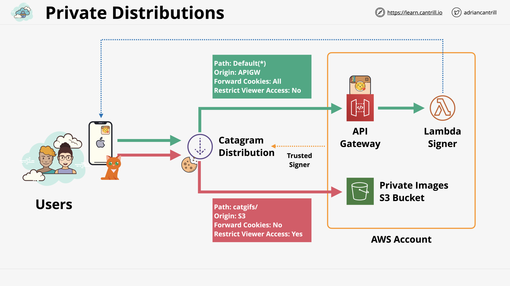
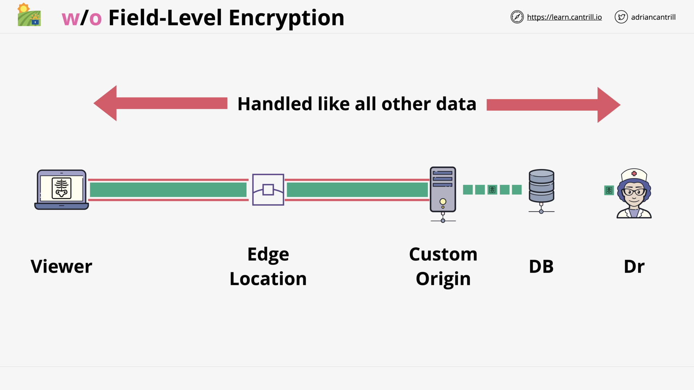
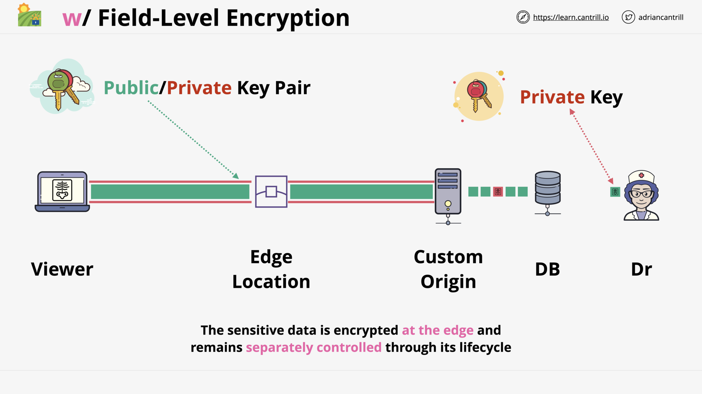
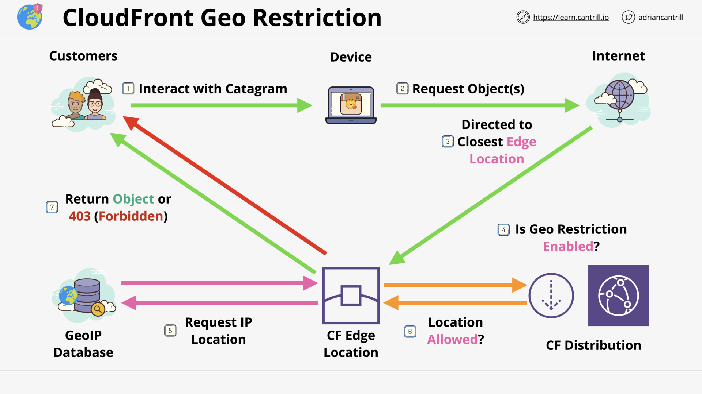
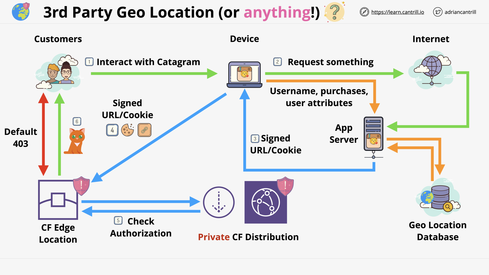

# GLOBAL CONTENT DELIVERY AND OPTIMIZATION

## Cloudfront Architecture (14:56)

## CloudFront (CF) - Behaviours (9:21)

## CloudFront - TTL and Invalidations (13:48)

## ACM (11:21)

## Cloudfront and SSL/TLS (14:59)

## CloudFront (CF) - Origin Types & Origin Architecture (10:20)

## [_DEMO_] CloudFront (CF) - Adding a CDN to a static Website-PART1 (16:23)

## [_DEMO_] CloudFront (CF) - Adding a CDN to a static Website-PART2 (12:24)

## [_DEMO_] CloudFront (CF) - Adding an Alternate CNAME and SSL (11:12)

## Securing CF and S3 using OAI (8:50)

## CloudFront - Private Distribution & Behaviours (7:49)

## [_DEMO_] CloudFront (CF) - Using Origin Access Control (OAC) (new version of OAI) (11:21)

## Lambda@Edge (8:03)

## Global Accelerator (10:29)

## CDN and Optimisation Section Quiz

