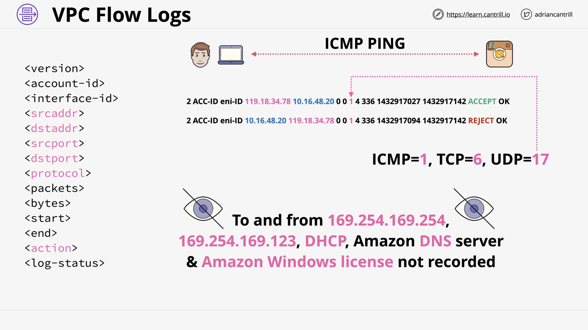
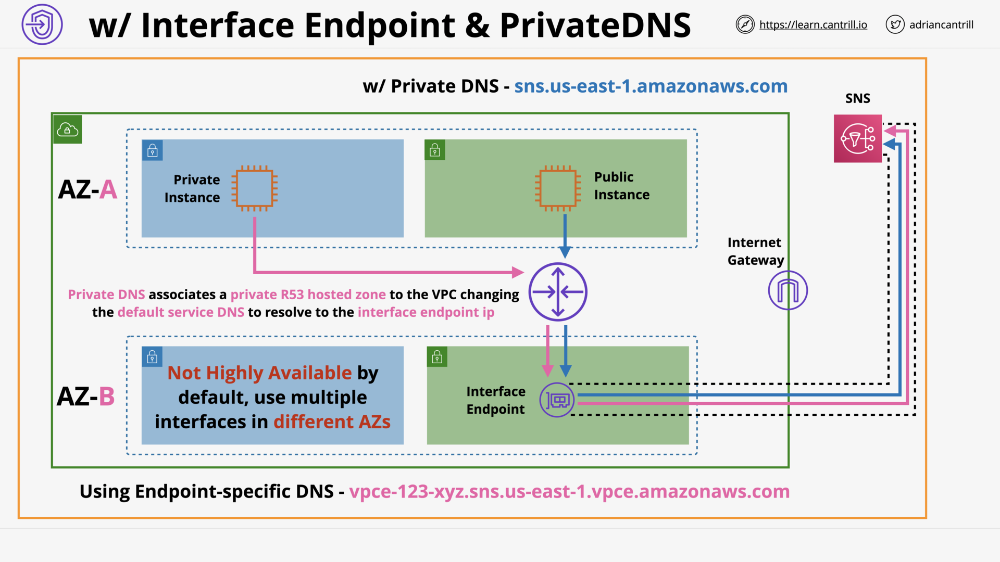
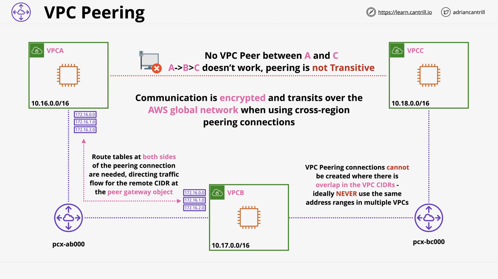

# ADVANCED VPC NETWORKING

## VPC Flow Logs (9:56)

## Egress-Only Internet gateway (6:46)

## VPC Endpoints (Gateway) (11:14)

## VPC Endpoints (Interface) (11:26)

## [_DEMO_] VPC Endpoints - Interface - PART1 (11:59)

## [_DEMO_] VPC Endpoints - Gateway - PART2 (9:59)

## [_DEMO_] Egress-Only Internet Gateway - PART3 (7:57)

## VPC Peering (9:04)

## [_DEMO_] VPC Peering (22:38)

## Advanced VPC Section Quiz
