# HYBRID ENVIRONMENTS AND MIGRATION

## Border Gateway Protocol 101 (17:29)

## IPSec VPN Fundamentals (14:54)

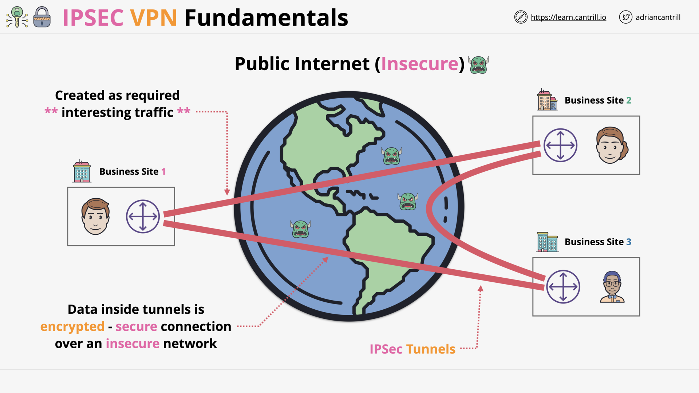

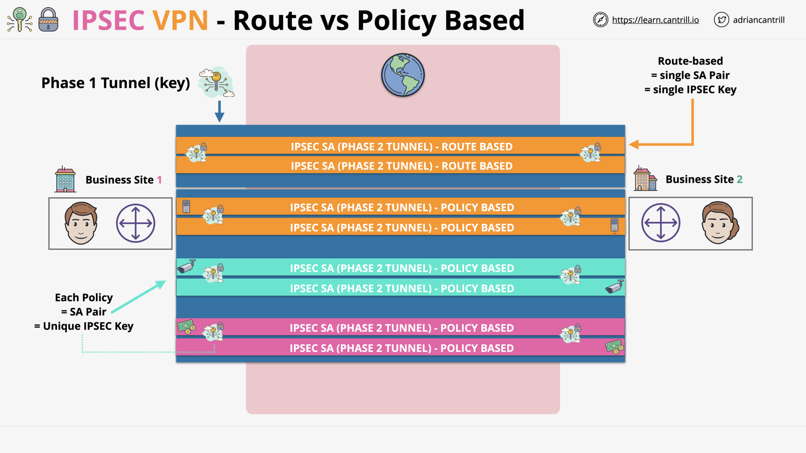

## AWS Site-to-Site VPN (18:05)

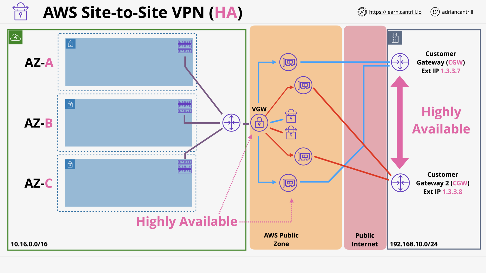
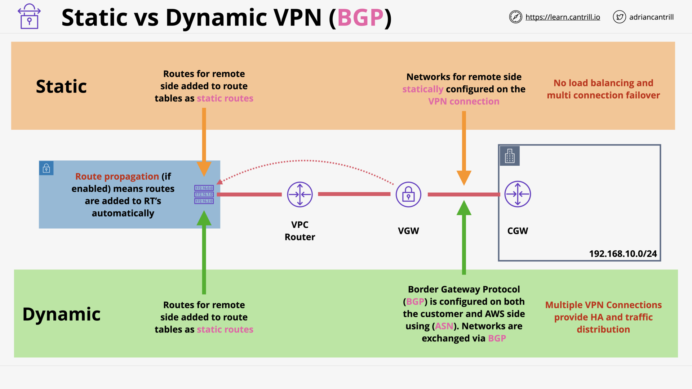

## [_DEMO_] Simple Site2Site VPN - STAGE0 - SETUP (4:52)

## [_DEMO_] Simple Site2Site VPN - STAGE1 - AWS VPN (10:01)

## [_DEMO_] Simple Site2Site VPN - STAGE2 - onprep pfSense Config (17:09)

## [_DEMO_] Simple Site2Site VPN - STAGE3 - Routing & Security (10:29)

## [_DEMO_] Simple Site2Site VPN - STAGE4 - Testing (5:42)

## [_DEMO_] Simple Site2Site VPN - STAGE5 - Cleanup (1:50)

## Direct Connect (DX) Concepts (9:37)

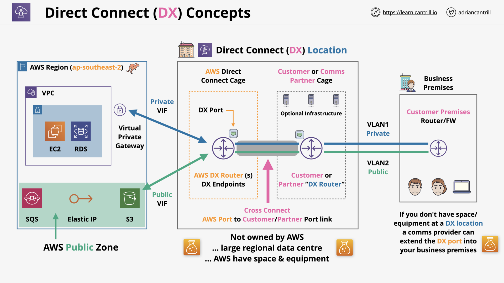

## Direct Connect (DX) Resilience (13:50)

## Direct Connect (DX) - Public VIF + VPN (Encryption) (6:43)

## Transit Gateway (10:26)

## Storage Gateway - Volume (14:15)

## Storage Gateway - Tape (VTL) (12:11)

## Storage Gateway - File (12:15)

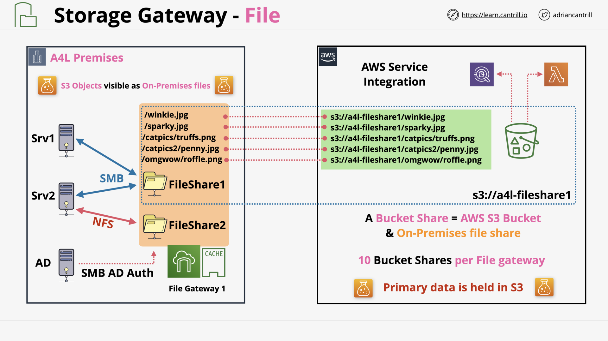

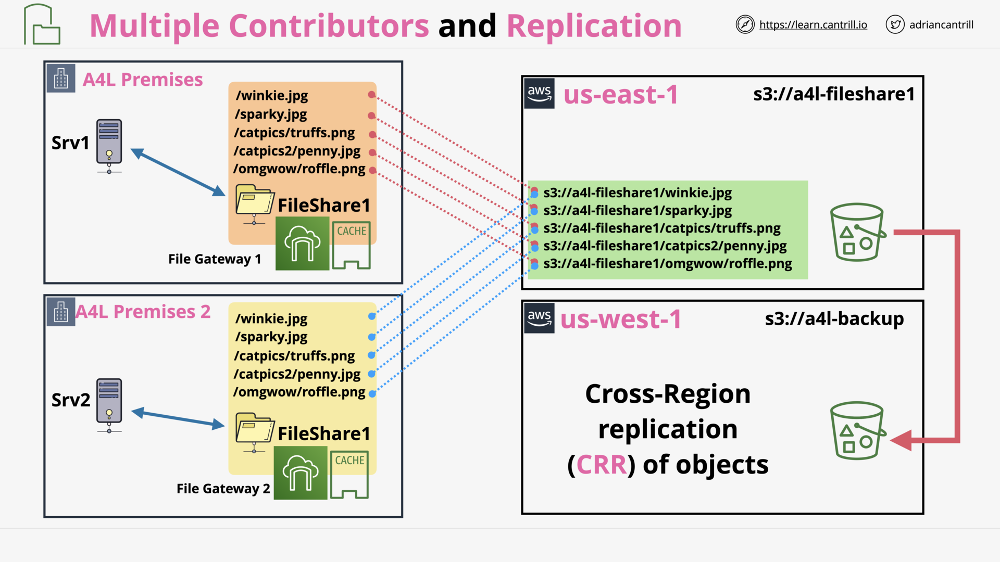

## Snowball / Edge / Snowmobile [NEW VERSION COMING SOON] (10:47)

## Directory Service (15:50)

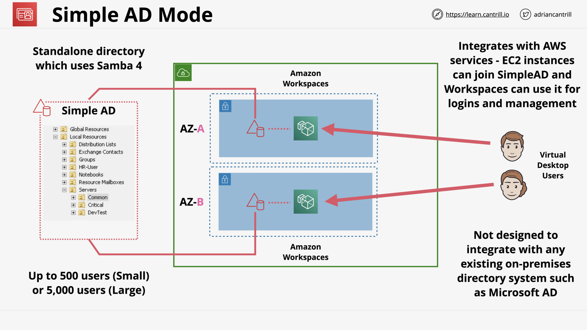

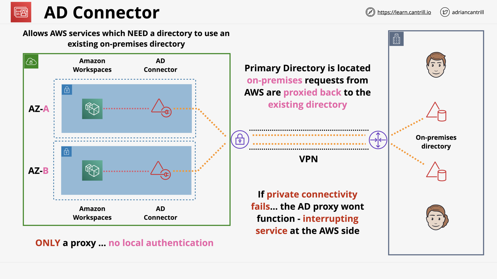

## DataSync (9:27)

## FSx for Windows Servers (11:32)

## FSx For Lustre (13:57)

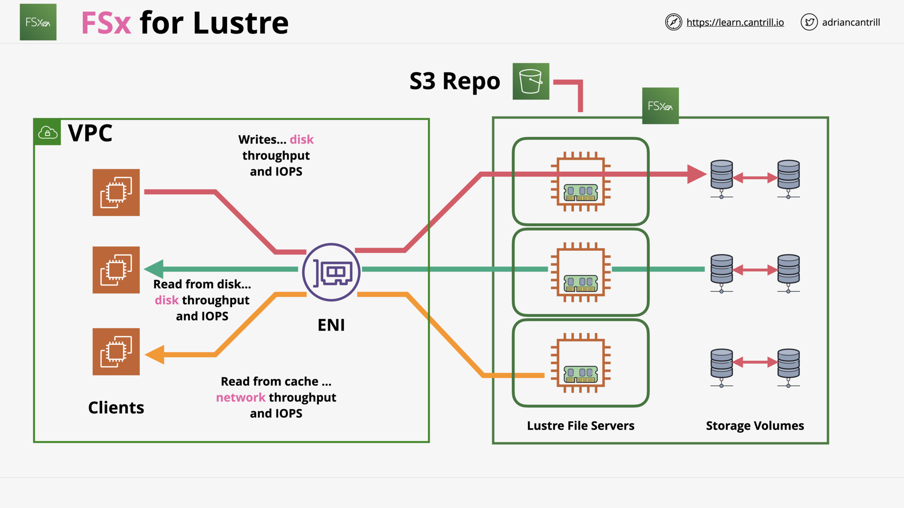

## AWS Transfer Family (10:24)

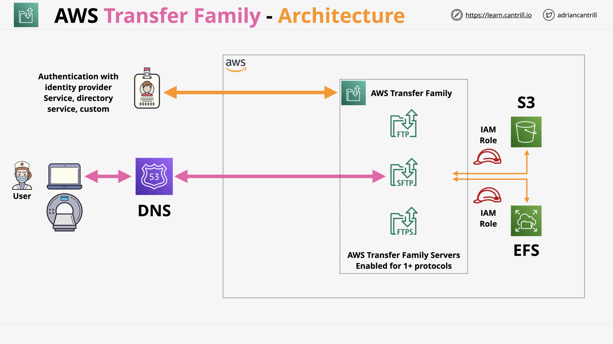

## Hybrid and Migration Section Quiz
