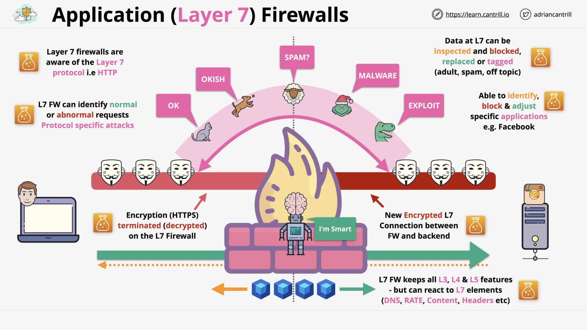
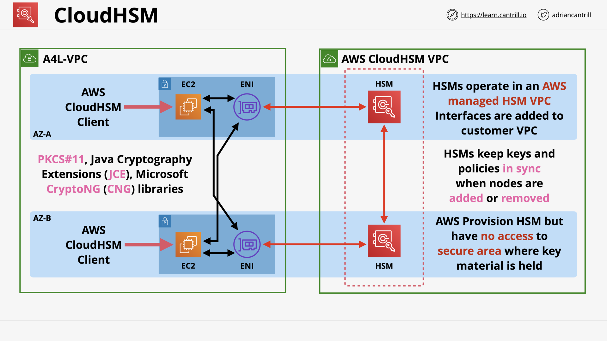
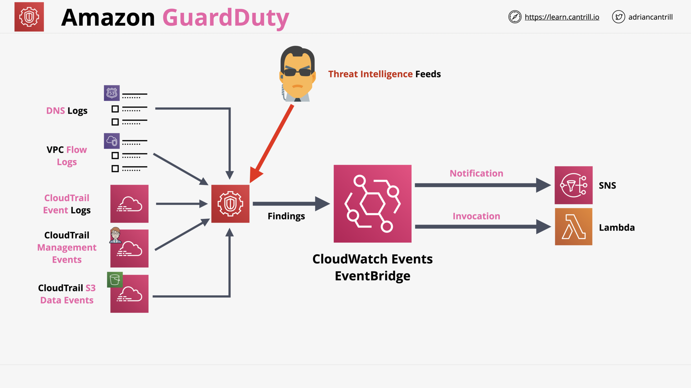

# SECURITY, DEPLOYMENT & OPERATIONS

## AWS Secrets Manager (7:44)

## Application Layer (L7) Firewall (7:44)

## Web Application Firewall (WAF), WEBACLs, Rule Groups and Rules (19:18)

## AWS Shield (9:47)

## CloudHSM (14:36)

## AWS Config (6:14)

## Amazon Macie (12:04)

## [_DEMO_] Amazon Macie (15:35)

## Amazon Inspector (6:28)

## Amazon Guardduty (4:14)

## Section Quiz
