# COURSE FUNDAMENTALS AND AWS ACCOUNTS

## AWS Accounts - The basics (11:33)

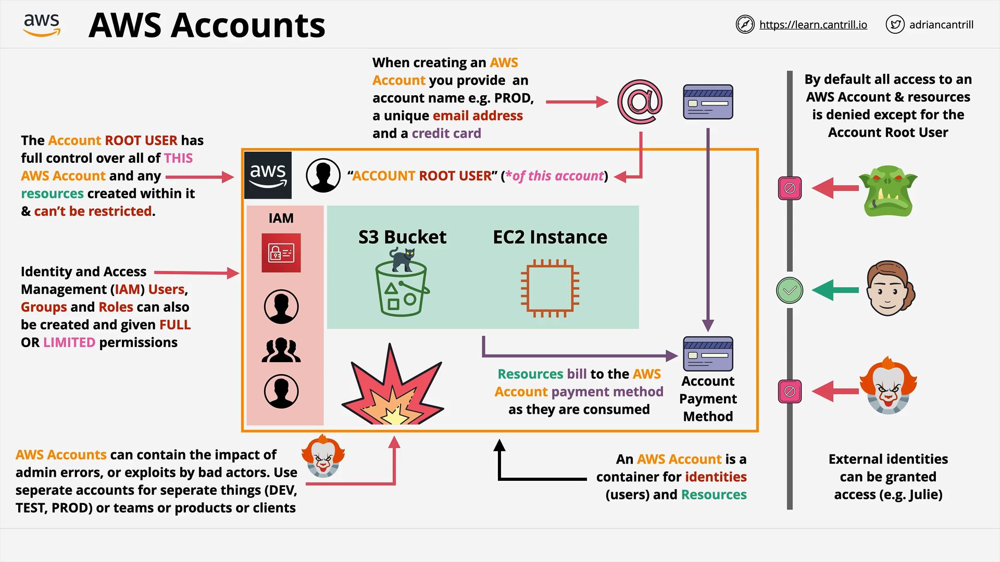

## [_DEMO_] ACCOUNTS - STEP1 - Creating GENERAL AWS Account (14:44)

## Multi-factor Authentication (MFA) (8:25)

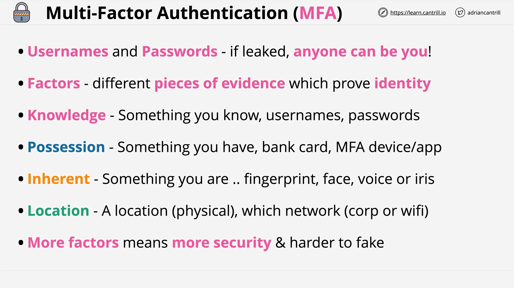

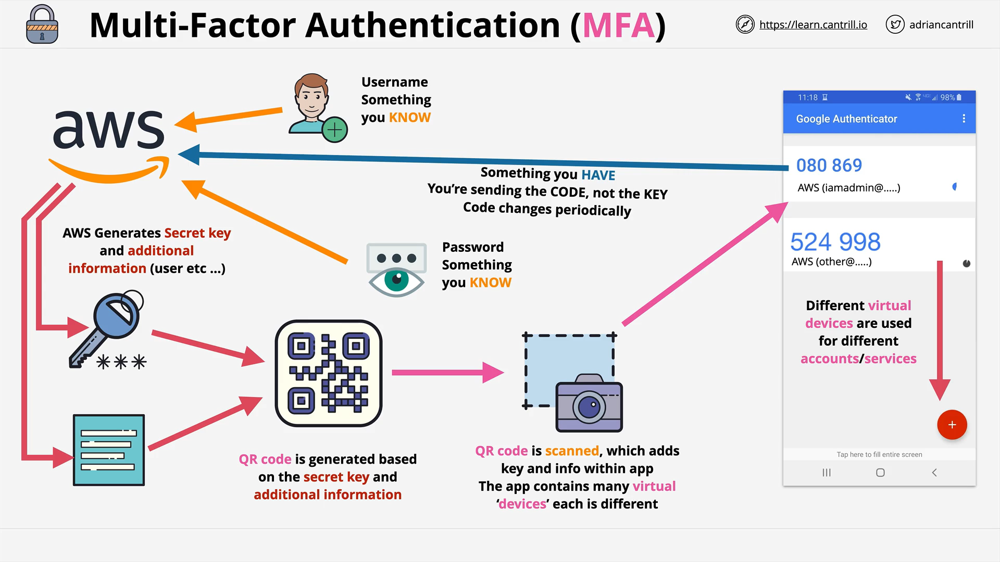

## [_DEMO_] ACCOUNTS - STEP2 - Securing GENERAL AWS Account (9:44)

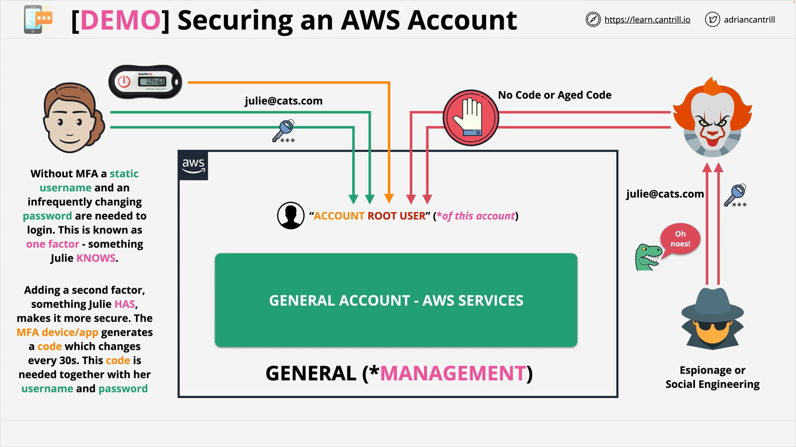

## [_DEMO_] ACCOUNTS - STEP3 - Creating a Budget (6:46)

## [_DO_IT_YOURSELF_] Creating the Production Account (4:59)

## Identity and Access Management (IAM) Basics (13:01)

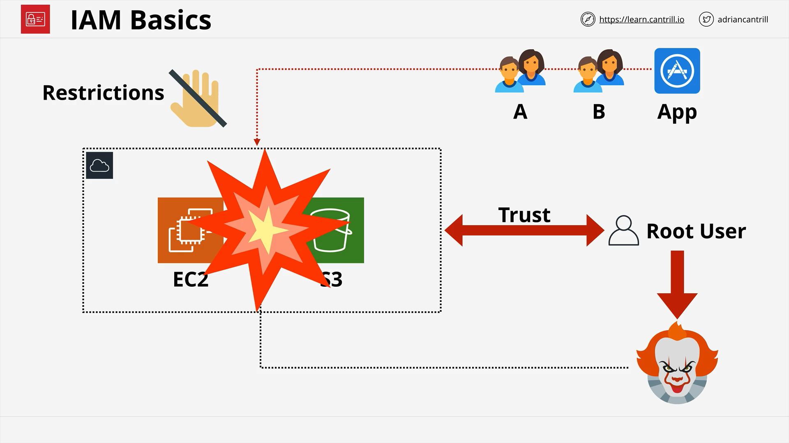

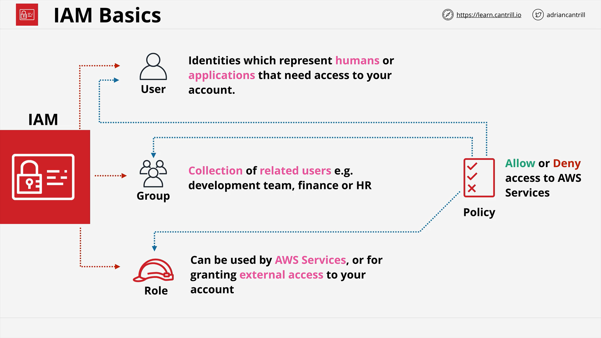
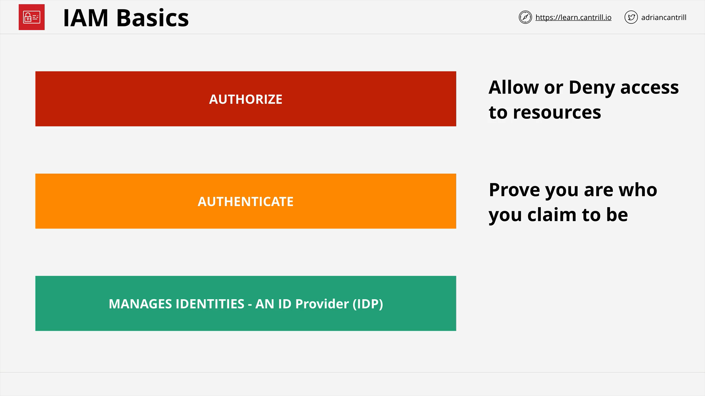
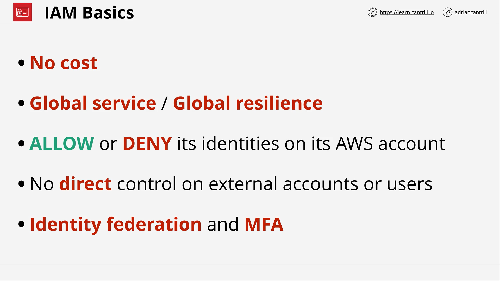

## [_DEMO_] ACCOUNTS - STEP4 - Adding IAMADMIN to GENERAL Account (12:36)

## [_DEMO_] ACCOUNTS - STEP4 - Adding IAMADMIN to PRODUCTION Account (10:17)

## IAM Access Keys (7:10)

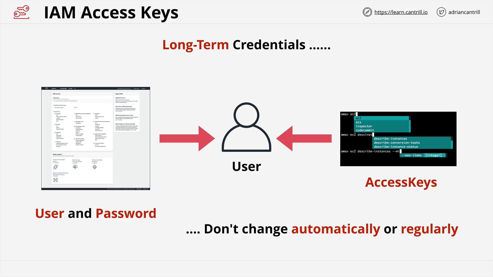
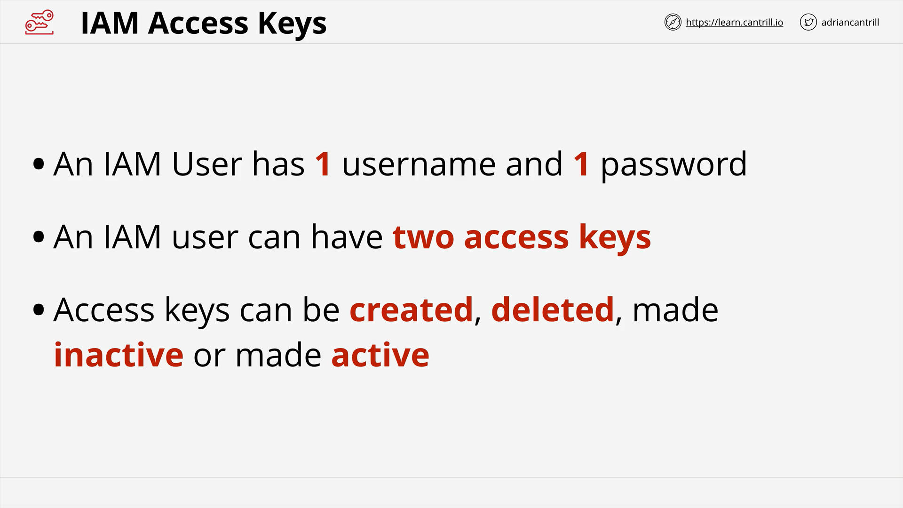
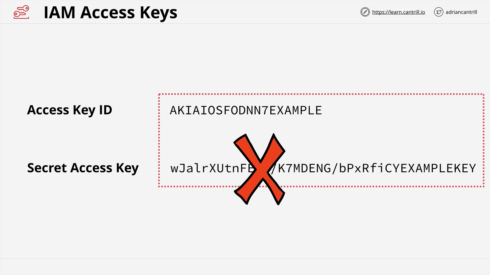

## [_DEMO_] Creating Access keys and setting up AWS CLI v2 tools (17:43)
