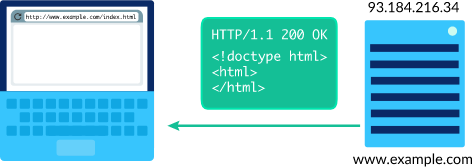
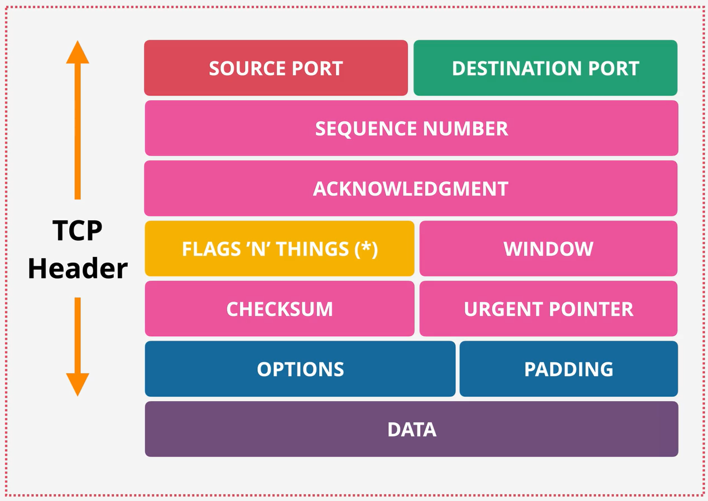
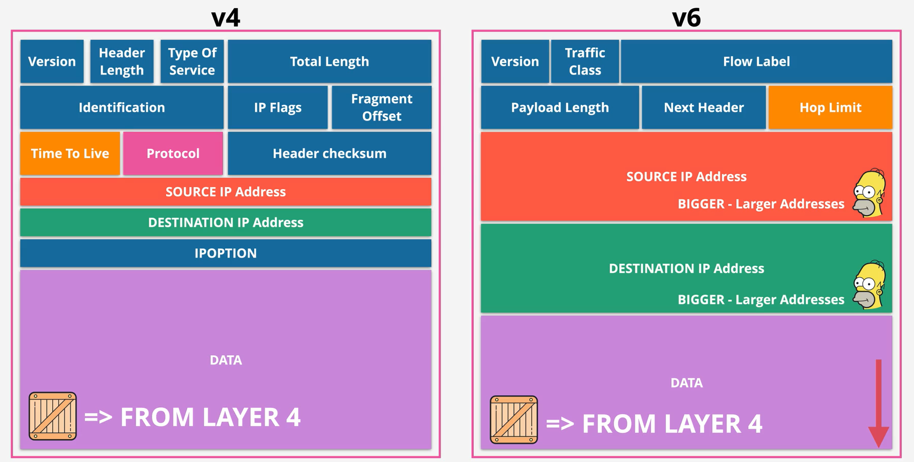
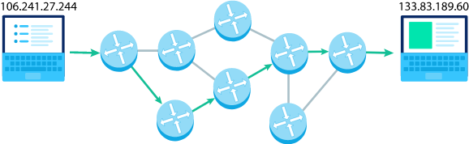
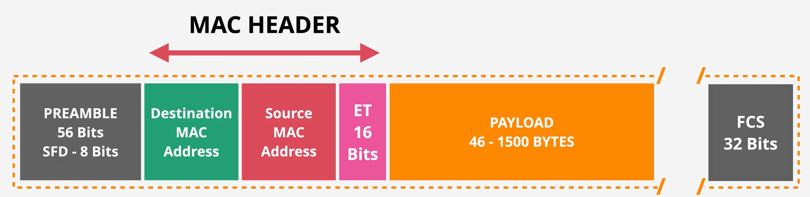
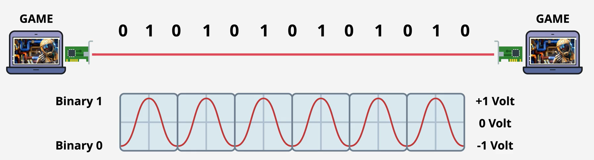

# OSI Model

|              | OSI Layer | OSI Layer Name | Protocol data unit (PDU) | PDU                                        | TCP/IP Protocols | Misc examples                                                | Software                 | Hardware |                                                     | Function                                                                                                                                              | Note                                                       |
| ------------ | --------- | -------------- | ------------------------ | ------------------------------------------ | ---------------- | ------------------------------------------------------------ | ------------------------ | -------- | --------------------------------------------------- | ----------------------------------------------------------------------------------------------------------------------------------------------------- | ---------------------------------------------------------- |
| Host layers  | 7         | Application    | Data                     |                                            | HTTP/S           | WebSocket                                                    | Browser, curl            |          |          | _High-level protocols_ such as for resource sharing or remote file access, e.g. HTTP.                                                                 |                                                            |
|              | 6         | Presentation   |                          |                                            | SSL/TLS          |                                                              |                          |          |       | Translation of data between a networking service and an application; including character _encoding_, data _compression_ and **encryption/decryption** |                                                            |
|              | 5         | Session        |                          |                                            | Sockets          | NFS                                                          |                          |          |                                                     | Managing communication sessions, i.e., continuous exchange of information in the form of multiple back-and-forth transmissions between two nodes      |                                                            |
|              | 4         | Transport      | Segment, Datagram        |  | TCP, UDP         |                                                              | Internet Socket [1] (OS) |          |  | _Reliable transmission_ of **data segments** between points on a network, including _segmentation, acknowledgement and multiplexing_                  |                                                            |
| Media layers | 3         | Network        | Packet                   |    | IP, ICMP         |                                                              |                          | Router   |          | Structuring and managing a _multi-node network_, including _addressing, routing and traffic control_                                                  | Which physical path the data will take?                    |
|              | 2         | Data link      | Frame                    |      | PPP              | MAC, Ethernet, Wifi, ARP, IEEE 802.1Q, 802.1AD (QinQ) (VLAN) |                          | Switch   |                                                     | Transmission of **data frames** between _two nodes_ connected by a physical layer                                                                     | Two devices on the _same_ network.                         |
|              | 1         | Physical       | Bit                      |          |                  | RS232, Bluetooth                                             |                          | NIC, Hub |          | Transmission and reception of **raw bit streams** over a _physical medium_                                                                            | Raw bit stream over ethernet cable, optical fibre, Wifi... |

[1]: https://www.wikiwand.com/en/Network_socket

| Please   | Do        | Not     | Throw     | Sausage | Pizza        | Away        |
| -------- | --------- | ------- | --------- | ------- | ------------ | ----------- |
| Physical | Data Link | Network | Transport | Session | Presentation | Application |

| All         | People       | Seem    | To        | Need    | Data | Processing |
| ----------- | ------------ | ------- | --------- | ------- | ---- | ---------- |
| Application | Presentation | Session | Transport | Network | Data | Physical   |
