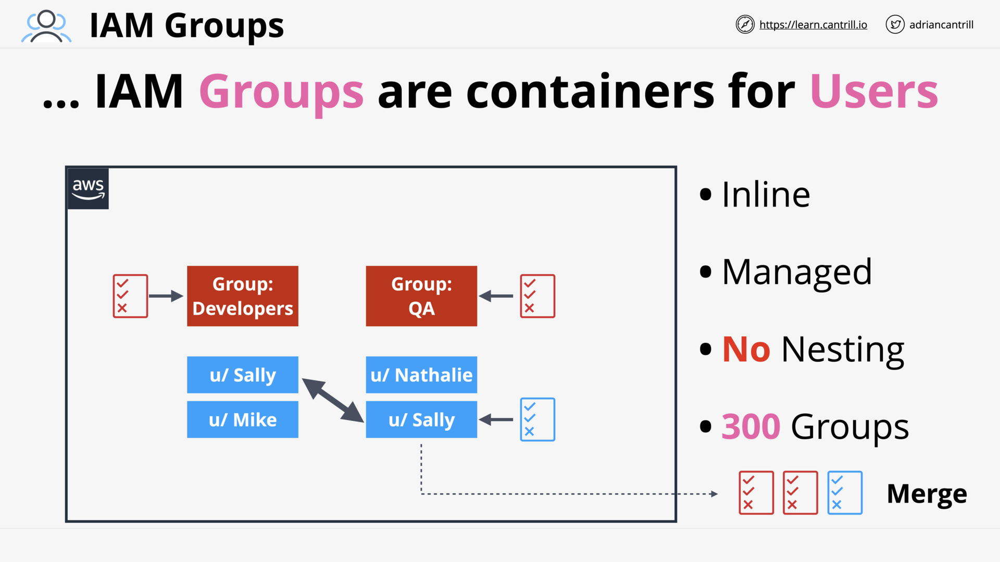
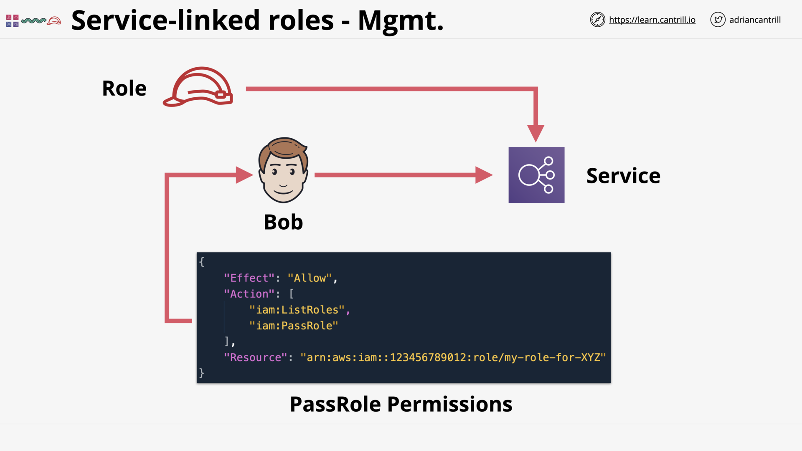

# IAM, ACCOUNTS AND AWS ORGANISATIONS

## [_ASSOCIATE_] IAM Identity Policies (15:52)

IAM Policy Document

DENY - ALLOW - DENY

All policies for IAM Identities (User, Role, Group) & AWS Resources are evaluated at the same time.

Inline Policy vs Managed Policy

## [_ASSOCIATE_] IAM Users and ARNs (13:49)

IAM Users

IAM Users - Limitation

> [!NOTE] What is the limit IAM Users per account?

> [!NOTE] How many IAM Groups a IAM User can be a member of?

ARNs

> [!NOTE] What is the format of ARN?
>
> - **arn**:_partition_:_service_:_region_:_account-id_:_resource-id_
> - **arn**:_partition_:_service_:_region_:_account-id_:_resource-type_/_resource-id_
> - **arn**:_partition_:_service_:_region_:_account-id_:_resource-type_:_resource-id_
>
> 👉
>
> - 5 to 6 colon `:`
> - _region_ or/and _account-id_ can be omitted.

| **arn** | _partition_                       | _service_                     | _region_                              | _account-id_ | _resource-type_ | _resource-id_ |
| ------- | --------------------------------- | ----------------------------- | ------------------------------------- | ------------ | --------------- | ------------- |
|         | `aws` `aws-cn` `aws-us-gov` | `iam` `s3` `ec2` ... | `us-east-1` `ap-southest-1` ... |              | `user`          |               |

## [_ASSOCIATE_, _DEMO_] Simple Identity Permissions in AWS (16:06)

## [_ASSOCIATE_] IAM Groups (7:48)

IAM Groups

> [!NOTE] What is IAM Group?
>
> Containers for IAM Users.

> [!NOTE] What are the limits of IAM Group?
>
> - No Nesting.
> - Limit of 300 Groups.

IAM Group is not a true identity

> [!NOTE] Can a IAM Group be used as a Principle in a policy?
>
> IAM Group can NOT be used as a Principle in a policy. IAM Group is NOT a true identity.

## [_ASSOCIATE_, _DEMO_] Permissions control using IAM Groups (9:24)

## [_ASSOCIATE_] IAM Roles - The Tech (8:13)

IAM Role and Assuming an IAM Role

Trust Policy vs Permission Policy

> [!NOTE] What is Trust Policy in IAM?

## [_ASSOCIATE_] When to use IAM Roles (15:27)

Lambda Execute Role

Emergency Role

Existing Identities (e.g. Active Directory)

Web Identities (e.g. Google, Facebook)

AWS Partner Accounts

## Service-linked Roles & PassRole (5:16)

Service-linked Roles

> [!NOTE] What is Service-linked Role?

Permissions to allow create/edit the service-linked role

Pass an existing role to the service

## [_ASSOCIATE_] AWS Organizations (12:56)

Management/Master Account

Invite Standalone accounts to an AWS Organization

Accepting invitations to become member of an AWS Organization

Member Accounts

Organization Root & Organization Unit (OU)

Consolidated Billing

Role Switching

## [_ALL_, _DEMO_] AWS Organizations (19:48)

## [_ASSOCIATE_] Service Control Policies (SCPs) (12:44)

Service Control Policies (SCP)

_.png>)
SCP controls account permissions in an organization

> [!NOTE] At which level the SCP work?
>
> Account-level.

_.png>)
SCP - Deny List

_.png>)
SCP - Allow List

Identity Policies and SCPs

> [!NOTE] Can SCP restrict management account?
>
> No.

> [!NOTE] Can SCP restrict root user?
>
> SCP can un-directly control the member account's root user (by control the account's permission)

## [_ALL_, _DEMO_] Using Service Control Policies (16:45)

## [_ASSOCIATE_] CloudWatch Logs (7:16)

CloudWatch Logs - Basic

<!--  -->

CloudWatch Logs - Architecture

> [!NOTE] What is Log Event?

> [!NOTE] What is Log Stream?

> [!NOTE] What is Log Group?

## [_ASSOCIATE_] CloudTrail (11:40)

> [!NOTE] What is CloudTrail Event/Trail?

> [!NOTE] How long is the default CloudTrail history?

> [!NOTE] In CloudTrail, what are Management Events / Data Events?

> [!NOTE] How to implement a central log store for AWS Organization?

> [!NOTE] Is CloudTrail realtime?

## [_ALL_, _DEMO_] Implementing an Organizational Trail (18:23)

## AWS Control Tower 101 (15:42)

## IAM & Orgs Section Quiz
