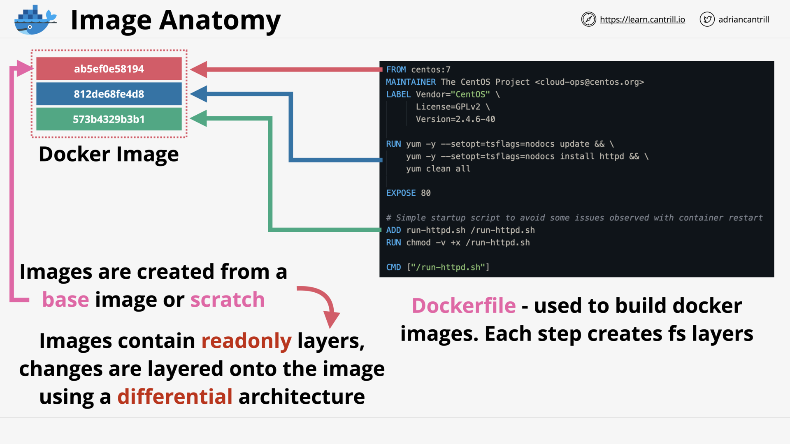
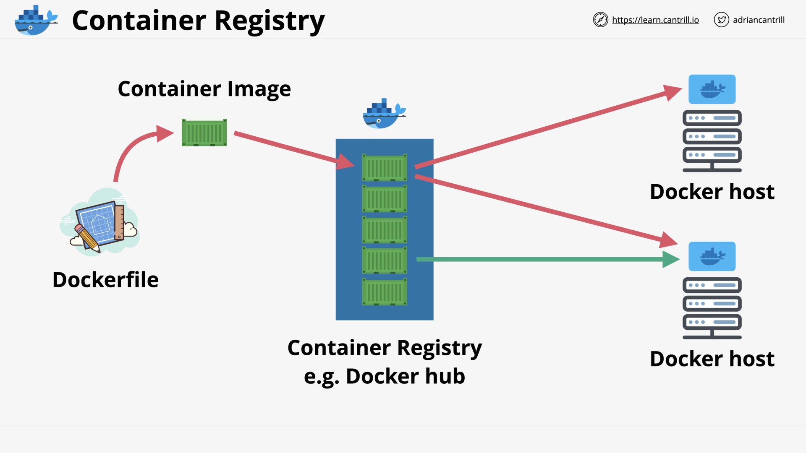
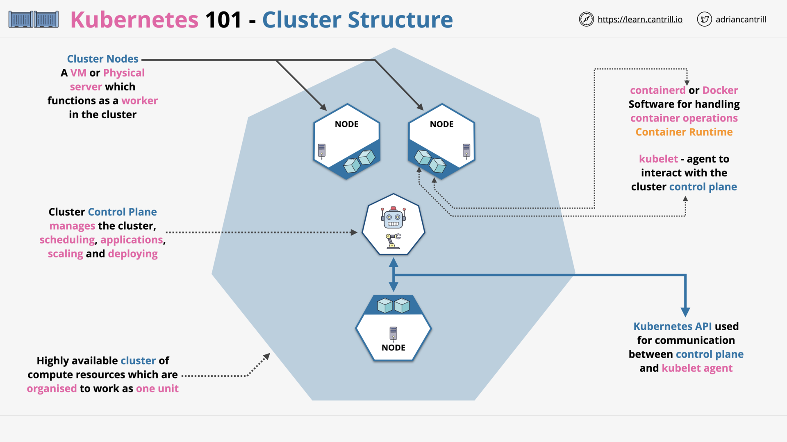
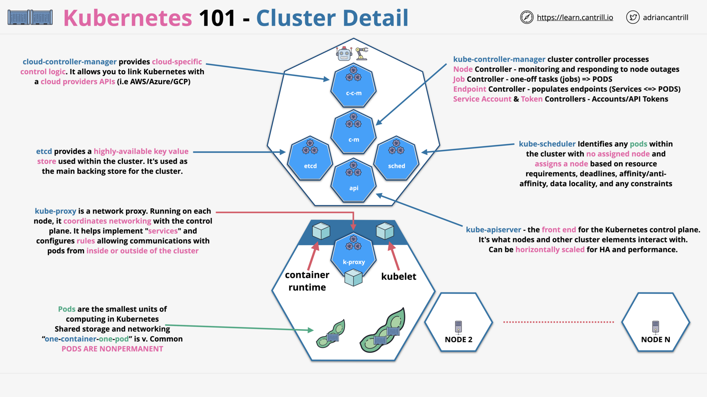
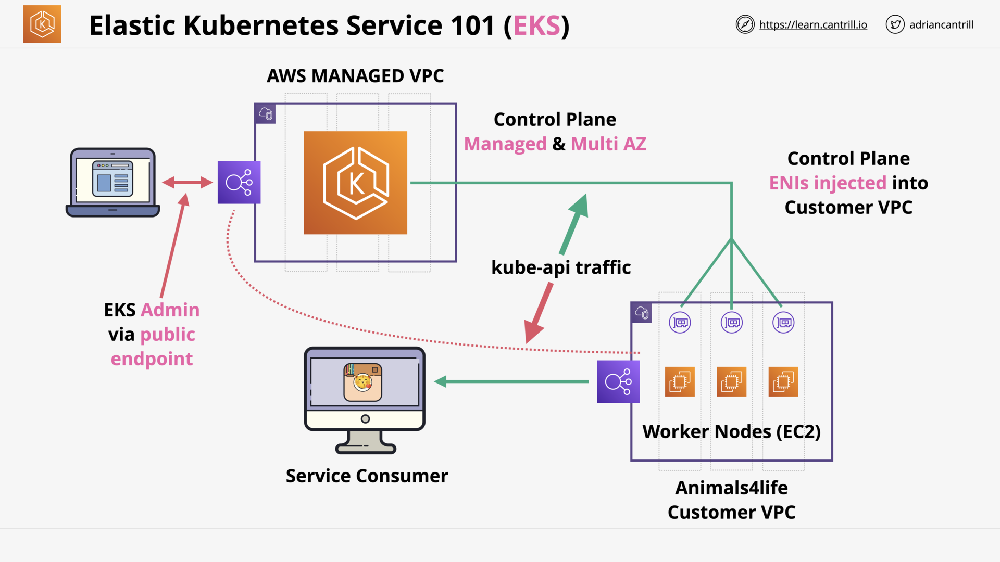

# CONTAINERS & ECS

## Introduction to Containers (17:13)

Virtualization Problems

Containerization

Image Anatomy

Container Anatomy

Container Registry

Container Key Concepts

## [_DEMO_] Creating 'container of cats' Docker Image (18:15)

## ECS - Concepts (10:25)

## ECS - Cluster Mode (13:09)

ECS - EC2 Mode

ECS - Fargate Mode

EC2 - ECS (EC2) - ECS (Fargate)

## [_DEMO_] - Deploying 'container of cats' using Fargate (13:13)

## Elastic Container Registry (ECR) (4:14)

__lea_—_Firefox_De.png>)
ECR - Public/Private Registry - Repo - Image - Tag

__lea_—_Firefox_De.png>)
ECR is integrated with many AWS services

## Kubernetes 101 (11:27)

K8s - Cluster - Control Plane - Worker Nodes

K8s - Architecture

K8s - Summary

## Elastic Kubernetes Service (EKS) 101 (6:14)

_101__.png>)
EKS - AWS managed K8s

EKS - Architecture

## Containers Section Quiz
