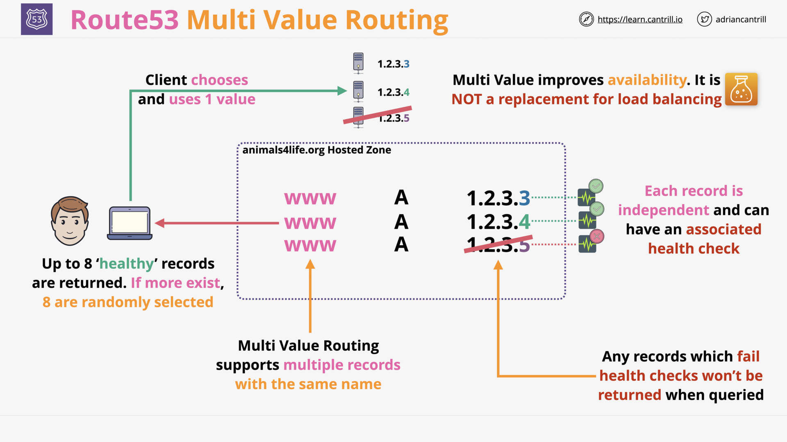
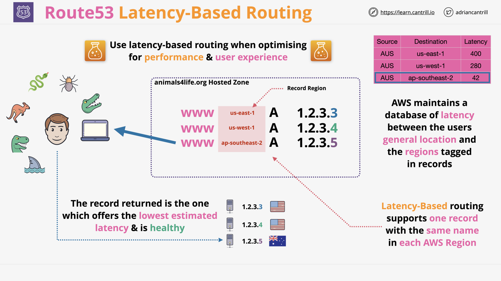
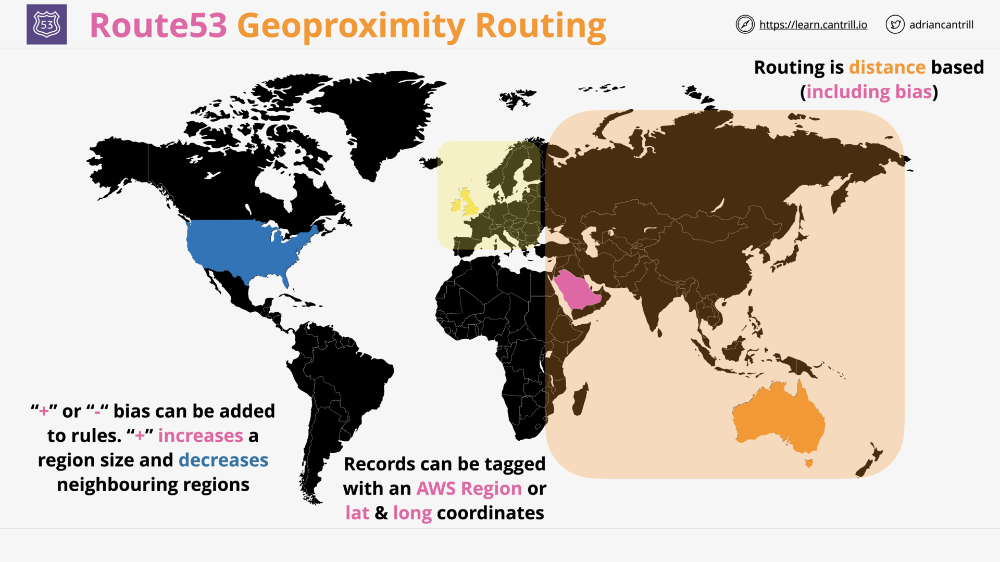
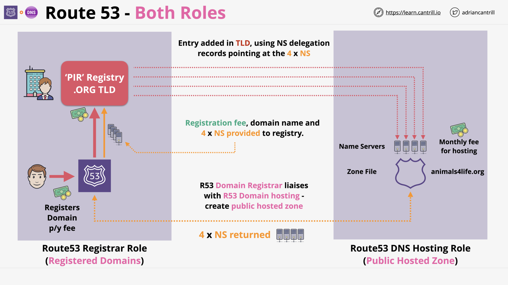
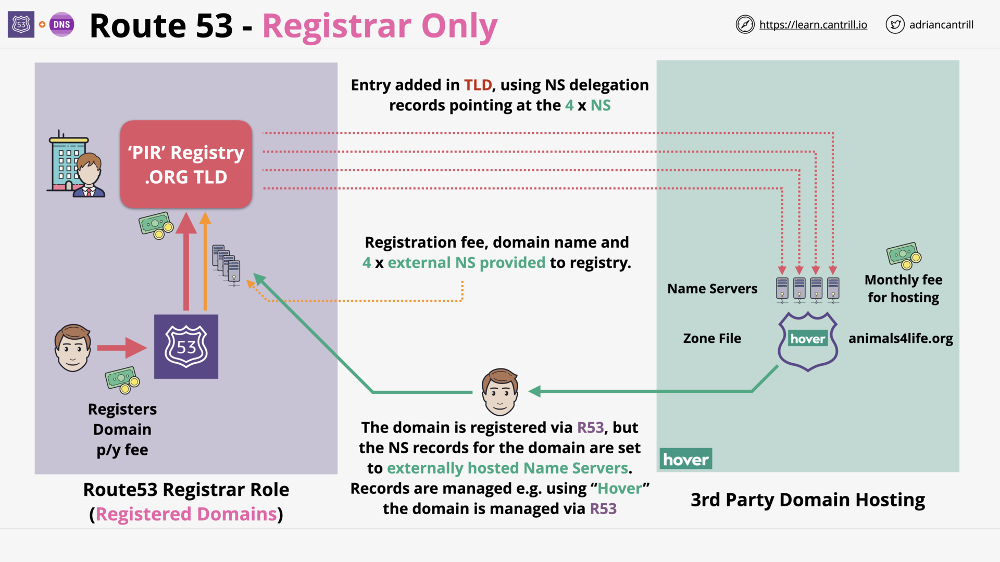
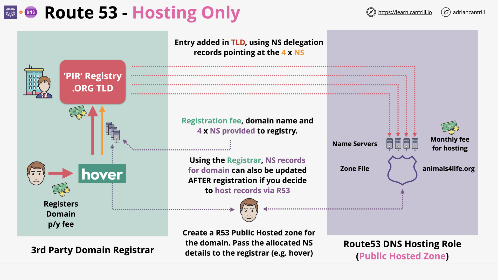

# ROUTE 53 - GLOBAL DNS

## R53 Hosted Zones

> [!NOTE] What is a Route53 Hosted Zone?
>
> A DNS database for a domain, e.g. animals4life.io
>
> - It's what the DNS system references for a domain.
> - In other words, hosted zone is the Authoritative nameserver of a domain.

## R53 Public Hosted Zones (6:28)

R53 Public Hosted Zones - Overview

> [!NOTE] How many nameservers does a Public Hosted Zone have?
>
> 4 Route53 nameservers

> [!NOTE] What is the accessibility of a R53 Public Zone?
>
> A R53 Public Zone can be accessed from:
>
> - the public internet
> - AWS VPCs.

> [!NOTE] For a Public Hosted Zone, what is the DNS query process of the AWS VPC?
>
> - VPC Instances are configured with the VPC `+2 Address` (R53 Resolver).
> - Any resources in the VPC can query public DNS and R53 Public Hosted Zones record.

R53 Public Hosted Zones - Example

## R53 Private Hosted Zones (5:10)

R53 Private Hosted Zones - Overview

> [!NOTE] What is the accessibility of a R53 Private Hosted Zone?
>
> A R53 Private Hosted Zone can only be accessed by the VPCs (which with it is associated).
>
> - These VPCs can be from the same account or different accounts.
> - The public internet cannot access R53 Private Hosted Zones.

R53 Private Hosted Zones - Example

## [R53 Split View](https://docs.aws.amazon.com/Route53/latest/DeveloperGuide/hosted-zone-private-considerations.html#hosted-zone-private-considerations-split-view-dns) Hosted Zones

R53 Split View Hosted Zones

> [!NOTE] What is R53 split-view DNS?
>
> Using the same domain name (`example.com`) for
>
> - internal uses (`accounting.example.com`)
> - external uses, such as your public website (`www.example.com`)
>
> Or even using the same sub-domain for both public (external) and internal usage.

## CNAME vs R53 Alias (5:19)

`CNAME` record - Problem

> [!NOTE] What is `CNAME` record?
>
> A `CNAME` record:
>
> - maps _DNS queries for the name of the current record_, such as `acme.example.com`
> - to:
>   - another domain (`example.com` or `example.net`)
>   - or subdomain (`acme.example.com` or `zenith.example.org`).

R53 `alias` record

> [!NOTE] What is `alias` record?
>
> Amazon Route 53 `alias` record is a Route 53–specific extension to DNS functionality.

> [!NOTE] What does R53 `alias` record do?
>
> R53 `alias` record:
>
> - route traffic _**to** selected AWS resources_, such as
>
>   - CloudFront distributions
>   - Amazon S3 buckets.
>
> - route traffic _from one record_ in a hosted zone _to another record_.

> [!NOTE] Why use R53 `alias` record?
>
> - Unlike a CNAME record, we can create an R53 `alias` record at the top node of a DNS namespace, also known as the `zone apex`.
>
>   e.g. DNS name `example.com`:
>
>   - We can't create a `CNAME` record for `example.com`
>   - But we can create a R53 `alias` record for `example.com` that routes traffic to `www.example.com`.
>
> - We can use a R53 `alias` record to route traffic to many AWS resources.
>
>   Many AWS resources don't have a static IP address. They only have a DNS name, e.g. `lb1-1234.us-east-1.elb.amazonaws.com`
>
>   With R53 `alias` record, we can route directly traffic to these DNS name, without allocating an additional [Elastic IP address](https://docs.aws.amazon.com/AWSEC2/latest/UserGuide/elastic-ip-addresses-eip.html).

## Simple Routing (2:17)

> [!NOTE] What is R53 `Simple Routing`?
>
> Routing traffic to a single resource, for example, to a web server for your website.

> [!NOTE] What is the drawback of R53 `Simple Routing`?
>
> `Simple Routing` doesn't support health check.

## R53 Health Checks (12:41)

R53 Health Check - Overview

R53 Distributed Health Checkers

## Failover Routing (1:53)

R53 Failover Routing

> [!NOTE] What is `Failover Routing`?
>
> Routing traffic
>
> - to a resource when the resource is healthy
> - or to a different resource when the first resource is unhealthy

## [_DEMO_] Using R53 and Failover Routing-PART1 (16:41)

## [_DEMO_] Using R53 and Failover Routing-PART2 (6:28)

## Multi Value Routing (2:32)

R53 Multi Value Routing

> [!NOTE] Can R53 `Simple Routing` return multi values?
>
> Yes.

> [!NOTE] What is the different between `Simple Routing` and `Multi Value Routing`?
>
> - With `Simple Routing`, a hosted zone can have _**a record** that have **multi values**_.
> - With `Multi Value Routing`, a hosted zone can have _**multiple records** with the **same name**_

## [Weighted Routing](https://docs.aws.amazon.com/Route53/latest/DeveloperGuide/routing-policy-weighted.html) (3:24)

R53 Weighted Routing

> [!NOTE] What is Weighted Routing?
>
> Associating multiple resources with
>
> - a single domain name (example.com)
> - or subdomain name (acme.example.com) and
>
> and choose how much traffic is routed to each resource.

## [Latency-based Routing](https://docs.aws.amazon.com/Route53/latest/DeveloperGuide/routing-policy-latency.html) (2:44)

> [!NOTE] What is Latency-based Routing?
>
> Routing traffic to the AWS Region that provides the lowest latency.

## [Geolocation Routing](https://docs.aws.amazon.com/Route53/latest/DeveloperGuide/routing-policy-geo.html) (5:02)

> [!NOTE] What is Geolocation Routing?
>
> Routing traffic based on the geographic location of users:
>
> - to localize content
> - to restrict distribution of content
> - ...

## Geoproximity Routing (4:50)

> [!NOTE] What is Geoproximity Routing?
>
> Routing traffic based on the geographic location of users and our resources.
>
> A 'bias' can be applied to expand/shrink the size of the geographic region.

> [!NOTE] Compare `Latency-based Routing` - `Geolocation Routing` - `Geoproximity Routing`?

## R53 Interoperability (11:50)

Route 53: Registrar + Hosting

Route 53: Registrar Only

Route 53: Hosting Only

## [_DEMO_] Implementing DNSSEC using Route53 (17:43)

## Route53 Section Quiz
