# SERVERLESS AND APPLICATION SERVICES

## Architecture Deep Dive - PART1 (8:52)

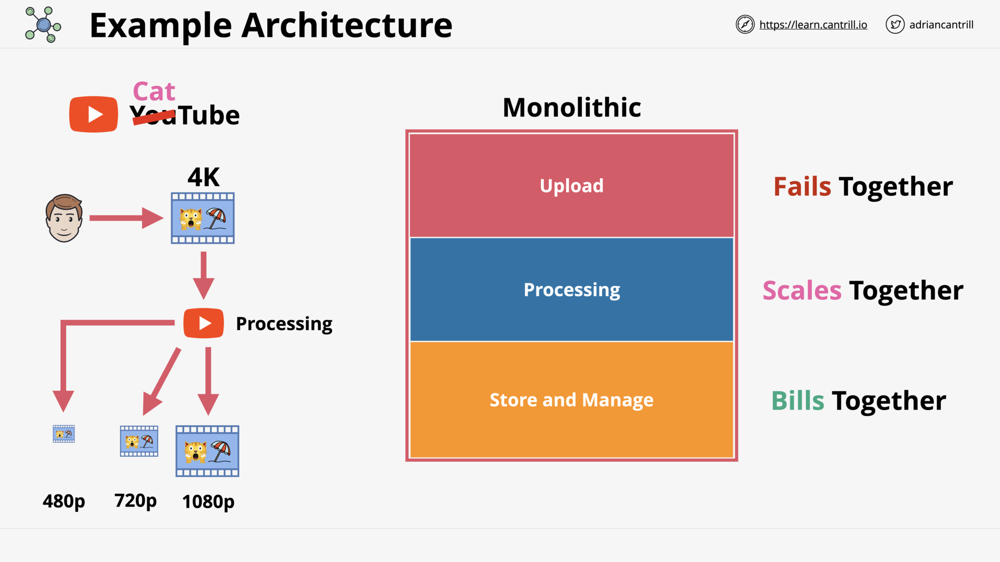
CatTube - Monolithic Architecture

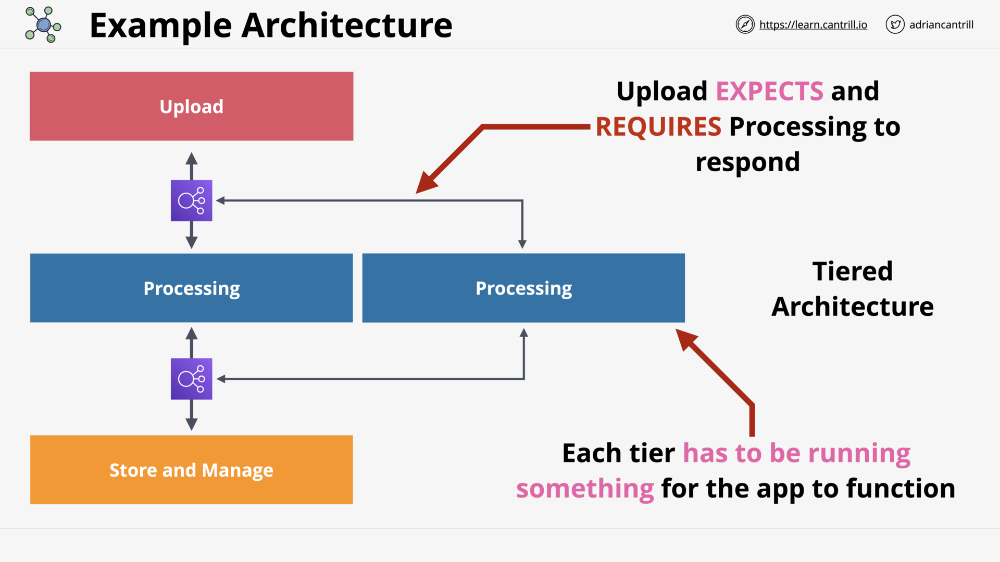
CatTube - Tiered Architecture

## Architecture Deep Dive - PART2 (13:09)

Evolving with Queues

Evolving with Queues

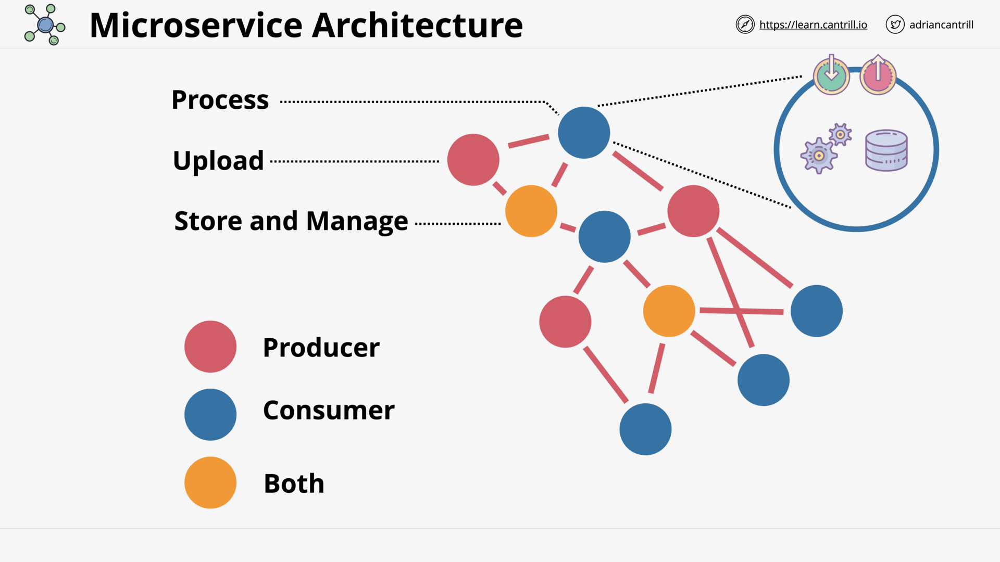
Microservices Architecture

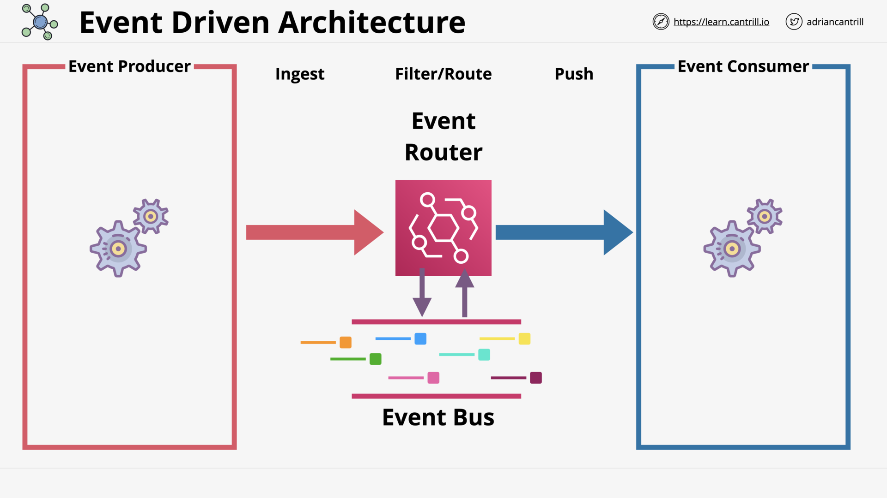
Event Driven Architecture - Event Producer / Event Consumer

Event Driven Architecture - Only consumes resources while handling events

## AWS Lambda - PART1 (11:25)

AWS Lambda - Overview

AWS Lambda - Architecture

> What is the maximum execution time of an AWS Lambda?
>
> 900s (15min)

AWS Lambda - Common Uses

## AWS Lambda - PART2 (13:59)

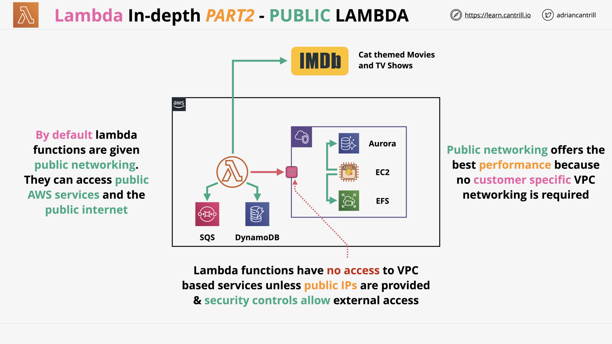
Public Lambda

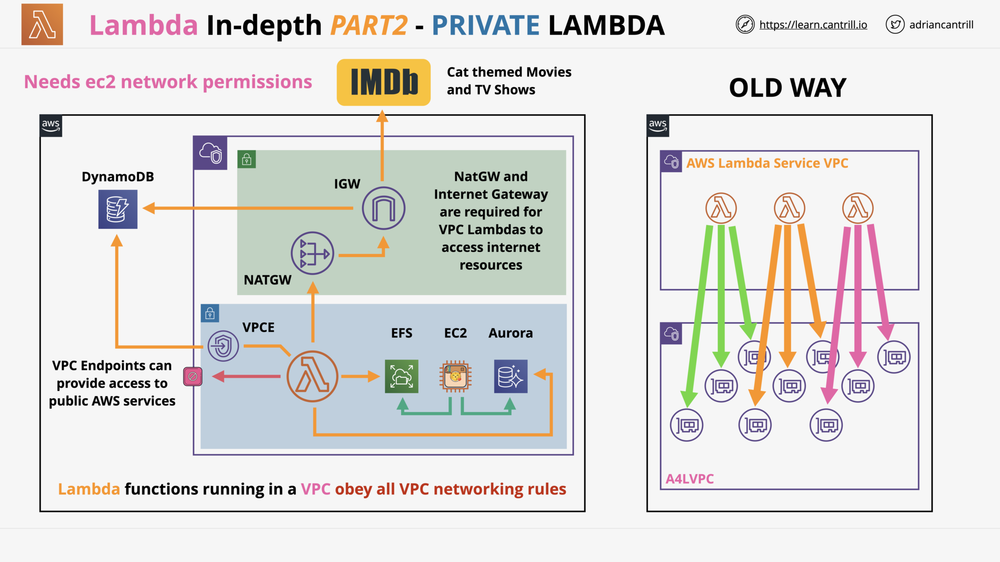
Private Lambda - Old Way

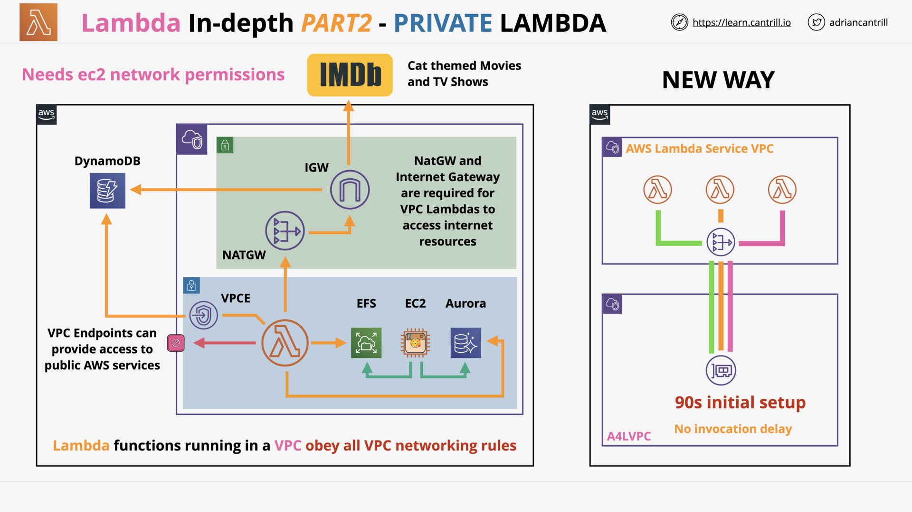
Private Lambda - New Way

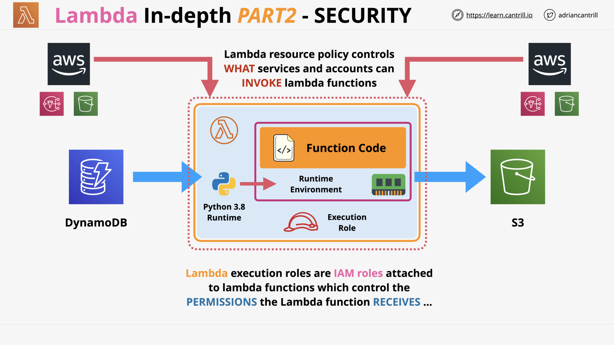
Lambda - Security

Lambda - Logging

## AWS Lambda - PART3 (17:03)

Lambda - 3 Types of Invocation

Lambda - Synchronous Invocation

Lambda - Asynchronous Invocation

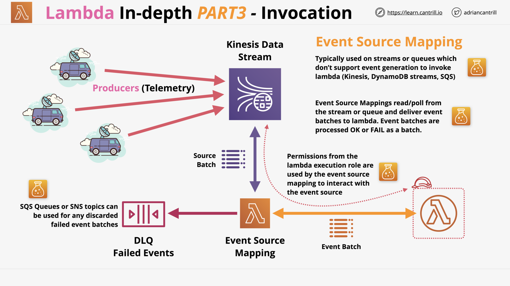
Lambda - Event Source Mapping

Lambda - Versions

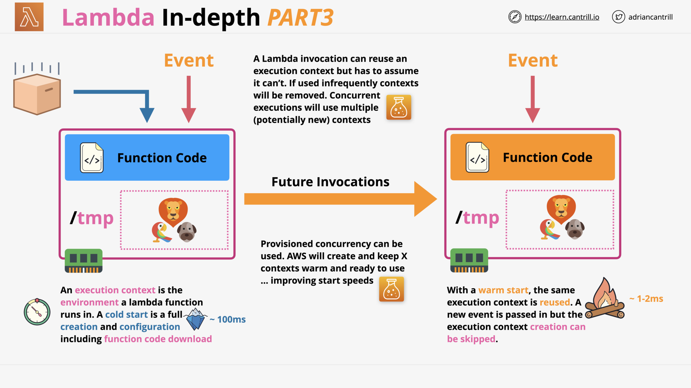
Lambda - Execution Context: Cold start ☃️ - Warm start 🌞

## CloudWatch Events and EventBridge (6:54)

EventBridge = CloudWatch Events v2

> Which type of events do CloudWatch Events and EventBridge process?
>
> Events generated by supported AWS services within an account.

> How many buses do CloudWatch Events and EventBridge have?
>
> - Both have a **default** Event bus:
>
>   - CloudWatch Events: 1
>
>     The default is the only bus CloudWatch Events has.
>
>   - EventBridge: 1+
>
>     In additional to the defaut event bus, EventBridge can have other event buses.

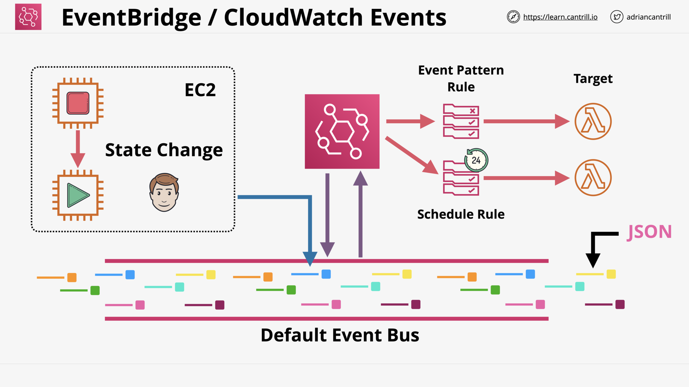
Rule & Target

> Which types of rules do CloudWatch Events and EventBridge support?
>
> - Event Pattern Rule üëà If `X` happens do `Z`.
> - Schedule Ruleüëà At `Y` time(s) do `Z`.

## [_DEMO_] Automated EC2 Control using Lambda and Events - PART1 (13:44)

## [_DEMO_] Automated EC2 Control using Lambda and Events - PART2 (18:49)

## Serverless Architecture (12:56)

What is serverless?

Serverless Architecture Example - PetTube

## Simple Notification Service (7:49)

SNS - Pub-Sub Service

> What is the maximum size of SNS message?
>
> 256KB

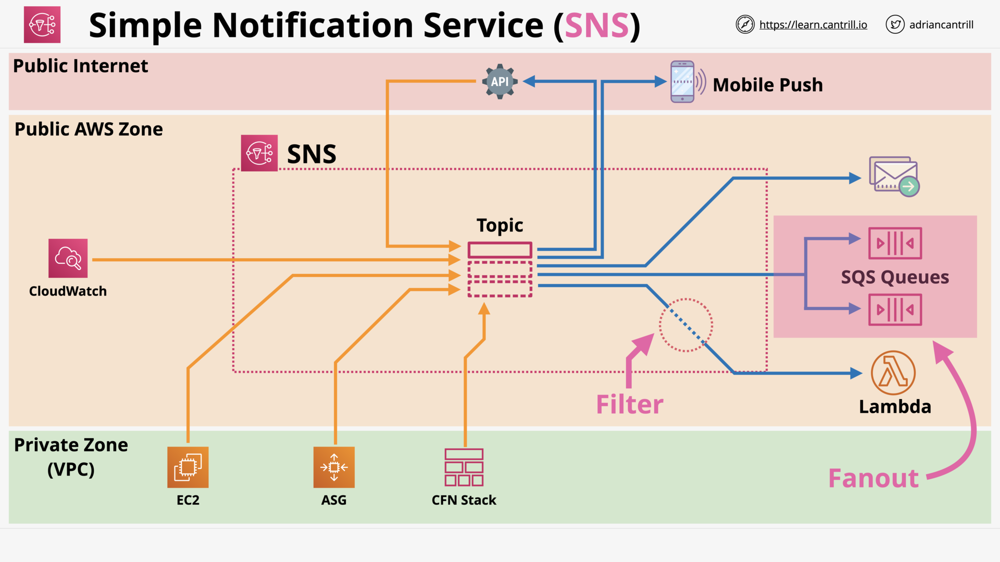
SNS - Architecture

SNS - Delivery Status/Retries

## Step Functions (16:09)

Lambda's Problems

Step Functions - State Machines

> What are the main concepts of AWS Step Functions?
>
> - _AWS Step Functions_ lets we coordinate individual **tasks** into a visual _workflow_, so you can build and update apps quickly.
>
>   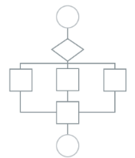
>
> - The _workflows_ we build with _Step Functions_ are called **state machines**.
> - Each _step_ of your _workflow_ is called a **state**.
>
>   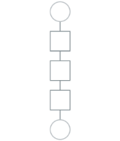
>
> - A **Task** (corresponding to a **state**) (a _"Step Function"_) represents a unit of work that another AWS service, such as AWS Lambda, performs.
>
>   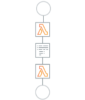

Step Functions - States

Step Functions - Example Architecture

## API Gateway 101 (16:27)

API Gateway - 101

API Gateway - Overview

API Gateway - Authentication

API Gateway - Endpoint Types

API Gateway - Stages

API Gateway - Errors

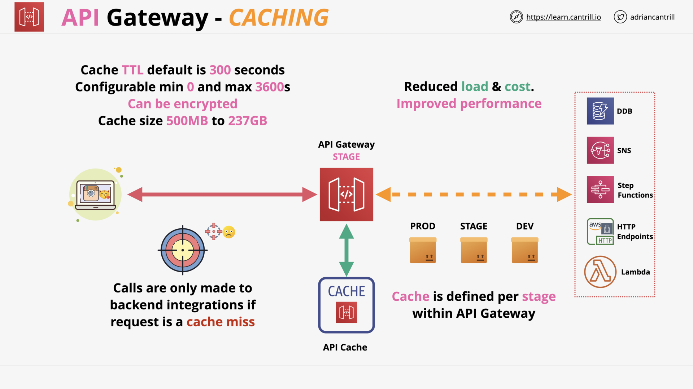
API Gateway - Caching

## [_MINI_PROJECT_] Build A Serverless App - Pet-Cuddle-o-Tron - PART1 (5:01)

## [_MINI_PROJECT_] Build A Serverless App - Pet-Cuddle-o-Tron - PART2 (8:24)

## [_MINI_PROJECT_] Build A Serverless App - Pet-Cuddle-o-Tron - PART3 (12:31)

## [_MINI_PROJECT_] Build A Serverless App - Pet-Cuddle-o-Tron - PART4 (13:31)

## [_MINI_PROJECT_] Build A Serverless App - Pet-Cuddle-o-Tron - PART5 (12:55)

## [_MINI_PROJECT_] Build A Serverless App - Pet-Cuddle-o-Tron - PART6 (2:39)

## Simple Queue Service (15:30)

SQS - Overview

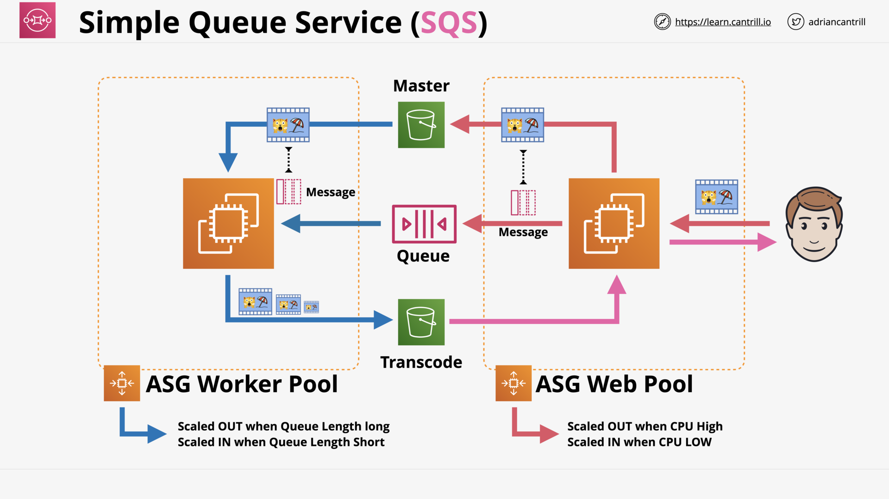
SQS - Architecture

SQS & SNS - Architecture

SQS - Recap

## SQS Standard vs FIFO Queues (3:29)

SQS - Standard vs FIFO Queues

## SQS Delay Queues (4:38)

SQS Visibility Timeout vs SQS Delay Queues

> What is [SQS Visibility Timeout](https://docs.aws.amazon.com/AWSSimpleQueueService/latest/SQSDeveloperGuide/sqs-delay-queues.html)?
>
> - While a SQS message is processing, it won't be visible in the SQS queue.
> - After the message are processed,
>   - It needs to be explicitly delete from the queue
>   - or it will reappear on the queue after the `Visibility Timeout`.

> What is the default value of SQS Visibility Timeout?
>
> 30s.
>
> It can be varied from 0s -> 12h.

> What is [SQS Delay Queues](https://docs.aws.amazon.com/AWSSimpleQueueService/latest/SQSDeveloperGuide/sqs-delay-queues.html)?
>
> For an SQS queue which has `DelaySeconds` set, after the messages added to the queue, they will be invisible for `DelaySeconds`.

> What is the limit of SQS `DelaySeconds`?
>
> 0s -> 15m

## SQS Dead-Letter Queues (DLQ) (4:17)

SQS Dead-Letter Queues

> What is [SQS DLQ](https://docs.aws.amazon.com/AWSSimpleQueueService/latest/SQSDeveloperGuide/sqs-dead-letter-queues.html)?
>
> The queue which stores messages that can't be processed (consumed) successfully.

## Kinesis Data Streams (7:52)

Kinesis - Concept

Kinesis - Architecture

SQS vs Kinesis

## Kinesis Data Firehose (9:11)

Kinesis Data Firehose - Overview

Kinesis Data Firehose - Architecture

> Can Kinesis Data Firehose offer real-time delivery?
>
> No. Although Kinesis Data Firehose can receive data in realtime (200ms), it only delivery data in **NEAR realtime**.
>
> The messages are delivered when:
>
> - buffer is filled (1MB)
> - buffer interval passed (60s)

## Kinesis Data Analytics (8:51)

Kinesis Data Analytics - Overview

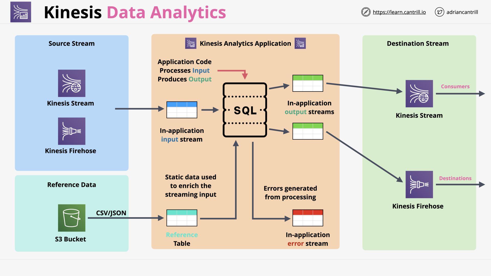
Kinesis Data Analytics - Architecture

Kinesis Data Analytics - When & Where?

## Kinesis Video Streams (5:09)

Kinesis Video Streams - Overview

Kinesis Video Streams - Architecture

## Amazon Cognito - User and Identity Pools (14:44)

Cognito - Overview

Cognito - User Pool (authenticate & authorize users to your _app_ or _API_)

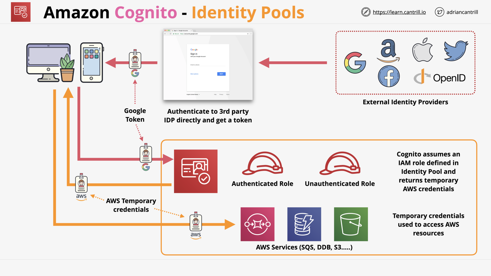
Cognito - Identity Pool (authorize authenticated/anonymous users to access your _AWS resources_)

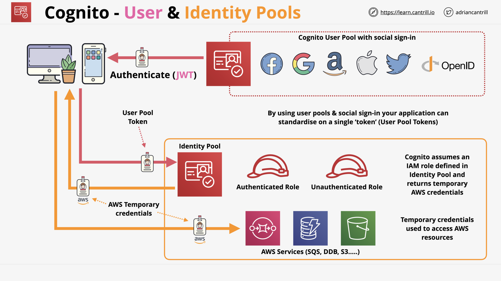
Cognito - User Pool & Identity Pool

## AWS Glue 101 (6:23)

AWS Glue - Serverless ETL

AWS Glue - Data Catalog

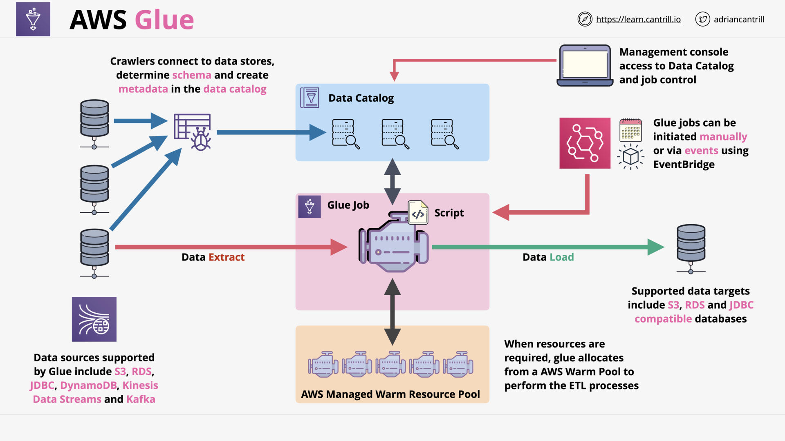
AWS Glue - Architecture

## Amazon MQ 101 (8:15)

Amazon MQ - Why?

Amazon MQ - What?

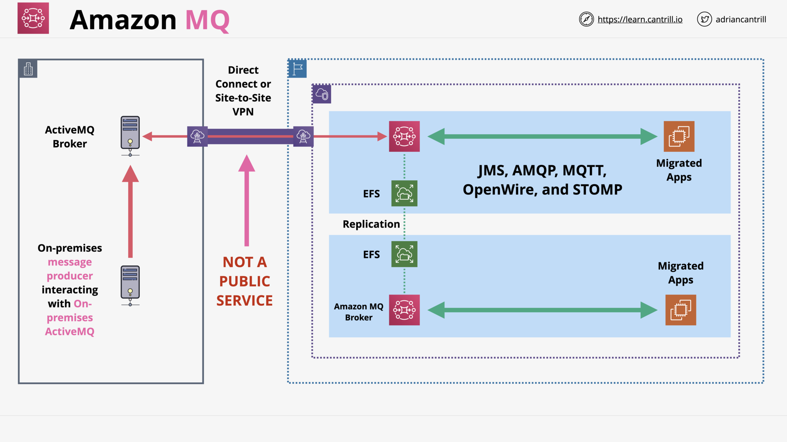
Amazon MQ - How?

Amazon MQ - When?

## Amazon AppFlow (3:30)

Amazon AppFlow - Overview

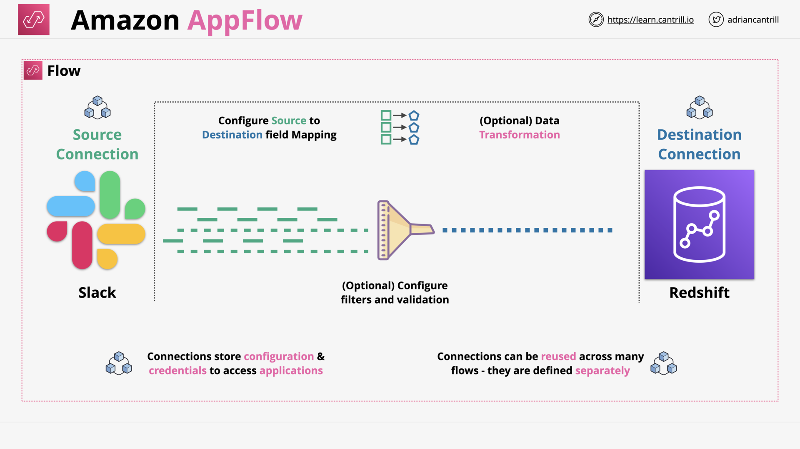
Amazon AppFlow - Architecture

## Serverless and App Services Section Quiz
