# GLOBAL CONTENT DELIVERY AND OPTIMIZATION

## CloudFront Architecture (14:56)

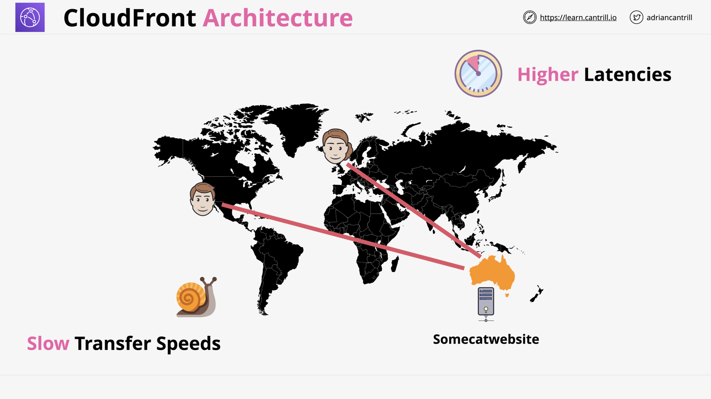
Which problems CloudFront solves?

CloudFront - Terms

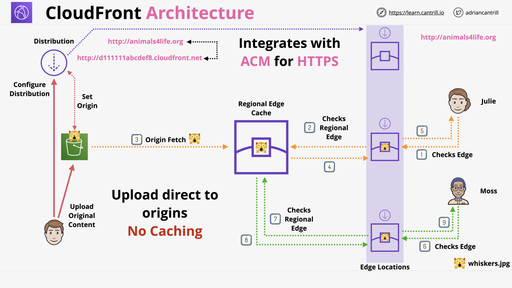
CloudFront - Regional Edge Cache & Edge Location

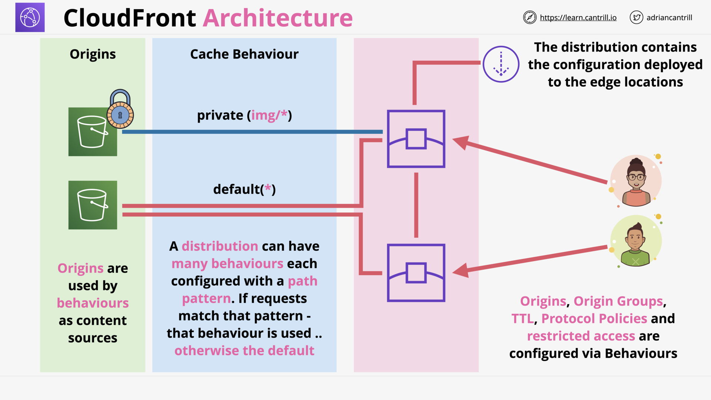
CloudFront - Distribution & Cache Behavior

## CloudFront (CF) - Behaviours (9:21)

CloudFront's [Cache behavior settings](https://docs.aws.amazon.com/AmazonCloudFront/latest/DeveloperGuide/distribution-web-values-specify.html)

## CloudFront - TTL and Invalidations (13:48)

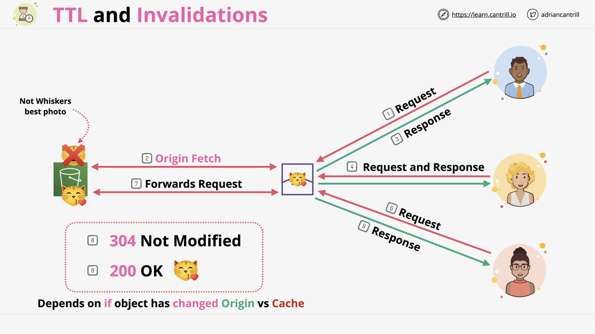
CloudFront - Cache Hit

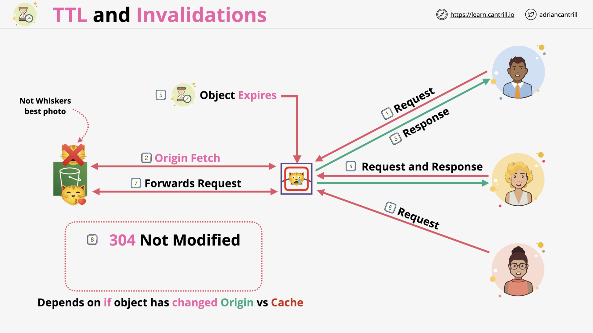
CloudFront - Stale Object

CloudFront - TTL

CloudFront - Invalidations

## ACM (11:21)

AWS Certificate Manager (ACM) - Overview

AWS Certificate Manager (ACM) - Certificates

AWS Certificate Manager (ACM) - Regional Service

> What types of services does ACM support?
>
> ACM supports: CloudFront, ALB.
>
> ACM does NOT support: EC2.

> Which region an ACM should be in?
>
> The same with AWS resources:
>
> - An ALB in `ap-southeast-1` needs a cert in ACM in `ap-southeast-1`.
> - CloudFront needs a cert in `us-east-1`. 👈 Global services are implicitly in `us-east-1`.

AWS Certificate Manager (ACM) - Architecture

## CloudFront and SSL/TLS (14:59)

CloudFront & SSL

CloudFront & SNI

> What is the problem between old browsers and SSL?
>
> Old browsers don't support SNI.

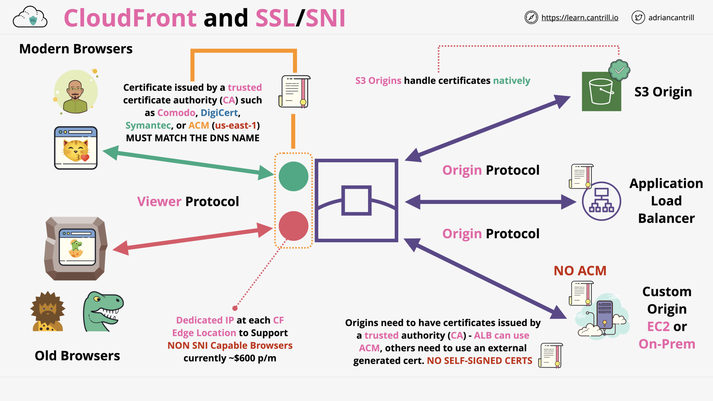
CloudFront & SSL/SNI

## CloudFront (CF) - Origin Types & Origin Architecture (10:20)

CloudFront distributions supports [various origins](https://docs.aws.amazon.com/AmazonCloudFront/latest/DeveloperGuide/DownloadDistS3AndCustomOrigins.html).

CloudFront [Origin Settings](https://docs.aws.amazon.com/AmazonCloudFront/latest/DeveloperGuide/distribution-web-values-specify.html#DownloadDistValuesOrigin)

## [_DEMO_] CloudFront (CF) - Adding a CDN to a static Website-PART1 (16:23)

## [_DEMO_] CloudFront (CF) - Adding a CDN to a static Website-PART2 (12:24)

## [_DEMO_] CloudFront (CF) - Adding an Alternate CNAME and SSL (11:12)

## Securing CF and S3 using OAI (8:50)

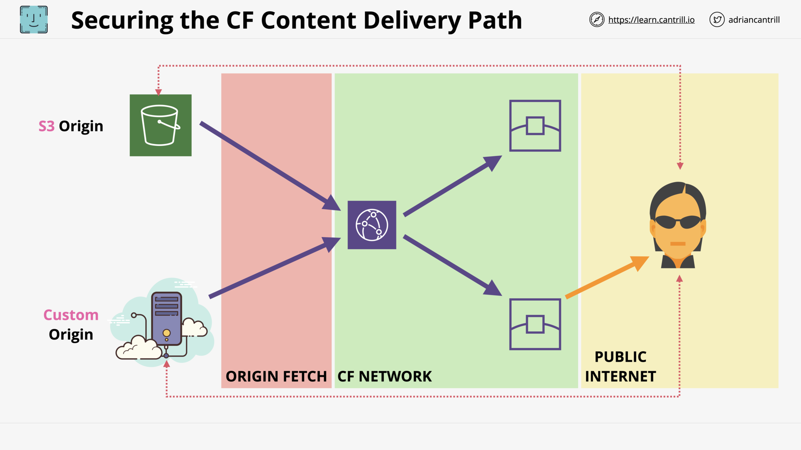
Securing CF Content Delivery Path

Origin Access Identity (OAI)

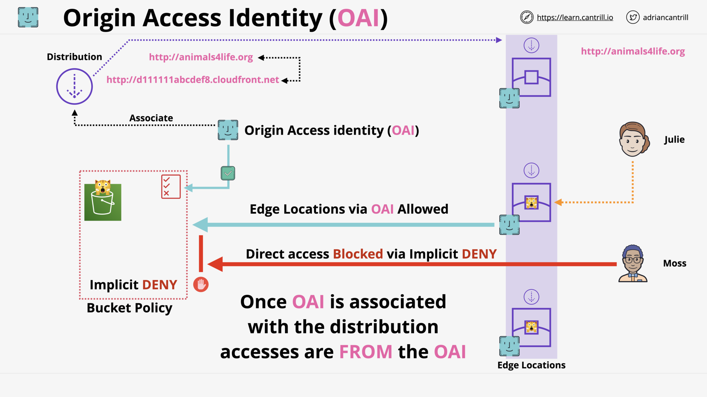
OAI - In Action

> ⚠️ AWS has introduced [OAC](https://aws.amazon.com/blogs/networking-and-content-delivery/amazon-cloudfront-introduces-origin-access-control-oac/) to replace OAI.
>
> [Docs](https://docs.aws.amazon.com/AmazonCloudFront/latest/DeveloperGuide/private-content-restricting-access-to-s3.html#private-content-restricting-access-to-s3-oai)

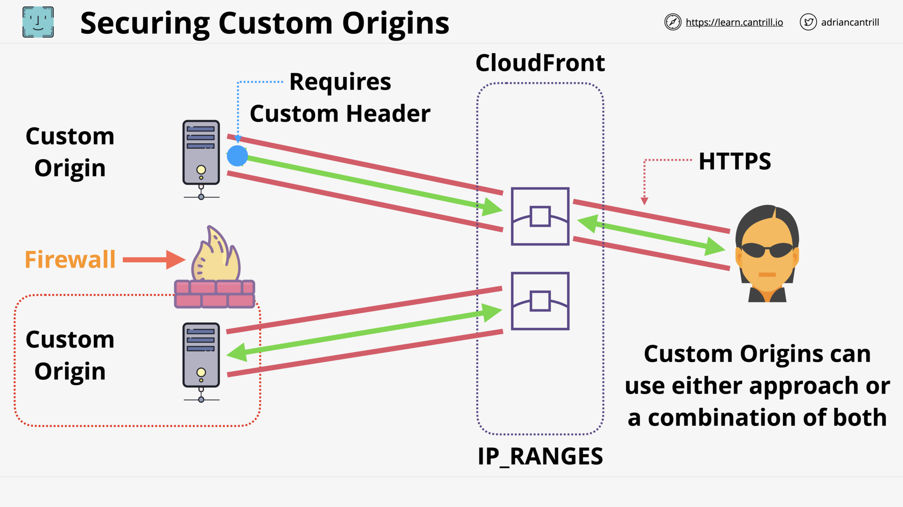
Securing Custom Origins

## CloudFront - Private Distribution & Behaviours (7:49)

Private Distributions (\*behaviours)

CloudFront Signed URLs 🔗 vs Cookies 🍪

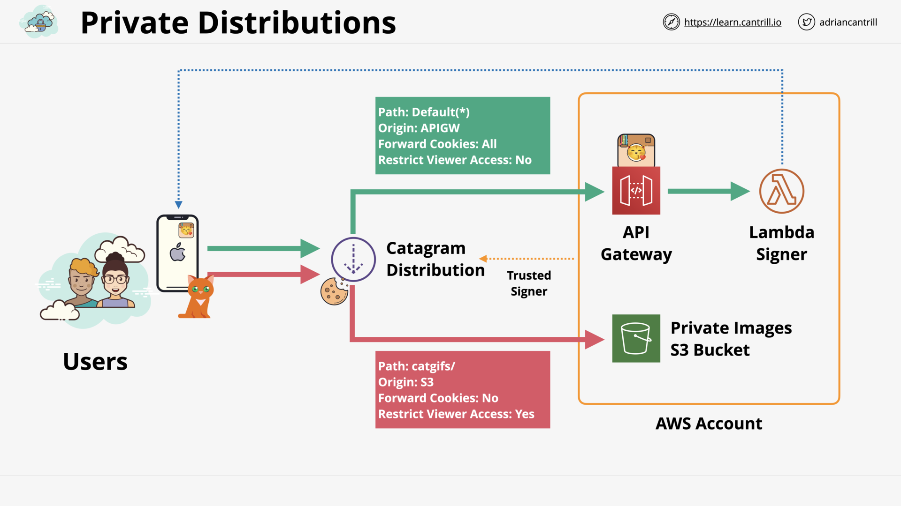
Private Distributions - Architecture

## [_DEMO_] CloudFront (CF) - Using Origin Access Control (OAC) (new version of OAI) (11:21)

## Lambda@Edge (8:03)

Lambda@Edge - Overview

Lambda@Edge - Architecture

Lambda@Edge - Use Cases ([More](https://docs.aws.amazon.com/AmazonCloudFront/latest/DeveloperGuide/lambda-examples.html#lambda-examples-redirecting-examples))

## Global Accelerator (10:29)

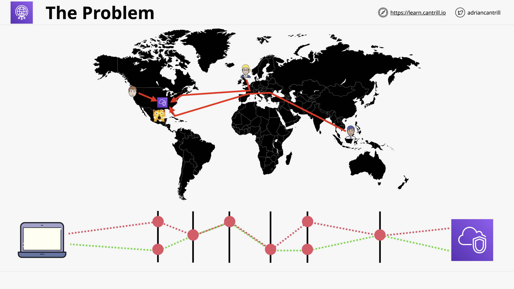
Global Accelerator - The Problem

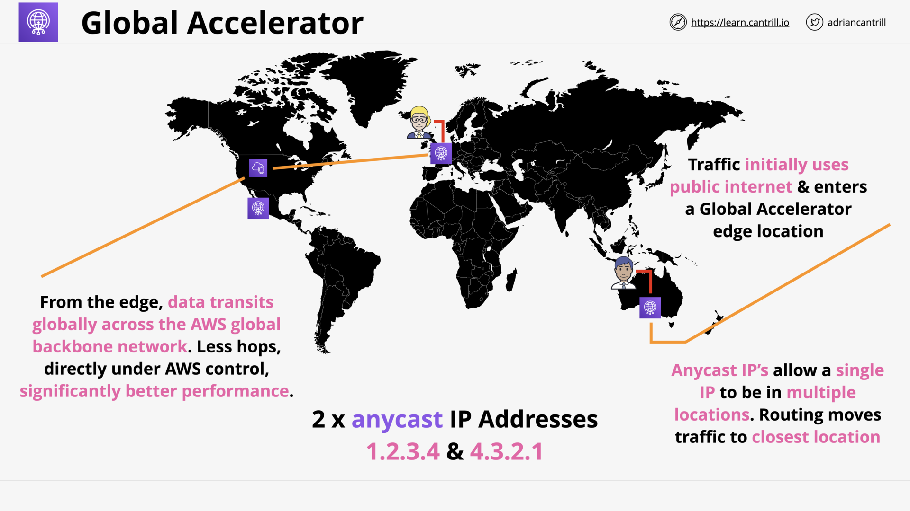
Global Accelerator - Use Anycast to route traffic to AWS global backbone network

> What is anycast?
>
> **Anycast** is a _network addressing and routing_ method in which incoming requests can be routed to a variety of different locations (called “nodes”).
>
> Anycast IP allow a _single IP to be in multiple locations_.

Global Accelerator - Key Concepts

## CloudFront Field-Level Encryption

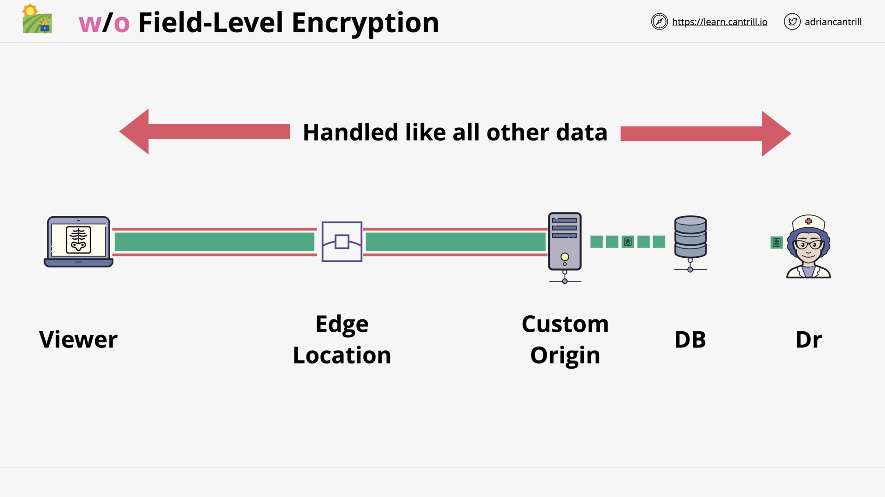
CloudFront - Without Field-Level Encryption

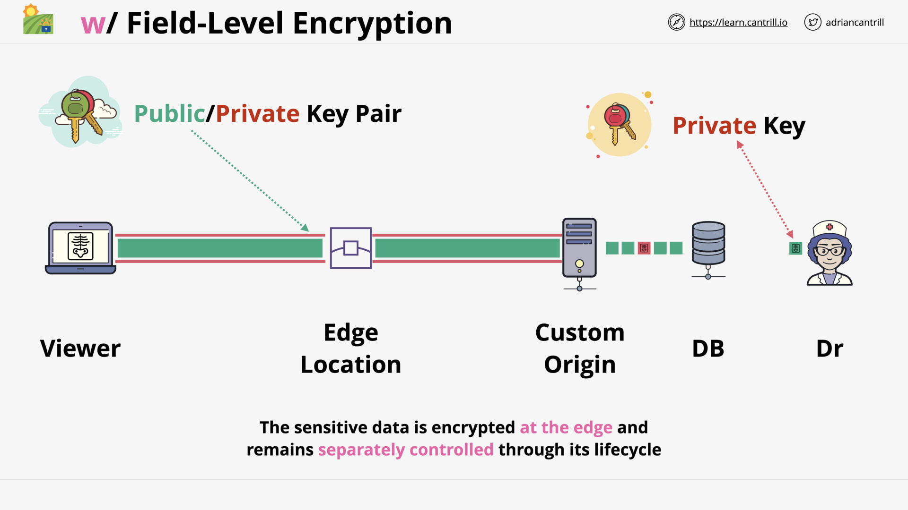
CloudFront - With Field-Level Encryption

> What does Field-Level Encryption do?
>
> Field-level encryption allows you to enable your users to securely upload sensitive information to your web servers.
>
> ([Docs](https://docs.aws.amazon.com/AmazonCloudFront/latest/DeveloperGuide/field-level-encryption.html))

## [CloudFront Geo Restriction](https://docs.aws.amazon.com/AmazonCloudFront/latest/DeveloperGuide/georestrictions.html) (Geo-blocking)

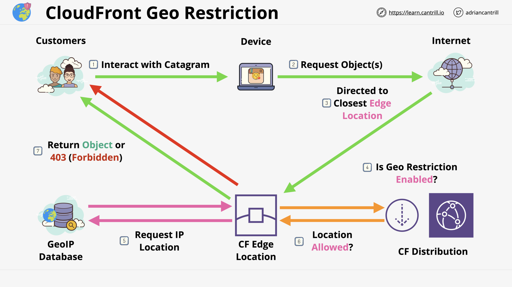
[CloudFront Geo Restriction](https://docs.aws.amazon.com/AmazonCloudFront/latest/DeveloperGuide/georestrictions.html#georestrictions-cloudfront)

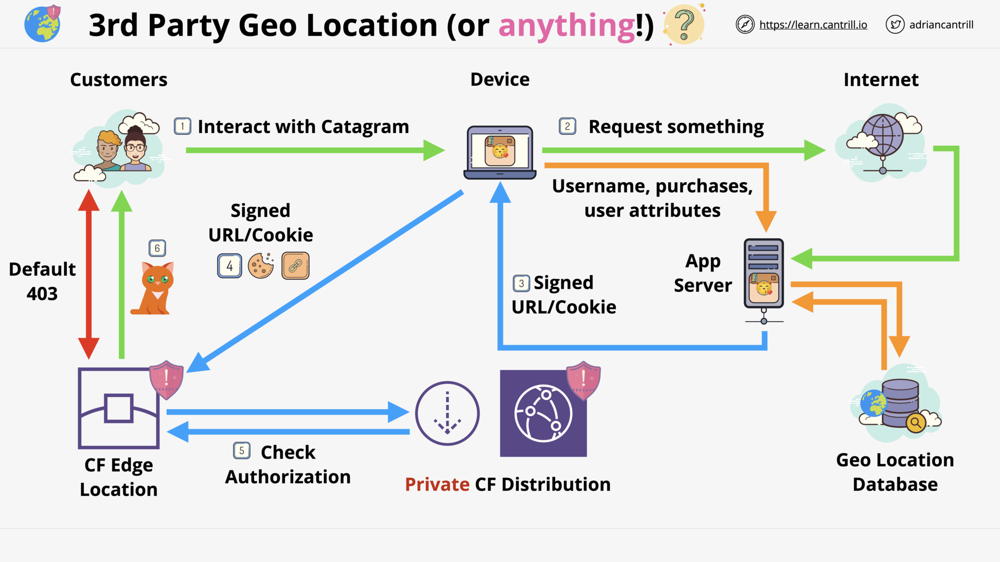
[3rd-Party GeoLocation Service](https://docs.aws.amazon.com/AmazonCloudFront/latest/DeveloperGuide/georestrictions.html#georestrictions-geolocation-service)

## CDN and Optimisation Section Quiz
