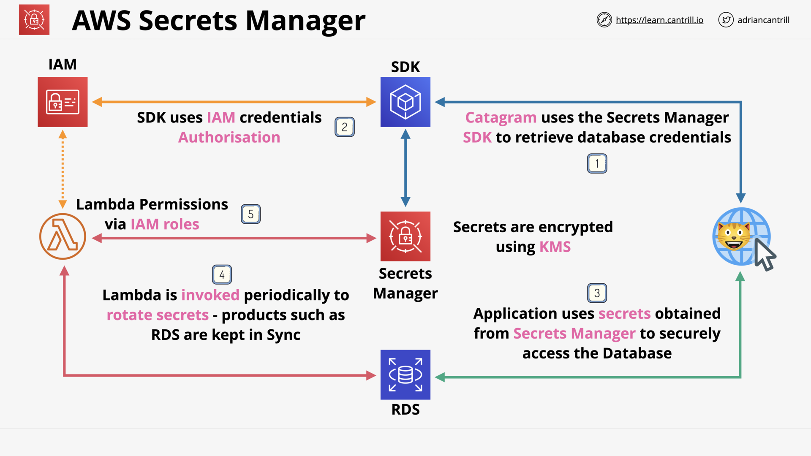
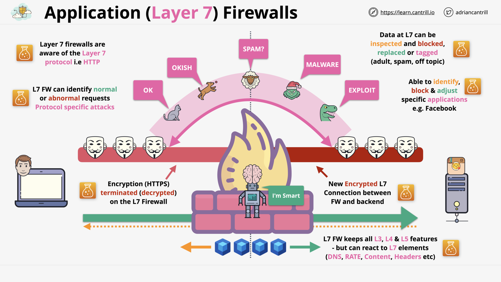
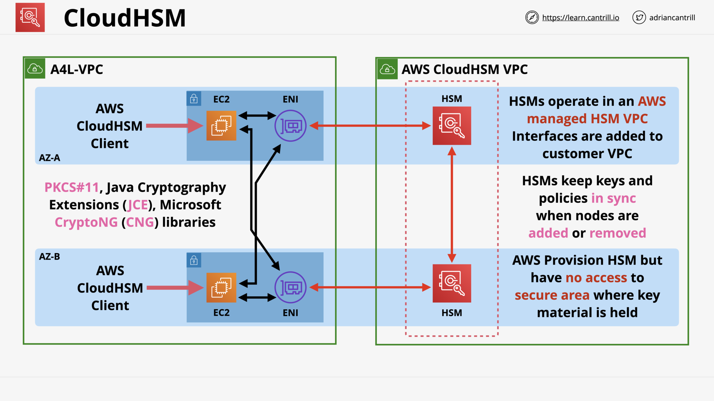
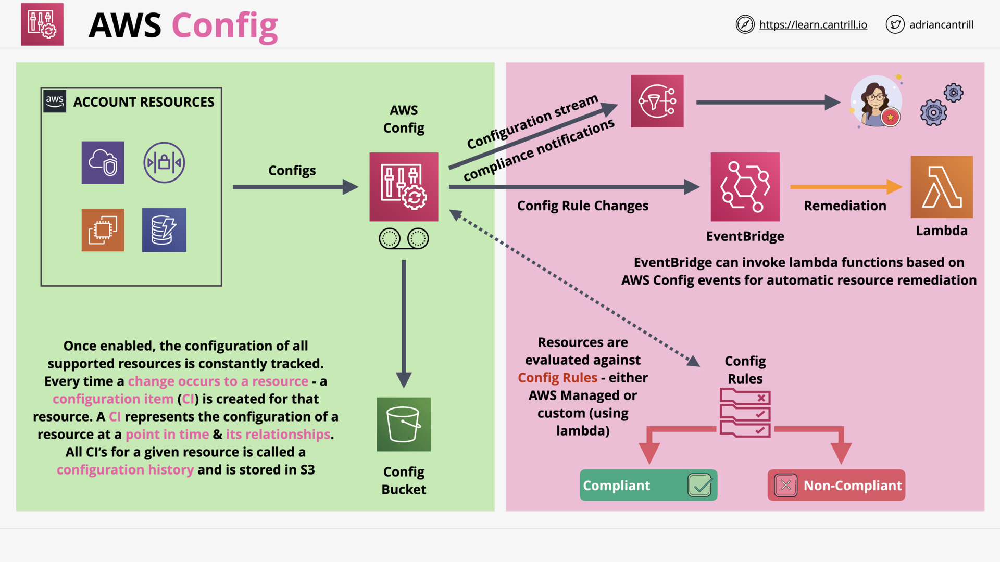
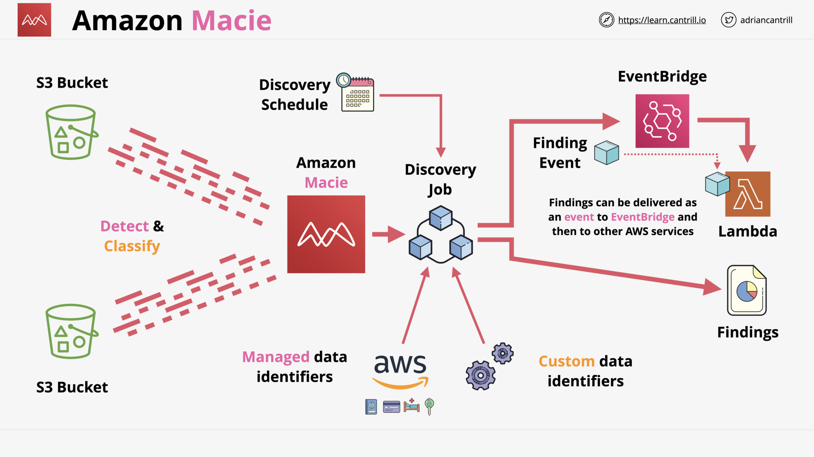
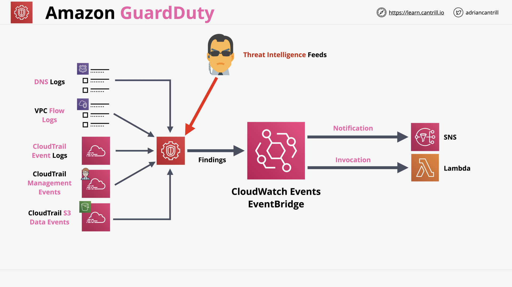

# SECURITY, DEPLOYMENT & OPERATIONS

## AWS Secrets Manager (7:44)

Secrets Manager vs System Manager's Parameter Store

AWS Secrets Manager - Architecture

## Application Layer (L7) Firewall (7:44)

Firewall - Layer 3-4-5

> What is the drawback of Firewall Layer 3-4?
>
> Packets & segemnts of REQUEST and REQUEST are different and unrelated.
>
> Because Layer 3-4 don't know what is the data.

> What is a big improve of Firewall Layer 5?
>
> Firewall Layer 5 understand REQUEST & RESPONSE's **session**, it can know which REQUEST and RESPONSE is a pair.

Firewall - Layer 7

> What does Firewall Layer 7 do?
>
> Firewall Layer 7 can:
>
> - understand HTTP/HTTPs.
> - and even decrypt the data (terminate TLS encryption) and encrypt again for the backend.
>
> 👉️ React to:
>
> - HTTP: Content, Headers, DNS, Rate...
> - SMTP: Mail metadata

## Web Application Firewall (WAF), WEBACLs, Rule Groups and Rules (19:18)

WAF - Architecture

WAF - Web ACL

WAF - Rule Groups

WAF - Rules (Type - Statement - Action)

WAF - Pricing

## AWS Shield (9:47)

AWS Shield - DDOS Protection

AWS Shield - Standard - Free - L3/L4

AWS Shield - Advanced - Pricing & Benefit

AWS Shield - Advanced - WAF Integration (L7) - Realtime + Health-based

## CloudHSM (14:36)

CloudHSM - Overview

CloudHSM - Architecture

CloudHSM - Use Cases

## AWS Config (6:14)

AWS Config - Record config changes over time on resources

AWS Config - Architecture

## Amazon Macie (12:04)

Amazon Macie - Data Security for S3

Amazon Macie - Architecture

Amazon Macie - Identifiers (AWS-managed / Custom)

Amazon Macie - Findings (Policy / Sensitive data)

## [_DEMO_] Amazon Macie (15:35)

## Amazon Inspector (6:28)

Amazon Inspector - Scan EC2 Instance + OS / Containers

Amazon Inspector - Agentless & Agent

Amazon Inspector - CVE, CIS, Security Best Practices

## Amazon GuardDuty (4:14)

Amazon GuardDuty - Security Monitoring Service (with AI/ML)

Amazon GuardDuty - Architecture

## Section Quiz
