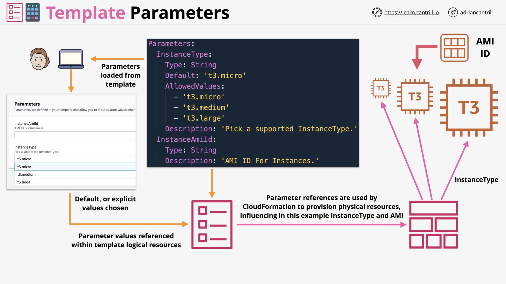
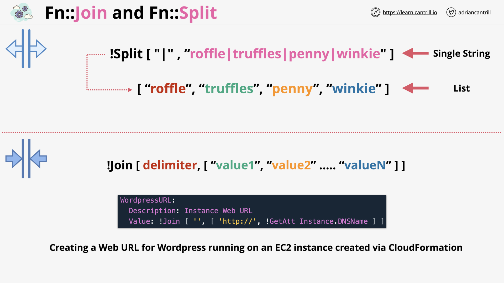
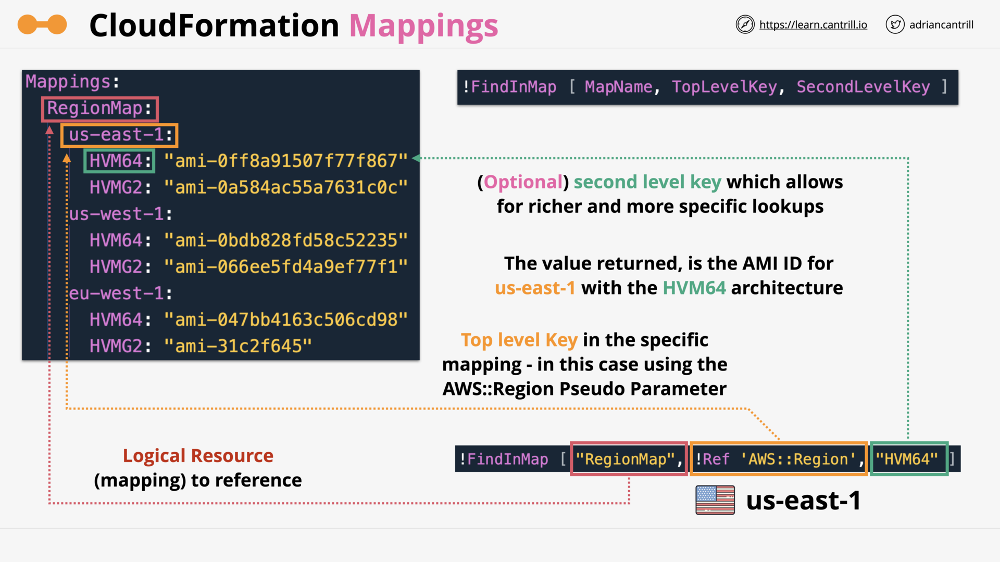
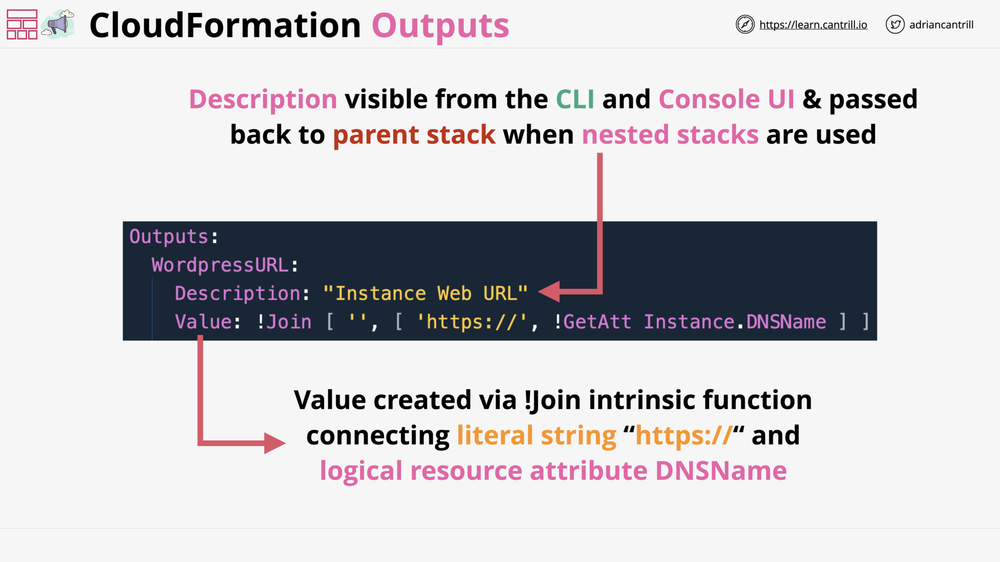
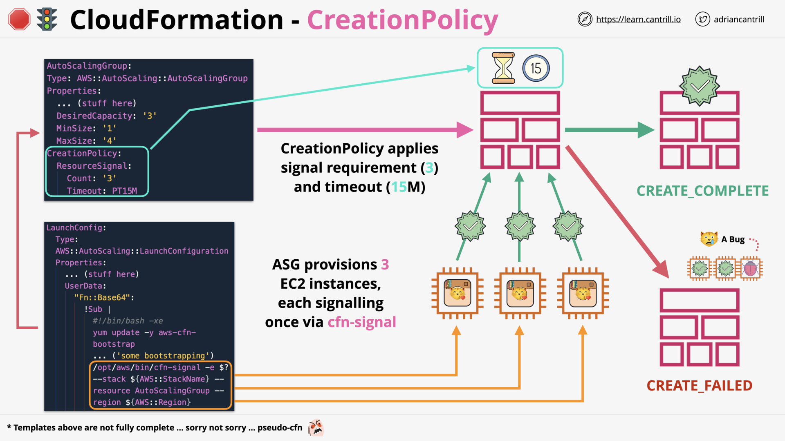
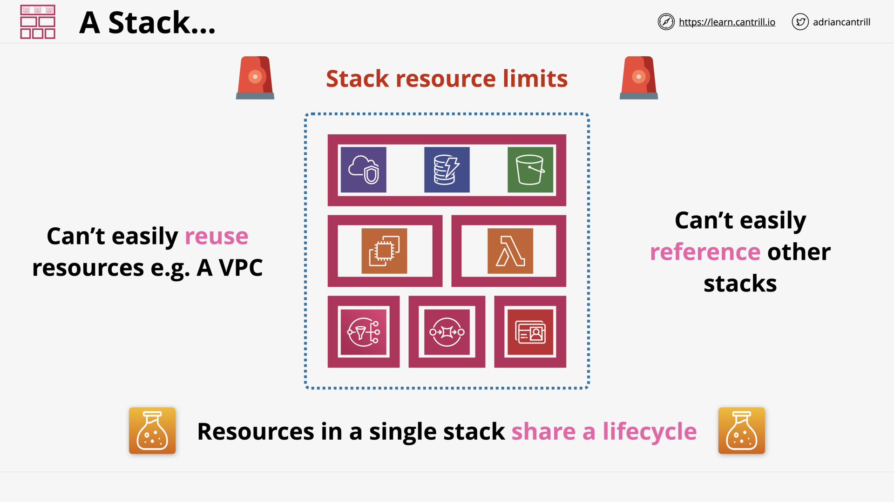
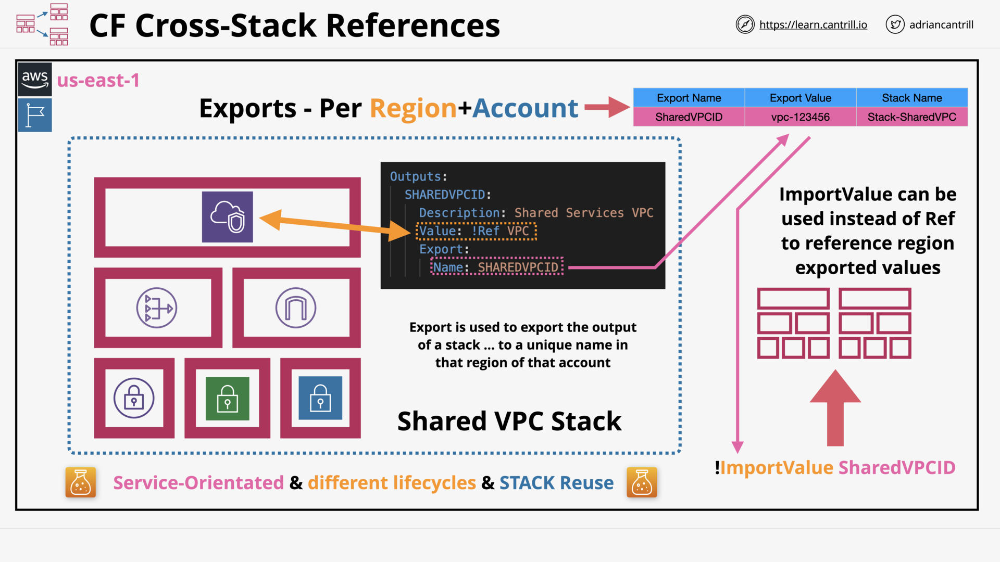
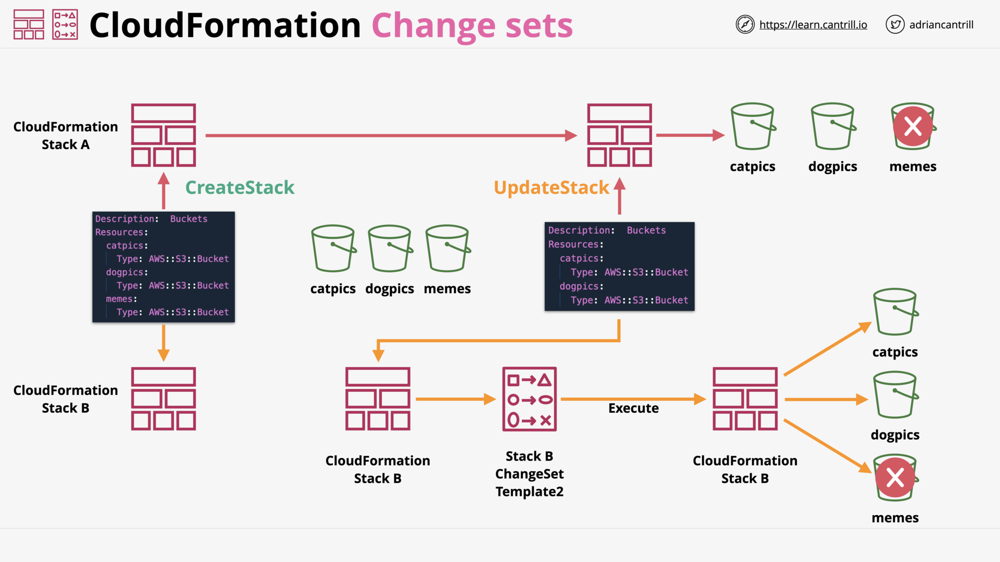
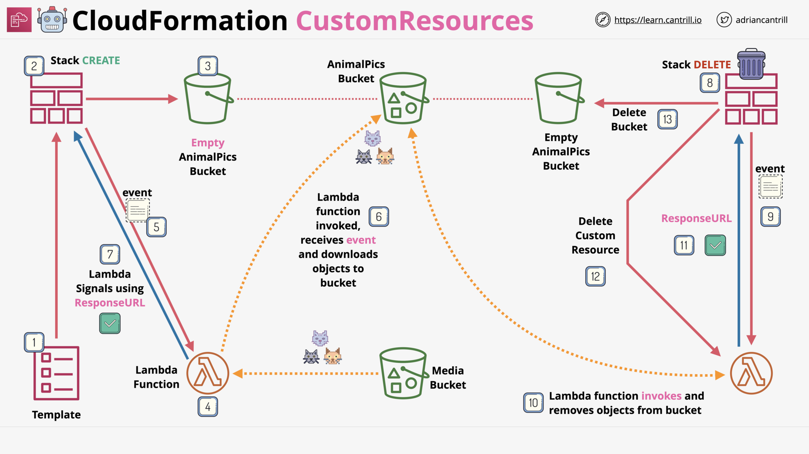

# INFRASTRUCTURE AS CODE (CLOUDFORMATION)

## CloudFormation Physical & Logical Resources (7:30)

Physical Resource / Logical Resource - Template - Stack

CloudFormation - Architecture

CloudFormation - Stack Create/Update/Delete

## [_DEMO_] Simple Non Portable Template - PART1 (10:28)

## [_DEMO_] Simple Non Portable Template - PART2 (11:28)

## CloudFormation Template and Pseudo Parameters (6:53)

Template/Pseudo Parameters - Overview

Template Parameters - Input for Cfn Template

[Pseudo Parameters](https://docs.aws.amazon.com/AWSCloudFormation/latest/UserGuide/pseudo-parameter-reference.html) - Provided by AWS based on the **Stack** environment

> [!NOTE] What are the difference between _Cfn - **Pseudo Parameters**_ and _AWS Systems Manager - **public parameters**_
>
> - _Cfn - **Pseudo Parameters**_: Parameters predefined by AWS CloudFormation
>
> - _AWS Systems Manager - **public parameters**_: Common artifacts published by some AWS services:
>   - EC2: Information about AMIs:
>     - `ami-amazon-linux-latest`
>     - `ami-windows-latest`
>
>   - ECS: `/aws/service/ecs/optimized-ami/amazon-linux-2/recommended`
>   - EKS: `/aws/service/eks/optimized-ami/1.14/amazon-linux-2/recommended`
>   - AWS:
>     - Services
>     - Regions
>     - Availability Zone
>     - ...

## CloudFormation Intrinsic Functions (14:28)

Cfn - [Intrinsic Functions](https://docs.aws.amazon.com/AWSCloudFormation/latest/UserGuide/intrinsic-function-reference.html)

Cfn Intrinsic Functions: `Ref` & `Fn::GetAtt`

Cfn Intrinsic Functions: `Fn:GetAZs` & `Fn:Select`

Cfn Intrinsic Functions: `Fn:Join` & `Fn:Split`

Cfn Intrinsic Functions: `Fn:Base64` & `Fn:Sub`

Cfn Intrinsic Functions: `Fn:Cidr`

## CloudFormation Mappings (4:30)

Cfn Mappings (Template): [`Mappings` section](https://docs.aws.amazon.com/AWSCloudFormation/latest/UserGuide/mappings-section-structure.html)  

Cfn Mappings: [`Fn::FindInMap`](https://docs.aws.amazon.com/AWSCloudFormation/latest/UserGuide/intrinsic-function-reference-findinmap.html)

## CloudFormation Outputs (3:37)

Cfn [Outputs (Template)](https://docs.aws.amazon.com/AWSCloudFormation/latest/UserGuide/outputs-section-structure.html): Views in CLI/Console - Used by parent-stack, cross-stack

Cfn Outputs: Example

## [_DEMO_] Template v2 - Portable (13:34)

## CloudFormation Conditions (7:24)

Cfn Conditions (Template): Only create resources if conditions meet

Cfn Conditions: Example

## CloudFormation DependsOn (7:14)

Cfn [DependsOn (Resource)](https://docs.aws.amazon.com/AWSCloudFormation/latest/UserGuide/aws-attribute-dependson.html): Explicitly define resources dependency order

Cfn DependsOn: Example

## CloudFormation Wait Conditions, CreationPolicy & cfn-signal (11:52)

Cfn Provisioning - How do Cfn know that a resource successfully created/update?

[cfn-signal](https://docs.aws.amazon.com/AWSCloudFormation/latest/UserGuide/cfn-signal.html): Signals CloudFormation to indicate whether Amazon EC2 instances have been successfully created/updated

Cfn [Creation Policy (Resource)](https://docs.aws.amazon.com/AWSCloudFormation/latest/UserGuide/aws-attribute-creationpolicy.html): Tell Cfn to wait on resource configuration actions before stack creation proceeds.

Cfn [Wait Conditions (Template)](https://docs.aws.amazon.com/AWSCloudFormation/latest/UserGuide/using-cfn-waitcondition.html): Tell Cfn to pause the creation of a stack and wait for a signal before it continues to create the stack

## CloudFormation Nested Stacks (13:55)

Single Stack - The Problem

Cfn [Nested Stack](https://docs.aws.amazon.com/AWSCloudFormation/latest/UserGuide/using-cfn-nested-stacks.html): Stacks created as part of other stacks 👈️ Allow reusing template (code)

> [!NOTE] `Nested Stack`, `Root Stack`, `Parent Stack`?
>
> - _Nested Stack_: Stacks created as **part of other stacks**.
> - _Root Stack_: The **top-level stack** to which all the _nested stacks_ ultimately belong.
> - _Parent Stack_: Each nested stack has an immediate _parent stack_.
>
>   

Cfn Nested Stacks - When?

> [!NOTE] How are lifecycle of nested stacks?
>
> The root stacks and all of its nested stacks share the same lifecycle.

## CloudFormation Cross-Stack References (10:05)

Cfn Stacks are isolated and self-contained

Cfn `Outputs` `Export`: Make a stack visible to other stacks ([Cross-Stack References](https://docs.aws.amazon.com/AWSCloudFormation/latest/UserGuide/walkthrough-crossstackref.html))

Cfn Cross-Stack References - Fn::ImportValue: Import another stack's Outputs Export

## CloudFormation Deletion Policy (5:24)

Cfn DeletionPolicy - What happen to physical resource when its logical resource deleted?

Cfn DeletionPolicy - Delete (Default) / Retain / Snapshot (If supported)

## CloudFormation Stack Sets (9:12)

Cfn StackSets - [Concepts](https://docs.aws.amazon.com/AWSCloudFormation/latest/UserGuide/what-is-cfnstacksets.html)

Cfn StackSets - Architecture

Cfn StackSets - Key Points

## CloudFormation Stack Roles (6:47)

Cfn Stack Roles - Overview

> [!NOTE] ⚠️ The identity creating the stack doesn't need permissions for resources.
>
> It only needs permissions for:
>
> - creating the stack
> - `PassRole` to give Cfn the role with permissions for creating resources.

Cfn Stack Roles - Example

## CloudFormation Init (cfn-init) (8:48)

[cfn-init](https://docs.aws.amazon.com/AWSCloudFormation/latest/UserGuide/cfn-init.html): Overview

cfn-init: **config keys** - *configsets*

## CloudFormation cfn-hup (4:13)

cfn-init: The problem

[cfn-hup](https://docs.aws.amazon.com/AWSCloudFormation/latest/UserGuide/cfn-hup.html): Rerun config when change detected

> [!NOTE] What **cfn-hup** stands for?
>
> **cfn** **h**ot **up**date.

> [!NOTE] [Update behaviors of stack resources](https://docs.aws.amazon.com/AWSCloudFormation/latest/UserGuide/using-cfn-updating-stacks-update-behaviors.html)

## [_DEMO_] wait conditions, cfn-signal, cfn-init and cfn-hup-PART1 (12:51)

## [_DEMO_] wait conditions, cfn-signal, cfn-init and cfn-hup-PART2 (14:42)

## CloudFormation ChangeSets [NEW VERSION COMING SOON] (11:03)

Cfn ChangeSets: Preview changes before execute

Cfn ChangeSets: Example

## CloudFormation Custom Resources (11:03)

Cfn Custom Resources: Let Cfn integrate with not-natively-support things

Cfn Custom Resources: Example

## [_DEMO_] CloudFormation Custom Resources-PART1 (9:12)

## [_DEMO_] CloudFormation Custom Resources-PART2 (13:27)
