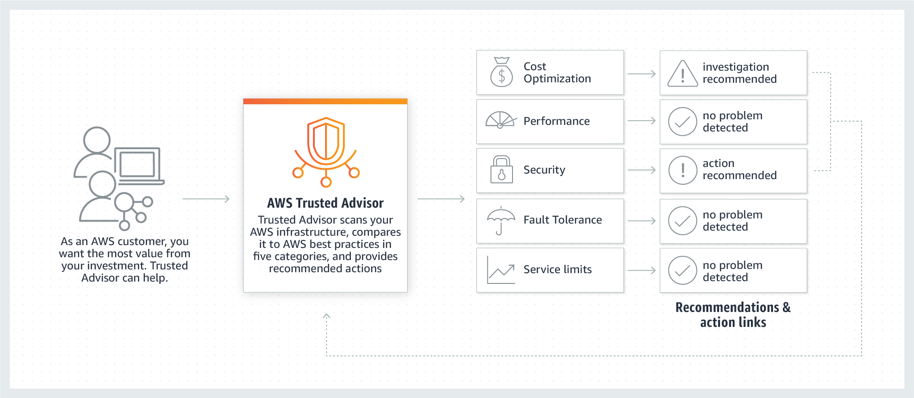
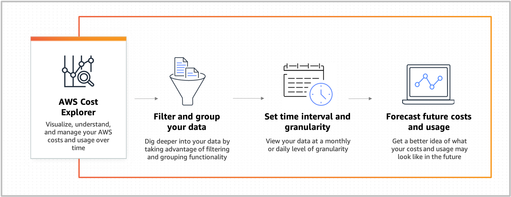

# TUTORIALS DOJO - Practice Exam - Time-mode Set 7 - Bonus

- Scored: 34/45 (75%)

  - SAA – Design Cost-Optimized Architectures: 57.14%
  - SAA – Design High-Performing Architectures: 100%
  - SAA – Design Resilient Architectures: 75%
  - SAA – Design Secure Architectures: 70.59%

- Time: 00:44:37
- Date: Oct 24, 2023, 10h

## SAA - Design Cost-Optimized Architectures

### 1

```
A large corporation has several Windows file servers in various departments within its on-premises data center. To improve its data management and scalability, the corporation has to migrate and integrate its files into an Amazon FSx for Windows File Server file system while keeping the current file permissions intact.

Which of the following solutions will fulfill the company's requirements? (Select TWO.)

- Set up AWS DataSync agents on the corporation's on-premises file servers and schedule DataSync tasks for transferring data to the Amazon FSx for Windows File Server file system.

- Utilize the AWS CLI to copy the file shares from each on-premises file server to an Amazon S3 bucket. Then, schedule AWS DataSync tasks to move the data from S3 to the Amazon FSx for Windows File Server file system

- Extract the drives from the individual file servers and transport them to AWS via the AWS Snowmobile service. Import the file server data into Amazon S3 from Snowmobile. Afterward, configure the AWS DataSync tasks to sync the data from S3 to the Amazon FSx for Windows File Server file system.

- Acquire an AWS Snowcone device, then connect with the on-premises network. Use AWS OpsHub to launch the AWS DataSync agent AMI and activate the agent via the AWS Management Console. Schedule DataSync tasks to transfer the data to the Amazon FSx for Windows File Server file system.

- Order an AWS Snowball Edge Storage Optimized device, link it to the on-premises network, and transfer data using the AWS CLI. Return the device to AWS for data import into Amazon S3. Configure AWS DataSync tasks to migrate the data from S3 to the Amazon FSx for Windows File Server file system
```

> [!NOTE] AWS DataSync: Simple, fast, online data transfer
>
> An online data movement and discovery service that simplifies data migration and helps you quickly, easily, and securely transfer your file or object data to, from, and between AWS storage services.

> [!NOTE] AWS OpsHub: Graphical user interface to manage AWS Snowball devices

### 3

```
A FinTech company has been running its compute workload on the AWS Cloud. In order to quickly release the application, the developers have deployed several Amazon EC2 instances, Auto Scaling groups and AWS Lambda functions for the different components of the application stack. After a few weeks of operation, the users are complaining of slow performance in certain components of the application. The QA engineers suspect that the servers are not able to handle the traffic being sent to the application.

Which of the following actions should be taken to verify and resolve the above issue?

- Enable AWS Compute Optimizer to see recommendations on optimal sizing of compute-related resources. Implement changes based on the recommendations.

- Use AWS Trusted Advisor and select the cost optimization category to identify overutilized and underutilized resources. Resize the compute resources based on the recommendations.

- Use AWS Cost Explorer to gather cost information on all compute-related resources. Increase the size of the instances based on how much budget is allowed by the company.

- Use AWS CloudWatch to view performance metrics of the compute resources. Create a CloudWatch dashboard to identify overutilized or underutilized resources.
```

> [!NOTE] AWS Compute Optimizer: Identify optimal AWS compute resources
>
> - Analyzes the configuration and utilization metrics of your AWS resources
> - Reports whether your resources are optimal
> - Generates optimization recommendations to reduce the cost and improve the performance of your workloads

### 6

```

A Solutions Architect needs to ensure that all of the AWS resources in Amazon VPC don’t go beyond their respective service limits. The Architect should prepare a system that provides real-time guidance in provisioning resources that adheres to the AWS best practices.

Which of the following is the MOST appropriate service to use to satisfy this task?

- AWS Cost Explorer

- AWS Budgets

- AWS Trusted Advisor

- Amazon Inspector
```

> [!NOTE] AWS Inspector: Continual vulnerability management at scale
>
> 

> [!NOTE] AWS Trusted Advisor: Optimize Performance and Securityimage
>
> 

> [!NOTE] AWS Budgets: Set Custom Budgets and Receive Alerts
>
> 

> [!NOTE] AWS Cost Explorer: Visualize and Explore Your AWS Costs and Usage
>
> 

## SAA - Design High-Performing Architectures

## SAA - Design Resilient Architectures

### 4

```
A company faces performance degradation due to intermittent traffic spikes in its application. The application is deployed across multiple EC2 instances within an Auto Scaling group and is fronted by a Network Load Balancer (NLB). The operations team found out that HTTP errors are not being detected by the NLB. As a result, clients are continuously routed to unhealthy targets and are never replaced, which impacts the availability of the application.

Which solution could resolve the issue with the least amount of development overhead?

- Use an Application Load Balancer (ALB) in place of the NLB. Enable HTTP health checks using the application's path.

- Increase the NLB's idle timeout to allow more time for requests to be processed, reducing the occurrence of intermittent HTTP/s errors.

- Configure CloudFront as a content delivery network (CDN) in front of the NLB to reduce the load on the instances and improve performance.

- Configure the NLB to perform HTTP health checks on the critical paths of the application.

```

> [!NOTE] NLB: only support TCP, UDP, TLS, but it can perform HTTP/s health check.

### 6

```

A company plans to design an application that can handle batch processing of large amounts of financial data. The Solutions Architect is tasked to create two Amazon S3 buckets to store the input and output data. The application will transfer the data between multiple EC2 instances over the network to complete the data processing.

Which of the following options would reduce the data transfer costs?

- Deploy the Amazon EC2 instances behind an Application Load Balancer.

- Deploy the Amazon EC2 instances in the same Availability Zone.

- Deploy the Amazon EC2 instances in the same AWS Region.

- Deploy the Amazon EC2 instances in private subnets in different Availability Zones.
```

> [!NOTE] Data transfer within the same Availability Zone is free.

### 7

```

An advertising company is currently working on a proof of concept project that automatically provides SEO analytics for its clients. Your company has a VPC in AWS that operates in a dual-stack mode in which IPv4 and IPv6 communication is allowed. You deployed the application to an Auto Scaling group of EC2 instances with an Application Load Balancer in front that evenly distributes the incoming traffic. You are ready to go live but you need to point your domain name (tutorialsdojo.com) to the Application Load Balancer.

In Route 53, which record types will you use to point the DNS name of the Application Load Balancer? (Select TWO.)

- Non-Alias with a type "A" record set

- Alias with a type "AAAA" record set

- Alias with a type "CNAME" record set

- Alias with a type "A" record set

- Alias with a type of “MX” record set
```

> [!NOTE] CNAME record vs Route 53 alias record
>
> - CNAME record: doesn't work with zone apex (root domain name)
>
> - Route 53 alias record:
>   - make CNAME record work with zone apex 👉 can create alias CNAME to point to another domain
>   - make other record point to domain name
>   - can point to AWS resources
>     e.g. An alias A Record point to DNS name of a LB

## SAA - Design Secure Architectures

### 3

```
A serverless application has been launched on the DevOps team’s AWS account. Users from the development team’s account must be granted permission to invoke the Lambda function that runs the application. The solution must use the principle of least privilege access.

Which solution will fulfill these criteria?

- On the function’s resource-based policy, add a permission that includes the lambda:InvokeFunction as action and arn:aws:iam::[DEV AWSAccount Number]:root as principal.

- On the function’s resource-based policy, add a permission that includes the lambda:* as action and arn:aws:iam::[DevOps AWS Account Number]:root as principal.

- On the function’s execution role, add a permission that includes the lambda:* as action and arn:aws:iam::[DevOps AWS Account Number]:root as principal.

- On the function’s execution role, add a permission that includes the lambda:InvokeFunction as action and arn:aws:iam::[DEV AWS Account Number]:root as principal.
```

> [!NOTE] Permission to invoke a Lambda function
>
> Use the Lambda function's `resource policy`:
>
> - Principal: the ARN of dev account
> - Action: lambda:InvokeFunction

> [!NOTE] Lambda function's `execution role`
>
> Give the Lambda function permissions to access AWS resources.

### 8

```

A large electronics company is using Amazon Simple Storage Service to store important documents. For reporting purposes, they want to track and log every request access to their S3 buckets including the requester, bucket name, request time, request action, referrer, turnaround time, and error code information. The solution should also provide more visibility into the object-level operations of the bucket.

Which is the best solution among the following options that can satisfy the requirement?

- Enable AWS CloudTrail to audit all Amazon S3 bucket access.

- Enable server access logging for all required Amazon S3 buckets.

- Enable the Requester Pays option to track access via AWS Billing.

- Enable Amazon S3 Event Notifications for PUT and POST.
```

> [!NOTE] CloudTrail Logs vs S3 server access logs
>
> - CloudTrail Logs: record of actions taken by a user, role, or an AWS service in Amazon S3
> - S3 server access logs: detailed records for the requests that are made to an S3 bucket
>   - Fields for Object Size, Total Time, Turn-Around Time, and HTTP Referrer for log records
>   - Lifecycle transitions, expirations, restores
>   - Invalid Authentication

Ref:

- <https://docs.aws.amazon.com/AmazonS3/latest/userguide/logging-with-S3.html>

### 9

```

A company runs its multitier online shopping platform on AWS. Every new sale transaction is published as a message in an open-source RabbitMQ queue that runs on an Amazon EC2 instance. There is a consumer application is hosted on a separate EC2 instance that consumes the incoming messages, which then stores the transaction in a self-hosted PostgreSQL database on another EC2 instance.

All of the EC2 instances used are in the same Availability Zone in the eu-central-1 Region. A solutions architect needs to redesign its cloud architecture to provide the highest availability with the least amount of operational overhead.

What should a solutions architect do to meet the company’s requirements above?

- Migrate the RabbitMQ queue to Amazon Simple Queue Service (SQS). Rehost the consumer application to an Amazon OpenSearch Service (Amazon Elasticsearch) cluster. Migrate the PostgreSQL database to an Amazon Aurora Serverless cluster

- Migrate the RabbitMQ queue to Amazon MQ to a cluster broker deployment setup. Launch a Multi-AZ Auto Scaling group for the Amazon EC2 instances that host the consumer application. Migrate the existing database to Amazon RDS for PostgreSQL in a Multi-AZ Deployment configuration.

- Migrate the RabbitMQ queue to an Auto Scaling group of EC2 instances. Rehost the consumer application to an Amazon ECS cluster with AWS Fargate. Migrate the PostgreSQL database to Amazon Aurora PostgreSQL using the Aurora cloning feature.

- Migrate the RabbitMQ queue to a redundant pair (active/standby) of Amazon MQ brokers in AWS. Launch a Multi-AZ Auto Scaling group for the Amazon EC2 instances that host the consumer application. Migrate the PostgreSQL database to Amazon RDS for PostgreSQL with cross-Region read replicas
```

> [!NOTE] Amazon MQ:
>
> - A _single-instance broker_: is comprised of one broker in one Availability Zone behind a Network Load Balancer (NLB) The broker communicates with your application and with an Amazon EBS storage volume.
>
> - A _cluster deployment_: is a logical grouping of three RabbitMQ broker nodes behind a Network Load Balancer, each sharing users, queues, and a distributed state across multiple Availability Zones (AZ).

### 12

```
A company has both on-premises data center as well as AWS cloud infrastructure. They store their graphics, audio, videos, and other multimedia assets primarily in their on-premises storage server and use an S3 Standard storage class bucket as a backup. Their data is heavily used for only a week (7 days) but after that period, it will only be infrequently used by their customers. The Solutions Architect is instructed to save storage costs in AWS yet maintain the ability to fetch a subset of their media assets in a matter of minutes for a surprise annual data audit, which will be conducted on their cloud storage.

Which of the following are valid options that the Solutions Architect can implement to meet the above requirement? (Select TWO.)

- Set a lifecycle policy in the bucket to transition the data from Standard storage class to Glacier after one week (7 days).

- Set a lifecycle policy in the bucket to transition the data to S3 - Standard IA storage class after one week (7 days).

- Set a lifecycle policy in the bucket to transition the data to S3 - One Zone-Infrequent Access storage class after one week (7 days).

- Set a lifecycle policy in the bucket to transition the data to S3 Glacier Deep Archive storage class after one week (7 days).

- Set a lifecycle policy in the bucket to transition to S3 - Standard IA after 30 days
```

> [!NOTE] S3 Standard-IA or S3 One Zone-IA:
>
> - Minimum Days for Transition from Standard: 30 days
> - Minimum 30-Day Storage Charge: 30 days

### 17

```

A well-known music streaming service is planning to broaden its platform globally. However, the company must ensure that listeners in certain countries cannot access specific music content until it is officially launched in their respective regions, in accordance with its music licensing agreements and restrictions.

To achieve this, the company will utilize Amazon CloudFront's content delivery network and Origin Access Control (OAC) feature to prevent unauthorized users from accessing the content. Customized error messages must also be configured for users who are not authorized to access particular music tracks.

What solution would be able to fulfill these requirements?

- Configure CloudFront to return a custom error response to the viewer. Use both signed URLs and signed cookies for secure content access.

- Configure CloudFront to return a custom error response to the viewer. Implement a time-restricted IAM access policy for CloudFront distribution.

- Configure CloudFront to return a custom error response to the viewer. Set up a CloudFront Function URL to control access.

- Configure CloudFront to return a custom error response to the viewer and apply geographic restrictions using an Allow list.
```

> [!NOTE] CloudFront supports `geo blocking` (`geographic restrictions`)

---

## Correct answers

### 33

> [!NOTE] Amazon Managed Service for Prometheus: Highly available, secure, and managed monitoring for your containers
>
> Collects metrics

> [!NOTE] Amazon Managed Grafana: Visualize and analyze your operational data at scale
>
> Visualize metrics to dashboard

> [!NOTE] Amazon Quantum Ledger Database (QLDB): Fully managed ledger database
>
> Provides a transparent, immutable, and cryptographically verifiable transaction log owned by a central trusted authority.
>
> 👉 Track all application data changes, and maintain a complete and verifiable history of changes over time.
