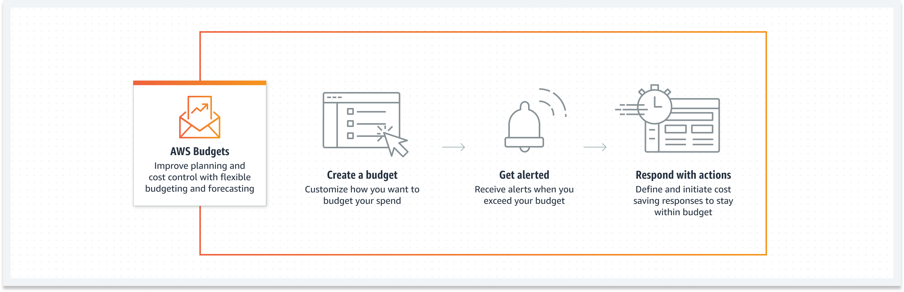
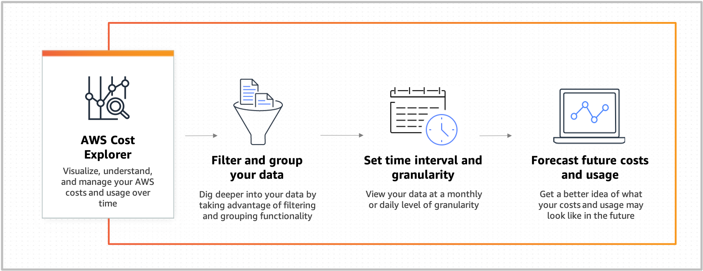
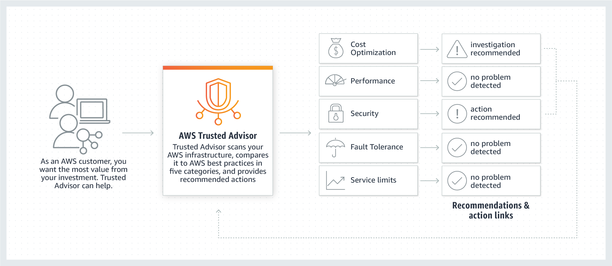
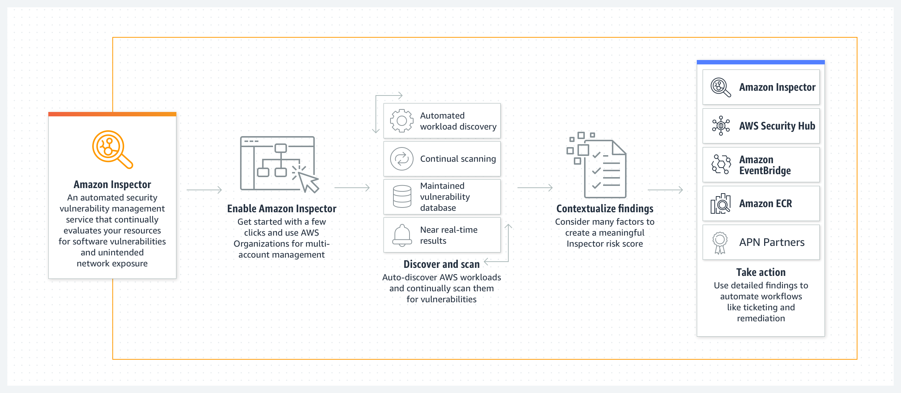

# TUTORIALS DOJO - TIPS AND TRICKS

## Analytics

### Amazon Athena: Query data in Amazon S3 using SQL

> Athena vs Redshift Spectrum
>
> SQL query data in S3
>
> - Athena: Serverless, simple query
> - Redshift Spectrum: Provision resources, complex query

### Amazon EMR: Hosted Hadoop framework

> CSV store in S3, automated convert to Parquet -> store in a S3 bucket; min operation cost
>
> - Working Solutions:
>   - AWS Batch + bash script
>   - Amazon EMR

> Amazon EMR: Hosted Hadoop framework
>
> - Amazon EMR Serverless

### AWS Glue: Simple, scalable, and serverless data integration

> AWS Glue
>
> - Serverless ETL
> - Glue Job can be triggered manually or via events using EventBridge

> AWS Glue - Job Bookmarking
>
> - maintain state information and prevent the reprocessing of old data.

### Amazon Kinesis: Analyze real-time video and data streams

> - Kinesis Video Streams: Capture, process, and store video streams for analytics and machine learning.
> - Kinesis Data Streams: Build custom applications that analyze data streams using popular stream-processing frameworks.
> - Kinesis Data Firehose: Load data streams into AWS data stores.

> Kinesis Data Streams vs SQS
>
> - Kinesis Data Streams: Provide real-time analyzing, but required provisioning shards
> - SQS: Use with Lambda (and its Event Sourcing) provides a cost-efficient solution

> Asynchronous process, cost-effective (alternative to Kinesis Streams)
>
> SQS + Lambda

### AWS Lake Formation: Build a secure data lake in days

### Amazon QuickSight: Fast business analytics service

### Amazon Redshift: Fast, simple, cost-effective data warehouse service

> Amazon Redshift Backup:
>
> - Manually Snapshots
> - Automatically increment backup:
>   - Every 8 hours or 5 GB of data
>   - 1-day retention (default, configurable up to 35 days)
>
> Backup to S3 bucket, configurable to copy snapshots to another region for DR.

> Latency: Redshift vs DynamoDB
>
> - Redshift: sub-second (s)
> - DynamoDB: millisecond (ms)

> Redshift Spectrum vs Athena
>
> SQL query data in S3
>
> - Redshift Spectrum: Provision resources, complex query
> - Athena: Serverless, simple query

## Application Integration

### Amazon EventBridge: Serverless event bus for SaaS apps and AWS services

### Amazon MQ: Managed message broker service

> Amazon MQ:
>
> - A _single-instance broker_: is comprised of one broker in one Availability Zone behind a Network Load Balancer (NLB) The broker communicates with your application and with an Amazon EBS storage volume.
>
> - A _cluster deployment_: is a logical grouping of three RabbitMQ broker nodes behind a Network Load Balancer, each sharing users, queues, and a distributed state across multiple Availability Zones (AZ).

### Amazon SNS: Pub/sub, SMS, email, and mobile push notifications

### Amazon SQS: Managed message queues

### AWS Step Functions: Coordination for distributed applications

### Amazon SWF: Build applications that coordinate work across distributed components

> Ensure a queue's messages are NOT process twice:
>
> - SQS FIFO Queue
> - Amazon Simple Workflow Service (Amazon SWF)

<!-- ## Blockchain -->

## Business Applications

### Amazon SES: High-scale inbound and outbound email

### Amazon Pinpoint: Multichannel marketing communications |

Engage your customers by sending them email, SMS and voice messages, and push notifications.

- send **targeted messages** (such as promotions and retention campaigns)
- send **transactional messages** (such as order confirmations and password reset messages)

## Cloud Financial Management

### AWS Billing and Cost Management: Find features that help you pay your bills and optimize your costs

> AWS Budgets: Set Custom Budgets and Receive Alerts
>
> 

> AWS Cost Explorer: Visualize and Explore Your AWS Costs and Usage
>
> 

## Compute

### AWS Batch: Run batch jobs at any scale

> CSV store in S3, automated convert to Parquet -> store in a S3 bucket; min operation cost
>
> - Working Solutions:
>   - AWS Batch + bash script
>   - Amazon EMR

> Amazon EMR: Hosted Hadoop framework
>
> - Amazon EMR Serverless

### Amazon EC2: Create and run virtual servers in the cloud

> EC2 - Hibernation
>
> - Quickly pausing and resuming the instances, by saving the memory footprint to disk.
> - Can only be enable at launch
> - Pay as stopped instances:
>   - No hourly charging
>   - EBS volume.
>   - Elastic IP Address.

> EC2 states:
>
> - pending
> - running 💸
>   - rebooting
>   - stopping - stopped (EBS-backed instances)
>     - hibernate 💸
> - shutting-down
> - terminated (Terminated Reserver Instances are still billed 💸)

> EC2 - Reserved Instance
>
> Reserved Instance Marketplace: Resell unused Standard Reserved Instances

> EC2 - Stop Instance vs Terminate Instance
>
> - Stopped: still be billed
> - Terminated: not billed

> EC2 - Instance store:
>
> - Its data will be lost if the EC2 instance is stopped / terminated.

> EC2 - Elastic IP address and EBS storage won't be effect after an instance is stopped.

> Security Group Referencing
>
> When you specify a security group as the source or destination for a rule (of a security group), the rule affects all instances that are associated with the security groups.

> ENI - ENA - EFA
>
> - Elastic Network Interface (ENI): logical networking component in a VPC that represents a **virtual network card**
>
> - Elastic Network Adapter (ENA): High Performance Network Interface for Amazon EC2
>
>   - _Enhanced networking_: up to 100 Gbps
>   - provide traditional IP networking features
>
> - Elastic Fabric Adapter (EFA): network device to accelerate High Performance Computing (HPC) applications
>
>   - support **OS-bypass** capabilities: allow HPC communicate directly with the EFA device.

> Fault Tolerance: ability of a system to remain in operation even if some of the components used to build the system fail

> CloudWatch Alarm can stop, terminate, reboot, recover an EC2 instance

> Monitor EC2:
>
> - CloudWatch default metric
>
>   - CPU utilization from hypervisor
>   - Disk
>   - Network
>
> - CloudWatch Agent:
>
>   - Memory
>   - Sub-resource metrics such as per-CPU core

> Notify for EC2 instance:
>
> - All EC2 instances:
>
>   - Create an Amazon EventBridge (Amazon CloudWatch Events) rule to check for **AWS Personal Health Dashboard** events that are related to Amazon EC2 instances.
>   - To send notifications, set an Amazon SNS topic as a target for the rule.
>
> - A specific EC2 instance:
>
>   Use CloudWatch Alarm and EC2 Action to interact with EC2 instance.

> Best practice to control access to EC2 instances:
>
> - Tag the EC2 instances, to categorize by purpose, owner, or environment...
> - Control access using resource tags and IAM policy.

> EC2 - Capacity Reservations vs Reserved Instances
>
> - (On-demand) Capacity Reservations:
>
>   - Reserve compute capacity for your Amazon EC2 instances in a specific Availability Zone for any duration
>   - Full price
>
> - Reserve Instances:
>
>   - Regional Reserve Instances: Save money
>   - Zone Reserve Instances: Save money

> EC2 - Placement Group - Error adding instance 'insufficient capacity error'
>
> - Amazon does not currently have enough available On-Demand capacity on the existing host to fulfill your request.
>
> Workaround: Stop all instances, then start -> Maybe a new host have enough capacity

> EC2 Auto Scaling Group's [Termination Policy](https://docs.aws.amazon.com/autoscaling/ec2/userguide/as-instance-termination.html#default-termination-policy)
>
> - Maximum availability: Kill instance in the AZs with the most instances (and oldest Launch Configuration)
> - Keep most updated instance: Kill instance with oldest LC
> - Maximum instance usage: Kill the instance closest to billing hour.
> - Finally: random.

> Auto Scaling Group (ASG) Policies:
>
> - Manually
> - Scheduled
> - Dynamic
>   - Simple
>   - Stepped
>   - Target Tracking
> - Predictive

> Data transfer
>
> - S3: within the same Region is free.
> - Others (EC2) within the same Availability Zone is free.

### AWS Elastic Beanstalk: Run and manage web apps

Reduces the operational overhead by taking care of provisioning the needed resources for your application.

> Elastic Beanstalk: Run and manage web apps
>
> - Reduces the operational overhead by taking care of provisioning the needed resources for your application
>
> - Elastic Beanstalk supports:
>
>   - applications developed in Go, Java, .NET, Node.js, PHP, Python, and Ruby
>   - custom environment with Docker
>
> - When you deploy your application, Elastic Beanstalk
>
>   - builds the selected supported platform version
>   - provisions one or more AWS resources, such as Amazon EC2 instances, to run your application.

> Elastic Beanstalk vs ECS
>
> - Elastic Beanstalk:
>
>   Automatically handles the details of capacity provisioning, load balancing, scaling, and application health monitoring.
>
>   => Quickly deploy and manage applications in the AWS Cloud without having to learn about the infrastructure that runs those applications
>
> - ECS:
>
>   Need to manually config Service Auto Scaling, Service Load Balancing, and Monitoring with CloudWatch

### AWS Lambda: Run code without thinking about servers

> Allow an Lambda permission to use KMS:
>
> - Attach the kms:decrypt permission to the Lambda function’s `execution role`
> - Add a statement to the AWS KMS `key policy` that grants the function’s execution role the kms:decrypt permission.

> Permission to invoke a Lambda function
>
> Use the Lambda function's `resource policy`:
>
> - Principal: the ARN of dev account
> - Action: lambda:InvokeFunction

> Lambda function's `execution role`
>
> Give the Lambda function permissions to access AWS resources.

### AWS Wavelength: Deliver ultra-low latency applications for 5G devices

- Application traffic can reach application servers running in Wavelength Zones without leaving the mobile providers’ network

## Containers

### Amazon ECR: Easily store, manage, and deploy container images

### Amazon ECS: Highly secure, reliable, and scalable way to run containers

> Elastic Beanstalk vs ECS
>
> - Elastic Beanstalk:
>
>   Automatically handles the details of capacity provisioning, load balancing, scaling, and application health monitoring.
>
>   => Quickly deploy and manage applications in the AWS Cloud without having to learn about the infrastructure that runs those applications
>
> - ECS:
>
>   Need to manually config Service Auto Scaling, Service Load Balancing, and Monitoring with CloudWatch

> ECS Auto Scaling - Metric:
>
> - ECS Instances (~ K8s Node):
>
>   - CPU Utilization
>   - Disk
>     - Disk Reads
>     - Disk Read Operations
>     - Disk Writes
>     - Disk Write Operations
>   - Network
>     - Network In
>     - Network Out
>   - Status Check Failed
>     - Status Check Failed (Any)
>     - Status Check Failed (Instance)
>     - Status Check Failed (System)
>
> - ECS Service (~ K8s Pod):
>
>   - ECSService**AverageCPU**Utilization
>   - ECSService**AverageMemory**Utilization
>   - ALB**Request**Count**PerTarget**

### Amazon EKS: Run Kubernetes on AWS without operating your own Kubernetes clusters

> IAM and K8s:
>
> - Enable with _AWS IAM Authenticator for Kubernetes_, which runs on the Amazon EKS control plane.
> - The authenticator gets its configuration information from the aws-auth ConfigMap (AWS authenticator configuration map).

## Cryptography & PKI

### AWS Certificate Manager (ACM): Provision, manage, and deploy SSL/TLS certificates

> Which services support storing SSL certificate?
>
> - AWS Certificate Manager (ACM)
> - IAM SSL certificate storage (Used for region that not support ACM)

> When using regional API Gateway, the certificate for the domain name needs to be in the same region.

> Monitor expiration of certificates
>
> - Option 1: Use the ACM built-in Certificate Expiration event
>   - ACM sends daily expiration events for all active certificates (public, private and imported) starting 45 days prior to expiration.
>   - AWS Health events are generated for ACM certificates that are eligible for renewal.
> - Option 2: Use the `DaysToExpiry` metric

### AWS CloudHSM: Hardware-based key storage for regulatory compliance

### AWS KMS: Managed creation and control of encryption keys

> K8s has its own mechanism for storing secret, which are default store as plain text in etcd key-value store.
>
> We can apply _envelope encryption_ to encrypt these secrets with AWS KMS before stored them in etcd store.
>
> [Source](https://aws.amazon.com/blogs/containers/using-eks-encryption-provider-support-for-defense-in-depth/)

> KMS - [Custom Key Store](https://docs.aws.amazon.com/kms/latest/developerguide/custom-key-store-overview.html)
>
> -> We own and manage

> Allow an Lambda permission to use KMS:
>
> - Attach the kms:decrypt permission to the Lambda function’s `execution role`
> - Add a statement to the AWS KMS `key policy` that grants the function’s execution role the kms:decrypt permission.

> S3 Object encryption:
>
> - Server-Side Encryption (SSE):
>
>   - SSE-S3 (Amazon S3 managed keys)
>   - SSE-KMS (AWS KMS)
>   - SSE-C (Customer-provided keys)
>
> - Client-Side Encryption (CSE):
>
>   - CSE-KMS-CMK
>   - CSE-Client Master key
>
> | Encryption | Fullname                        | Who Manages Key?                                | Who Manages Encryption Process? | Notes                       |
> | ---------- | ------------------------------- | ----------------------------------------------- | ------------------------------- | --------------------------- |
> | SSE-S3     | SSE with Amazon S3 managed keys | S3                                              | S3                              | Default                     |
> | SSE-KMS    | SSE with AWS KMS keys           | AWS managed key                                 | S3                              | Support audit keys usage... |
> |            |                                 | Customer managed key (CMK) - Renamed to KMS Key |                                 |                             |
> | SSE-C      | SSE with Customer-Provided Key  | Customer                                        | S3                              | Use your own encryption key |
> |            |                                 |                                                 |                                 |                             |
> | CSE        |                                 | Customer                                        | Customer                        |                             |

<!-- ## Customer Enablement Services -->

## Database

### Amazon Aurora: High performance managed relational database engine

> Aurora Auto Scaling vs Aurora Serverless
>
> - [Aurora Auto Scaling](https://docs.aws.amazon.com/AmazonRDS/latest/AuroraUserGuide/Aurora.Integrating.AutoScaling.html): Dynamically adjusts the number of Aurora Replicas (reader DB instances) provisioned for an Aurora DB cluster.
>
> - [Aurora Serverless](https://docs.aws.amazon.com/AmazonRDS/latest/AuroraUserGuide/aurora-serverless-v2.html): On-demand, autoscaling the capacity of Aurora DB cluster resource

> Aurora Serverless
>
> - The DB instance cannot be changed from Provisioned to Serverless after created.
>
> - After the DB instanced is created, need to use AWS Database Migration Service (AWS DMS) to migrate data from the existing DB cluster to a new Aurora Serverless database.

> Aurora Custom Endpoint: provides load-balanced database connections based on criteria other than the read-only or read-write capability of the DB instances

> Aurora - Reader endpoint:
>
> - A reader endpoint for an Aurora DB cluster provides load-balancing support for read-only connections to the DB cluster

> Aurora Failover: Automatically handled by Amazon Aurora
>
> 1. If you have an Amazon Aurora Replica
>
>    Amazon Aurora flips the canonical name record (CNAME) for your DB Instance to point at the healthy replica
>
> 2. If you are running Aurora Serverless and the DB instance or AZ becomes unavailable
>
>    Aurora will automatically recreate the DB instance in a different AZ.
>
> 3. Otherwise:
>
>    Aurora will attempt to create a new DB Instance in the same Availability Zone as the original instance.
>
>    The replacement is done on a best-effort basis and may not succeed

> Aurora - Clone:
>
> - Creating a Aurora clone is _faster_ and more _space-efficient_ than physically copying the data using other techniques, such as restoring from a snapshot like you would in Amazon RDS
>
> - Aurora uses a copy-on-write protocol to create a clone.

> Aurora - Storage:
>
> - Aurora data is stored in the _cluster volume_, which is a single, virtual volume that uses solid state drives (SSDs)
>   - A _cluster volume_ consists of copies of the data across three Availability Zones in a single AWS Region.
>     - The data is automatically replicated across Availability Zones,

<!-- ### Amazon DocumentDB: Fully managed document database -->

### Amazon DynamoDB: Managed NoSQL database

> Latency: Redshift vs DynamoDB
>
> - Redshift: sub-second (s)
> - DynamoDB: millisecond (ms)

### Amazon ElastiCache: In-memory caching service

> Elasticache - Redis vs Memcached
>
> - Redis: Advance structure, replicas
>
> - Memcached: Multi-threads, multi-nodes.

<!-- ### Amazon Keyspaces (for Apache Cassandra): Managed Cassandra-compatible database -->

<!-- ### Amazon MemoryDB for Redis: Redis-compatible, durable, in-memory database service -->

<!-- ### Amazon Neptune: Fully managed graph database service -->

### Amazon Quantum Ledger Database - QLDB: Fully managed ledger database

Provides a transparent, immutable, and cryptographically verifiable transaction log owned by a central trusted authority.

👉 Track all application data changes, and maintain a complete and verifiable history of changes over time.

### Amazon RDS: Set up, operate, and scale a relational database in the cloud

> RDS Enhanced Monitoring
>
> - CloudWatch gathers metrics about CPU utilization from the **hypervisor** for a DB instance
> - Enhanced Monitoring gathers its metrics from an agent on the **instance** ~ EC2 CloudWatch Agent

> Monitor RDS:
>
> - Default metric
>
>   - CPU utilization from hypervisor
>   - Database connections
>   - Free memory
>
> - Enhanced Monitoring:
>
>   - OS processes
>   - RDS processes

> RDS - [IAM DB Authentication](https://docs.aws.amazon.com/AmazonRDS/latest/UserGuide/UsingWithRDS.IAMDBAuth.html)
>
> To connect to DB instance, we'll use an authentication token (generated using the IAM role's credential).

> RDS - “too many connections”
>
> RDS Proxy: allow your applications to pool and share database connections to improve their ability to scale.

> RDS Multi-Az Failover:
>
> - Loss of availability in primary Availability Zone
>
> - Primary DB instance:
>
>   - Loss of network connectivity to primary
>   - Compute unit failure on primary
>   - Storage failure on primary
>
> - DB instance scaling or system upgrades:
>
>   Applied first on the standby prior then automatic failover

> Use Secure Sockets Layer (SSL) to encrypt connections between your client applications and your Amazon RDS DB instances running Microsoft SQL Server.
>
> - Download the Amazon RDS Root CA certificate. Import the certificate to your servers and configure your application to use SSL to encrypt the connection to RDS.
> - Force all connections to your DB instance to use SSL by setting the rds.force_ssl parameter to true. Once done, reboot your DB instance.

<!-- ### Amazon Timestream: Fully managed time series database -->

<!-- ## Developer Tools -->

<!-- ## End User Computing -->

## Front-End Web & Mobile

### AWS AppSync: Accelerate app development with fully-managed, scalable GraphQL APIs

> AWS AppSync Pipeline Resolver: orchestrating requests to multiple data sources.
>
> Simplify client-side application complexity and help enforce server-side business logic controls by

<!-- ## Game Development -->

<!-- ## General Reference -->

<!-- ## Internet of Things -->

## Machine Learning

### Amazon Comprehend: Discover insights and relationships in text

### Amazon Comprehend Medical: Detect and return useful information in unstructured clinical text

### AWS Deep Learning AMI: Deep learning on Amazon EC2

### Amazon Forecast: Increase forecast accuracy using machine learning

### Amazon Fraud Detector: Detect more online fraud faster

### Amazon Kendra: Reinvent enterprise search with ML

### Amazon Lex: Build voice and text chatbots

### Amazon Polly: Turn text into life-like speech

### Amazon Rekognition: Analyze image and video

### Amazon SageMaker: Build, train, and deploy machine learning models at scale

### Amazon Textract: Extract text and data from documents

### Amazon Transcribe: Automatic speech recognition

### Amazon Translate: Natural and fluent language translation

## Management & Governance

### Auto Scaling: Scale multiple resources to meet demand

### AWS CloudFormation: Create and manage resources with templates

> CloudFormation: CreationPolicy & cfn-signal
>
> - CreationPolicy: Wait on resource configuration actions before stack creation proceeds.
> - cfn-signal: Signals CloudFormation to indicate whether Amazon EC2 instances have been successfully created/updated

### AWS CloudTrail: Track and monitor activities by users, roles, or AWS services

> CloudTrail - Encryption
>
> By default, CloudTrail event log files are encrypted using Amazon S3 server-side encryption (SSE)

> CloudTrail Logs vs S3 server access logs
>
> - CloudTrail Logs: record of actions taken by a user, role, or an AWS service in Amazon S3
> - S3 server access logs: detailed records for the requests that are made to an S3 bucket
>   - Fields for Object Size, Total Time, Turn-Around Time, and HTTP Referrer for log records
>   - Lifecycle transitions, expirations, restores
>   - Invalid Authentication

### Amazon CloudWatch: Monitor resources and applications

> CloudWatch Alarm can stop, terminate, reboot, recover an EC2 instance

> Monitor EC2:
>
> - CloudWatch default metric
>
>   - CPU utilization from hypervisor
>   - Disk
>   - Network
>
> - CloudWatch Agent:
>
>   - Memory
>   - Sub-resource metrics such as per-CPU core

> Monitor RDS:
>
> - Default metric
>
>   - CPU utilization from hypervisor
>   - Database connections
>   - Free memory
>
> - Enhanced Monitoring:
>
>   - OS processes
>   - RDS processes

> Monitor expiration of certificates
>
> - Option 1: Use the ACM built-in Certificate Expiration event
>   - ACM sends daily expiration events for all active certificates (public, private and imported) starting 45 days prior to expiration.
>   - AWS Health events are generated for ACM certificates that are eligible for renewal.
> - Option 2: Use the `DaysToExpiry` metric

### AWS CLI: Command line interface tool to manage AWS services

### AWS Compute Optimizer: Identify optimal AWS compute resources |

> - Analyzes the configuration and utilization metrics of your AWS resources
> - Reports whether your resources are optimal
> - Generates optimization recommendations to reduce the cost and improve the performance of your workloads

### AWS Config: _Track_ and _evaluate_ configuration changes

### AWS Control Tower: Set up and govern a secure, compliant multi-account environment

### Amazon Data Lifecycle Manager: Automate management of Amazon EBS snapshots and Amazon EBS-backed AMIs

### AWS Health: Find information about events that can affect your AWS resources

### AWS License Manager: Track and manage software licenses across multiple AWS Regions

### Amazon Managed Grafana: Visualize and analyze your operational data at scale

Visualize metrics to dashboard

### Amazon Managed Service for Prometheus: Highly available, secure, and managed monitoring for your containers

Collects metrics

### AWS Management Console: Web-based user interface comprising multiple AWS service consoles

### AWS Organizations: Central governance and management across AWS accounts

> Service Control Policy (SCP): a feature of AWS Organizations
>
> - A type of organization policy that you can use to manage permissions in your organization.

### AWS Proton: Automate management for container and serverless deployments

### AWS Systems Manager: Gain operational insights and take action

> AWS Systems Manager's Fleet Manager: UI for managing nodes/EC2 instance.

### Tag Editor: Add, edit, or delete tags on multiple AWS resources

### AWS Trusted Advisor: Optimize performance and security

Inspects your AWS environment and recommends ways to save money, close security gaps, and improve system availability and performance.

> **AWS Trusted Advisor** _Service Limits_:
>
> - Monitor the service quotas in all Regions.
> - Alerts you if your account reaches _more than 80% of a service quota_ in any Region.

### AWS Well-Architected Tool: Review and improve your workloads

### CloudWatch

> CloudWatch - CloudWatch Logs - CloudTrail - CloudWatch Events - EventBridge?
>
> - CloudWatch: Monitor resources and applications
>
>   Monitor your AWS resources and the applications you run on AWS in real time.
>
>   - CloudWatch Logs: Monitor, store, and access your log files from Amazon Elastic Compute Cloud instances, AWS CloudTrail, or other sources.
>
>   - CloudWatch Logs Insights: query logs with SQL-like syntax
>
>   - CLoudWatch Events: Is now Amazon EventBridge

### CloudTrail

> - CloudTrail: Track and monitor activities by users, roles, or AWS services

<!-- ## Marketplace -->

<!-- ## Media Services -->

## Migration & Transfer

### AWS Application Discovery Service: Discover on-premises applications to streamline migration

### AWS Application Migration Service: Automate application migration and modernization

### AWS Database Migration Service: Migrate databases with minimal downtime

Migrate on-premises databases to the AWS Cloud.

> Replicate database on S3 as CSV, stream on-going changes, min management overhead
>
> AWS Database Migration Service + Change Data Capture (CDC)

### AWS DataSync: Simple, fast, online data transfer

An online data movement and discovery service that simplifies data migration and helps you quickly, easily, and securely transfer your file or object data to, from, and between AWS storage services.

### AWS Schema Conversion Tool: Convert source schema and most code to target-compatible format

## Networking & Content Delivery

### Amazon API Gateway: Build, deploy, and manage APIs

> API Gateway works at any scale, just pay money.
>
> Throttle API requests for our budget (and for better throughtput)
>
> [Source](https://docs.aws.amazon.com/apigateway/latest/developerguide/api-gateway-request-throttling.html)

> When using regional API Gateway, the certificate for the domain name needs to be in the same region.

### Amazon CloudFront: Global content delivery network

> CloudFront supports `geo blocking` (`geographic restrictions`)

> Lambda@Edge: run Lambda functions to customize the content that CloudFront delivers

> CloudFront - Origin _Failover_
>
> Needs an origin groups with 2 origin:
>
> - a primary origin
> - a secondary origin

> CloudFront cannot host data, only cache data.

### AWS Direct Connect: Dedicated network connection to AWS

from your on-premises network

### Elastic Load Balancing: Distribute incoming traffic across multiple targets

> Elastic Load Balancer protocol:
>
> - Application Load Balancer: HTTP/s and gRPC
> - Network Load Balancer: TCP, UDP, TLS
> - Gateway Load Balancer: IP

> Application Load Balancer: supports Weighted Target Groups

> NLB: only support TCP, UDP, TLS, but it can perform HTTP/s health check.

> ELB - Access Logs
>
> Capture detailed information about requests sent to your load balancer
>
> - Disabled by default
>
> Ref:
>
> - <https://docs.aws.amazon.com/elasticloadbalancing/latest/application/load-balancer-access-logs.html>

> AWS Services with Access Logs:
>
> - S3
> - ELB
> - CloudFront: or standard logs
> - API Gateway

### AWS Global Accelerator: Improve global application availability and performance

### Amazon Route 53: Highly available and scalable Domain Name System (DNS) web service

> Route 53: GeoProximity Routing vs Geolocation Routing vs Latency-based Routing
>
> - Geolocation Routing: Location of user
> - GeoProximity Routing: Location of user AND AWS resources (with bias)
> - Latency-based Routing

> CNAME record vs Route 53 alias record
>
> - CNAME record: doesn't work with zone apex (root domain name)
>
> - Route 53 alias record:
>   - make CNAME record work with zone apex 👉 can create alias CNAME to point to another domain
>   - make other record point to domain name
>   - can point to AWS resources
>     e.g. An alias A Record point to DNS name of a LB

### Amazon VPC: Isolated cloud resources

> Data transfer
>
> - S3: within the same Region is free.
> - Others (EC2) within the same Availability Zone is free.

> VPC Peering: only works for VPCs, doesn't work with on-premise networks

> VPC Peering - Setup
>
> - Create, invite, accept VPC Peering Connection
> - Update each VPC's Route Table to point to IP range of other VPC.

> VPC: IPv4 vs IPv6
>
> - IPv4 is the default IP addressing system for VPC => Cannot be disabled
> - IPv6: optional

> VPC supports CIDR blocks from /16 to /28

> CIDR `/0`: The entire network -> is not used in SG and NACL.
>
> CIDR `/32`: One IP address.

> VPC endpoints for S3: Provide _private_ access to AWS Public services (S3)
>
> - Gateway endpoint:
>
>   - via Route Table's **Prefix List**, without IGW, NATGW, PrivateLink
>
>   - Free
>
> - Interface endpoint:
>
>   - via DNS using Private IP Address 👉 more features
>
>     - access from on-premises
>     - access from VPC in another AWS Region (using VPC Peering, Transit Gateway)
>
>   - Billed 💸

> VPC - NACL:
>
> - The client that initiates the request chooses the ephemeral port range.
> - In practice, to cover the different types of clients that might initiate traffic to public-facing instances in your VPC, you can open ephemeral ports 1024-65535.
>
> To turn on the connection to a service running on an instance, the associated network ACL must allow the following:
>
> - Inbound traffic on the port that the service is listening on
> - Outbound traffic to ephemeral ports

> ENI - ENA - EFA
>
> - Elastic Network Interface (ENI): logical networking component in a VPC that represents a **virtual network card**
>
> - Elastic Network Adapter (ENA): High Performance Network Interface for Amazon EC2
>
>   - _Enhanced networking_: up to 100 Gbps
>   - provide traditional IP networking features
>
> - Elastic Fabric Adapter (EFA): network device to accelerate High Performance Computing (HPC) applications
>
>   - support **OS-bypass** capabilities: allow HPC communicate directly with the EFA device.

> Security Group Referencing
>
> When you specify a security group as the source or destination for a rule (of a security group), the rule affects all instances that are associated with the security groups.

> Default NACL allows all inbound and outbound traffic

> S3 - Restrict access to a VPC
>
> 👉 S3 Access Point

### AWS VPN: Securely access your network resources

By establishing a secure and private tunnel from your network or device to the AWS Cloud.)

> - AWS Site-to-Site VPN: AWS managed VPN services
> - AWS Client VPN: client-based managed VPN service

> AWS Site-to-Site VPN throughput limit: 1.25 Gbps
>
> - Scale VPN with Transit Gateway - Equal Cost Multipath Routing (ECMP).
>
>   Establish _multiple VPN tunnels_ to an ECMP-enabled transit gateway

<!-- ## Quantum Computing -->

<!-- ## Robotics -->

<!-- ## Satellite -->

## Security, Identity, & Compliance

### AWS Artifact: On-demand access to AWS compliance reports

Reports

### Amazon Cognito: Identity management for your apps

- Customer already has Active Directory Service -> No need to use Amazon Cognito -> use AWS IAM Identity Center with the Active Director Connector

### AWS Directory Service: Set up and run Microsoft Active Directory with AWS services

### AWS Firewall Manager: Deploy network security across your VPCs with just a few clicks

Simplifies your AWS WAF administration and maintenance tasks across multiple accounts and resources

### Amazon GuardDuty: Managed threat detection service

Identify unexpected and potentially unauthorized or malicious activity in your AWS environment.

> Block SQL injection
>
> - AWS Web Application Firewall (WAF): can block SQL injection.
>
> - GuardDuty: only detect SQL injection, not block.

### AWS Identity and Access Management - IAM: Securely manage access to services and resources

> Authenticate for making API calls to AWS resources
>
> - Long-term credentials: Access key

> [Identity Federation (with SAML)](https://docs.aws.amazon.com/singlesignon/latest/userguide/samlfederationconcept.html): Pass information about a user between
>
> - a SAML authority (called an identity provider or IdP)
> - a SAML consumer (called a service provider or SP)

> IAM identity provider (IdP): manage user identities outside of AWS and give these external user identities permissions to use AWS resources in your account.
>
> - Setup Identity Provider and Identity Federation.
> - Setup an AWS Security Token Service to generate temporary tokens (STS supports SAML)
> - Configure an IAM role and an IAM Policy to access the bucket.

> IAM Group
>
> - Cannot attach an IAM Role to an IAM Group.

> Which services support storing SSL certificate?
>
> - AWS Certificate Manager (ACM)
> - IAM SSL certificate storage (Used for region that not support ACM)

> IAM and EKS:
>
> - Enable with _AWS IAM Authenticator for Kubernetes_, which runs on the Amazon EKS control plane.
> - The authenticator gets its configuration information from the aws-auth ConfigMap (AWS authenticator configuration map).

> IAM cross-account access: Delegate access across AWS accounts
>
> e.g. 2 accounts for resources:
>
> - `Production` account: For production resources
> - `Development` account: For developments resources
>
> IAM user groups: `Developers` can
>
> - Always access resources in `Development`
> - From time to time, access resources in `Production` account.

### AWS IAM Identity Center: Manage single sign-on access to AWS accounts and apps

### Amazon Inspector: Automated and continual vulnerability management at scale

EC2, ECR, Lambda

### Amazon Macie: Discover and protect your sensitive data at scale

S3

### AWS Network Firewall: Deploy network security across your Amazon VPCs with just a few clicks

A stateful, managed, network firewall and intrusion detection and prevention service for your virtual private cloud (VPC).

Traffic from VPC need to be routed to Network Firewall through the firewall endpoints.

### AWS Resource Access Manager: Simple, secure service to share AWS resources

### AWS Secrets Manager: Rotate, manage, and retrieve secrets

### AWS Security Hub: Unified security and compliance center |

Dashboard / Overview

### AWS Shield: DDoS protection

### AWS WAF: Filter malicious web traffic

XSS, SQL-injection

> [AWS WAF, AWS Shield, and AWS Firewall Manager](https://docs.aws.amazon.com/waf/latest/developerguide/what-is-aws-waf.html): used together to create a comprehensive security solution
>
> - AWS WAF: Protect your web applications from common exploits
>
>   - Monitor web requests that your end users send to your applications and to control access to your content.
>
>   - Used for API Gateway, Load Balancer, Cloudfront.
>
>   - Block SQL injection, XSS (cross-site scripting)
>
>   - Can minimize the effects of a DDOS attack
>
> - AWS Shield: Managed DDoS protection
>
>   - Provides protection against distributed denial of service (DDoS) attacks for AWS resources, at the network and transport layers (layer 3 and 4) and the application layer (layer 7)
>   - Can use for more services: EC2, Route53
>
>   - Shield Standard: Free, L3-L4
>   - Shield Advanced: Cost money, L7
>
> - AWS Firewall Manager: Centrally configure and manage firewall rules across your accounts
>
>   Provides management of protections like AWS WAF and Shield Advanced across accounts and resources, even as new resources are added.

## Serverless

### Amazon API Gateway: Build, deploy, and manage APIs

### AWS AppSync: Accelerate app development with fully-managed, scalable GraphQL APIs

### Amazon DynamoDB: Managed NoSQL database

### Amazon EventBridge: Serverless event bus for SaaS apps and AWS services

### AWS Fargate: Serverless compute for containers

> AWS Fargate: Serverless compute for containers
>
> By default, Fargate tasks are given a minimum of 20 GiB of free ephemeral storage

### AWS Lambda: Run code without thinking about servers

### Amazon S3: Object storage built to retrieve any amount of data from anywhere

### Amazon SNS: Pub/sub, SMS, email, and mobile push notifications

### AWS Step Functions: Coordinate components for distributed applications

### Amazon SQS: Managed message queues

> Ensure a queue's messages are NOT process twice:
>
> - SQS FIFO Queue
> - Amazon Simple Workflow Service (Amazon SWF)

> Asynchronous process, cost-effective
>
> SQS + Lambda

## Storage

### AWS Backup: Centralized backup across AWS services

### Amazon EBS: Amazon EC2 block storage volumes

> EBS is not suitable for archiving datasets -> S3 is better option

> EBS - Backup: Use Amazon Data Lifecycle Manager (Amazon DLM)

> RAID 0:
>
> - I/O is distributed across the volumes in a stripe
> - higher level of performance for a file system than you can provision on a single Amazon EBS volume
>
> RAID 1, 2, 3, 4, 5, 6: NOT recommended for EBS

> EBS Encryption
>
> - Data at rest inside the volume 👈 Encryption at rest
> - All data moving between the volume and the instance 👈 Encryption in-transit
> - All snapshots created from the volume
> - All volumes created from those snapshots

### Amazon EFS: Fully managed file system for Amazon EC2

> EFS vs Storage Gateway
>
> - EFS: files are stored on AWS -> high-latency
> - Storage Gateway - File: low-latency

### Amazon FSx: Launch, run, and scale feature-rich and high-performing file systems

> FSx
>
> - FSx for Lustre: Linux, HPC
> - FSx for Windows File Server

### Amazon S3: Object storage built to retrieve any amount of data from anywhere

> KMS-managed CMK: key will be sent to AWS
>
> Server-side encryption: unencrypted data will be sent to AWS
>
> -> Client-side encryption with a client-side master key.

> S3 Object Lock
>
> - Retention:
>
>   - Retention Mode:
>
>     - Governance: Big Brother can by pass it.
>     - Compliance: It's universe law, nobody can do anything
>
>   - Retention Period: A fixed period of time during which an object remains locked
>
> - Legal holds: ~ Retention Periods but has no expiration date

> S3 Static website - Custom Domain: "The S3 bucket name must be the same as the domain name"
>
> What if someone use my domain name for their bucket ??? TODO

> S3 - Read data from Glacier
>
> - Bulk: Lowest (5-12 hours), cheapest
> - Standard: 3-5 hours
> - Expedited: Fastest (1-5 mins)
>   - Buy Provisioned capacity to ensure Expedited retrievals is available.

> S3 Object encryption:
>
> - Server-Side Encryption (SSE):
>
>   - SSE-S3 (Amazon S3 managed keys)
>   - SSE-KMS (AWS KMS)
>   - SSE-C (Customer-provided keys)
>
> - Client-Side Encryption (CSE):
>
>   - CSE-KMS-CMK
>   - CSE-Client Master key

> By default, all Amazon S3 resources such as buckets, objects, and related subresources are private.
>
> To public all objects in a bucket:
>
> - Unblocking the bucket. -> Configure the S3 bucket policy to set all objects to public read.
> - Explicit allows public read -> Using bucket policy.
> - Or manually public objects -> Grant public read access to the object when uploading it using the S3 Console.

> VPC endpoints for S3: Provide _private_ access to AWS Public services (S3)
>
> - Gateway endpoint:
>
>   - via Route Table's **Prefix List**, without IGW, NATGW, PrivateLink
>
>   - Free
>
> - Interface endpoint:
>
>   - via DNS using Private IP Address 👉 more features
>
>     - access from on-premises
>     - access from VPC in another AWS Region (using VPC Peering, Transit Gateway)
>
>   - Billed 💸

> S3 Select: Filter objects with SQL syntax using bucket name & object key

> S3 - Requester Pay
>
> - In general, bucket owners pay for all Amazon S3 storage and data transfer costs that are associated with their bucket.
> - With Requester Pays buckets,
>   - The requester (instead of the bucket owner) pays the cost of the request and the data download from the bucket.
>   - The bucket owner always pays the cost of storing data.

> S3 - PII:
>
> - Use Amazon Macie to automatically detect sensitive data.
> - Then use EventBridge and SNS to send notification.

> S3 - Min Storage Duration
>
> | Storage Class                      | Min Storage Duration |
> | ---------------------------------- | -------------------- |
> | Standard, Intelligent-Tier         | -                    |
> | Standard-IA, One Zone - IA         | 30 days              |
> | Glacier Instant/Flexible Retrieval | 90 days              |
> | Glacier Deep Archive               | 180 days             |

> S3 Standard-IA or S3 One Zone-IA:
>
> - Minimum Days for Transition from Standard: 30 days
> - Minimum 30-Day Storage Charge: 30 days

> Data transfer
>
> - S3: within the same Region is free.
> - Others (EC2) within the same Availability Zone is free.

> Replicate database on S3 as CSV, stream on-going changes, min management overhead
>
> AWS Database Migration Service + Change Data Capture (CDC)

> S3 - WORM
>
> 👉 S3 - Object Lock + Legal Hold

> S3 - Restrict access to a VPC
>
> 👉 S3 Access Point

> S3 server access logs vs CloudTrail Logs
>
> - CloudTrail Logs: record of actions taken by a user, role, or an AWS service in Amazon S3
> - S3 server access logs: detailed records for the requests that are made to an S3 bucket
>   - Fields for Object Size, Total Time, Turn-Around Time, and HTTP Referrer for log records
>   - Lifecycle transitions, expirations, restores
>   - Invalid Authentication

> AWS Services with Access Logs:
>
> - S3
> - ELB
> - CloudFront: or standard logs
> - API Gateway

### Amazon S3 Glacier: Low-cost archive storage in the AWS Cloud

> Amazon Glacier Select: FFilter objects with SQL syntax using bucket name & object key

### AWS Snow Family: Move petabytes of data to and from AWS, or process data at the edge

> AWS Snow Family:
>
> - Snowcone: 8TB - 14TB
> - Snowball: 80TB
> - Snowball Edge:
>   - Snowball Edge Compute Optimized: 80TB + EC2
>   - Snowball Edge Storage Optimized: 210TB + EC2
> - Snowmobile: 100PB

> AWS OpsHub: Graphical user interface to manage AWS Snowball devices

### AWS Storage Gateway: Hybrid storage integration

> NFS vs Storage Gateway
>
> - NFS: files are stored on AWS -> high-latency
> - Storage Gateway - File: low-latency

> AWS File Gateway - Handle Writes
>
> - When a client writes data to a file via File Gateway, that data is first written to the _local cache disk_ on the gateway itself.
>
>   - Once the data has been safely persisted to the local cache, only then does the File Gateway acknowledge the write back to the client.
>
> - From there, File Gateway transfers the data to the S3 bucket asynchronously in the background, optimizing data transfer using multipart parallel uploads, and encrypting data in transit using HTTPS.
