# IAM, ACCOUNTS AND AWS ORGANISATIONS

## [_ASSOCIATE_] IAM Identity Policies (15:52)

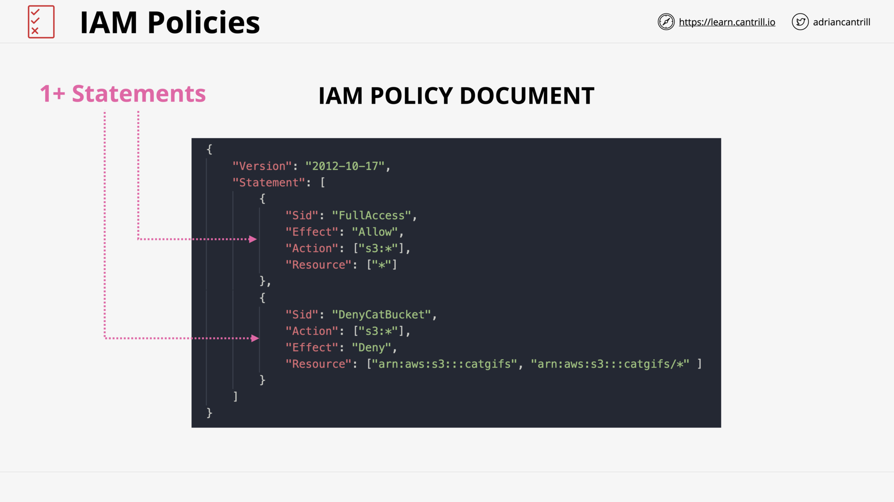
IAM Policy Document

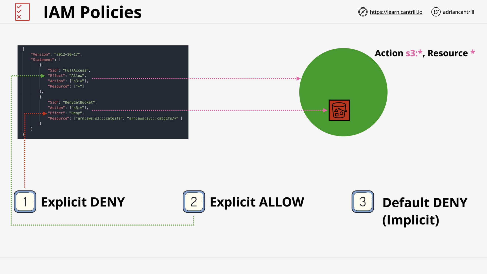
DENY - ALLOW - DENY

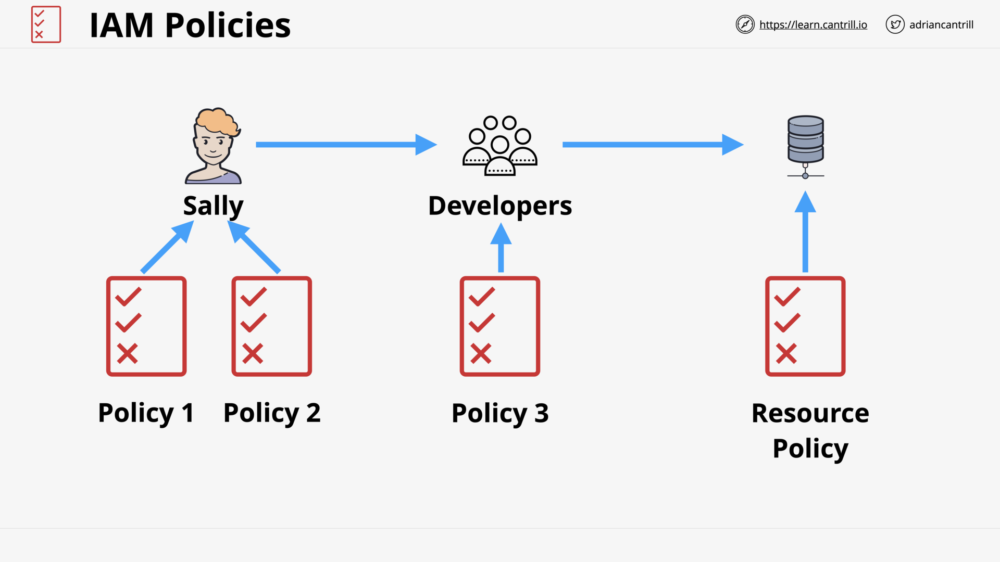
All policies for IAM Identities (User, Role, Group) & AWS Resources are evaluated at the same time.

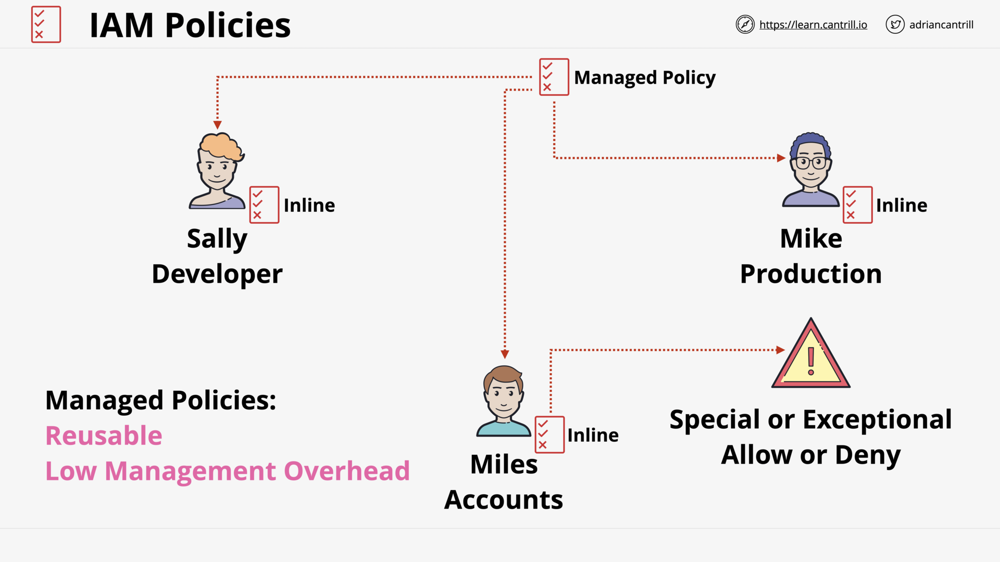
Inline Policy vs Managed Policy

## [_ASSOCIATE_] IAM Users and ARNs (13:49)

IAM User - What is it?

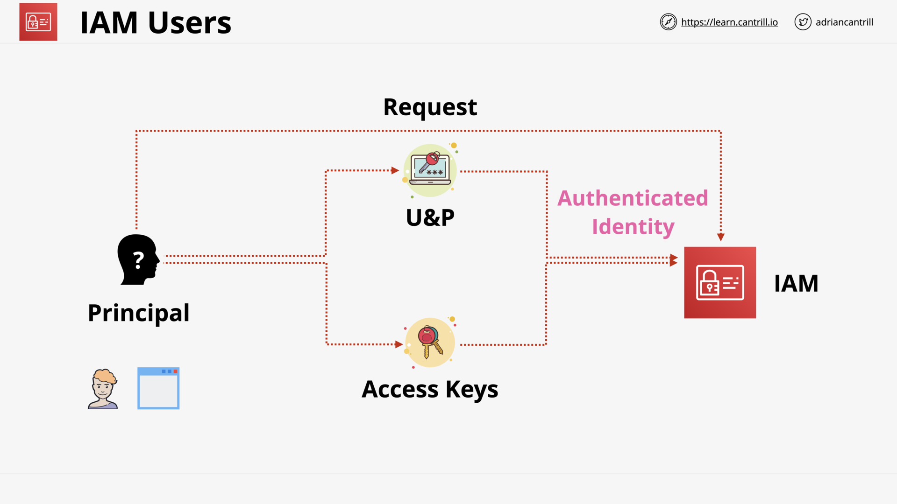
IAM - Principal and Authenticated Identity

> [!NOTE] What is a principal?
> Principal is an entity in AWS that can perform actions and access resources.

IAM Users - Limitation

> [!NOTE] What is the limit IAM Users per account?
>
> 5.000 IAM Users per AWS account

> [!NOTE] How many IAM Groups a IAM User can be a member of?
>
> 10 IAM groups per IAM User

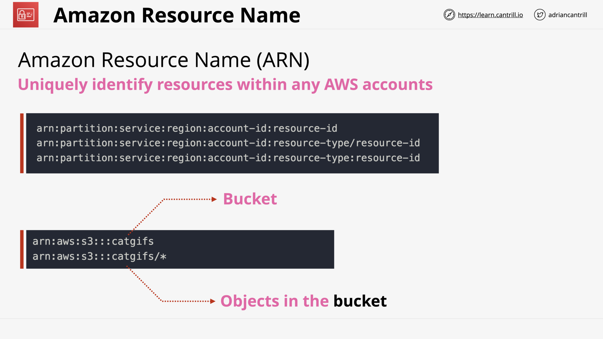
ARNs

> [!NOTE] What is the format of ARN?
>
> - **arn**:_partition_:_service_:_region_:_account-id_:_resource-id_
> - **arn**:_partition_:_service_:_region_:_account-id_:_resource-type_/_resource-id_
> - **arn**:_partition_:_service_:_region_:_account-id_:_resource-type_:_resource-id_
>
> 👉
>
> - 5 to 6 colon `:`
> - _region_ or/and _account-id_ can be omitted.

| **arn** | _partition_                       | _service_                     | _region_                              | _account-id_ | _resource-type_ | _resource-id_ |
| ------- | --------------------------------- | ----------------------------- | ------------------------------------- | ------------ | --------------- | ------------- |
|         | `aws` `aws-cn` `aws-us-gov` | `iam` `s3` `ec2` ... | `us-east-1` `ap-southest-1` ... |              | `user`          |               |

## [_ASSOCIATE_, _DEMO_] Simple Identity Permissions in AWS (16:06)

## [_ASSOCIATE_] IAM Groups (7:48)

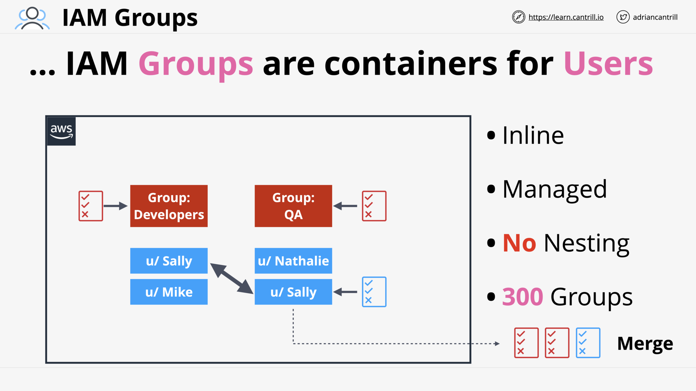
IAM Groups

> [!NOTE] What is IAM Group?
>
> Containers for IAM Users.

> [!NOTE] What are the limits of IAM Group?
>
> - No Nesting.
> - Limit of 300 Groups.

IAM Group is not a true identity

> [!NOTE] Can an IAM Group be used as a Principle in a policy?
> IAM Group is NOT a true identity, that
>
> - can NOT be used as a Principle in a policy.
> - don't have credential to login with

## [_ASSOCIATE_, _DEMO_] Permissions control using IAM Groups (9:24)

## [_ASSOCIATE_] IAM Roles - The Tech (8:13)

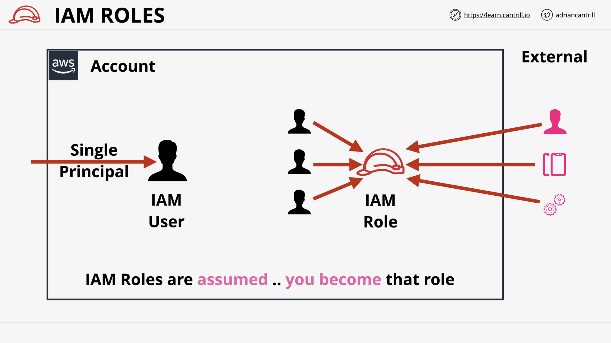
IAM Role and Assuming an IAM Role

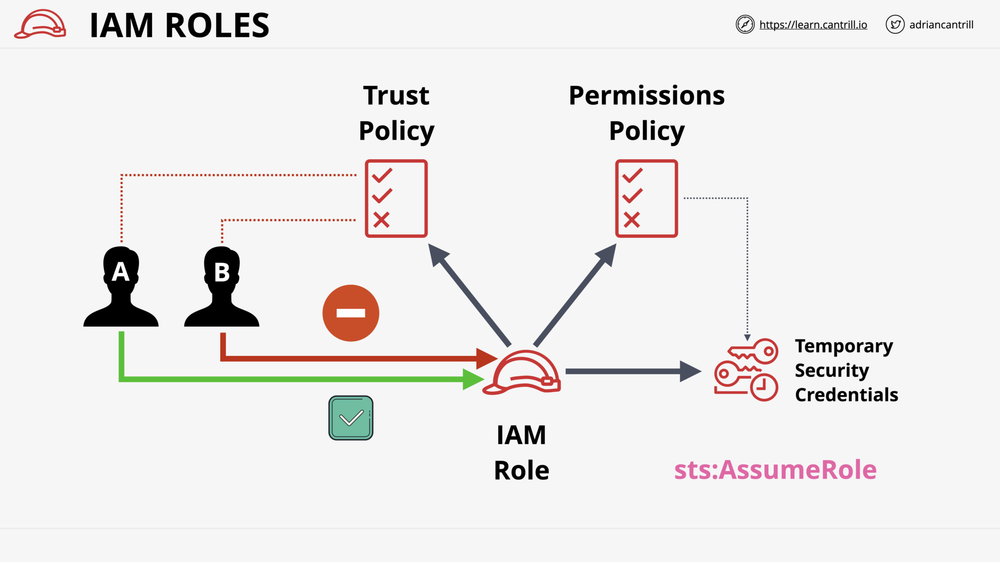
Trust Policy vs Permission Policy

> [!NOTE] What is Trust Policy in IAM?
>
> The trust policy defines
>
> - which principals can assume the role, and
> - under which conditions
>
> See [How to use trust policies with IAM roles | AWS Security Blog](https://aws.amazon.com/blogs/security/how-to-use-trust-policies-with-iam-roles/)

## [_ASSOCIATE_] When to use IAM Roles (15:27)

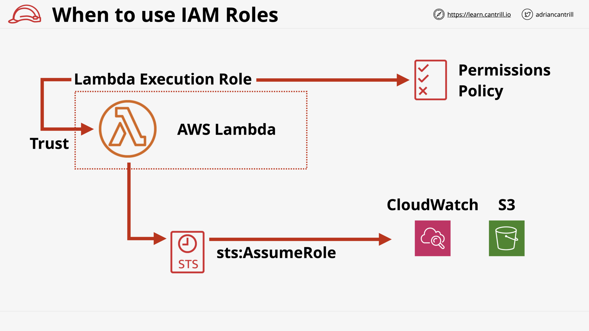
Lambda Execute Role

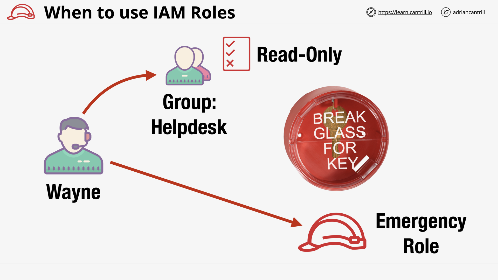
Emergency Role

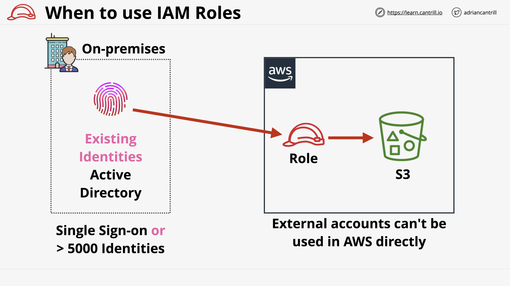
Existing Identities (e.g. Active Directory)

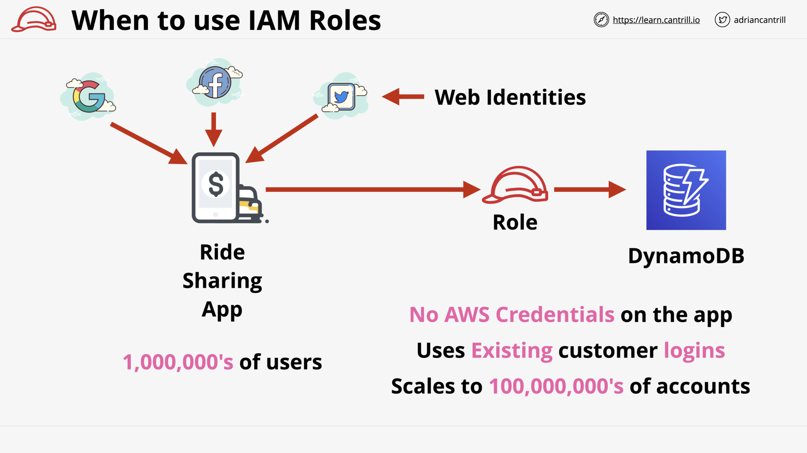
Web Identities (e.g. Google, Facebook)

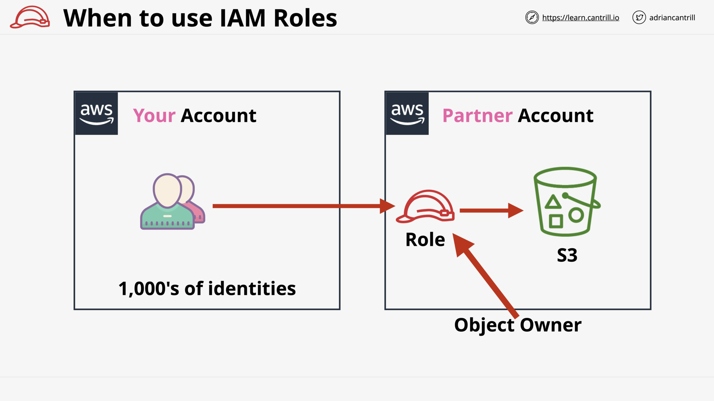
AWS Partner Accounts

## Service-linked Roles & PassRole (5:16)

Service-linked Roles

> [!NOTE] What is Service-linked Role?
>
> A service-linked role is
>
> - a unique type of IAM role that is linked directly to an AWS service.
> - predefined (by the service) to include all the permissions that the service requires (to call other AWS services on your behalf).

> [!NOTE] Why use Service-linked Role?
>
> A service-linked Role
>
> - simplify the process of setting up a service because
>
>   - you don't have to manually add permissions for the service to complete actions on your behalf
>
> - may be created
>   - automatically (by the service)
>   - manually using a wizard in the console
>   - manually using IAM
>
> See [Create a service-linked role](https://docs.aws.amazon.com/IAM/latest/UserGuide/id_roles_create-service-linked-role.html)

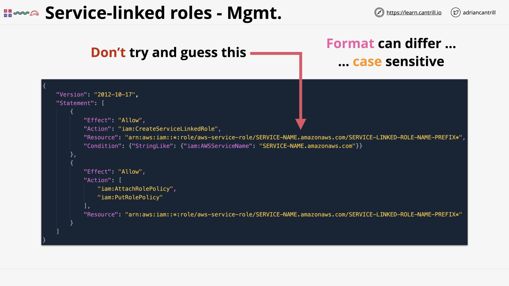
Permissions to allow create/edit the service-linked role

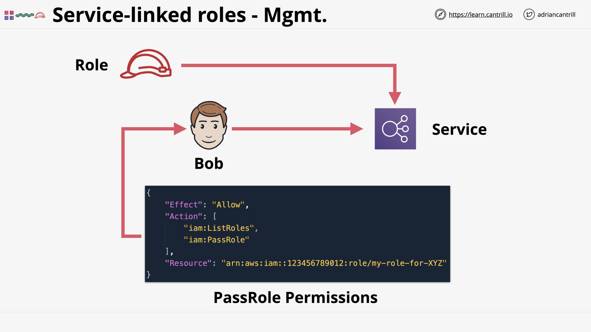
Pass an existing role to the service

## [_ASSOCIATE_] AWS Organizations (12:56)

"Standard" AWS Account

Management/Master Account

> [!NOTE] AWS Organization and Management Account, which come first?
>
> - First, you use a standard account to create an AWS Organization
> - Then that standard account become the management account of the AWS Organization.

Invite existed standard accounts to an AWS Organization

Accepting invitations to become member of an AWS Organization

Member Accounts

Organization Root & Organization Unit (OU)

Consolidated Billing

Role Switching

## [_ALL_, _DEMO_] AWS Organizations (19:48)

Create an account in your organization

> [!NOTE] How to access an AWS account in an AWS organization?
>
> 1. Using username/password of that AWS account to access that AWS account using its root user
> 2. Using another account to _switch role_ to that account's IAM role `OrganizationAccountAccessRole`
> 3. Using the AWS access portal with corporation credentials (Google, Facebook...)

## [_ASSOCIATE_] Service Control Policies (SCPs) (12:44)

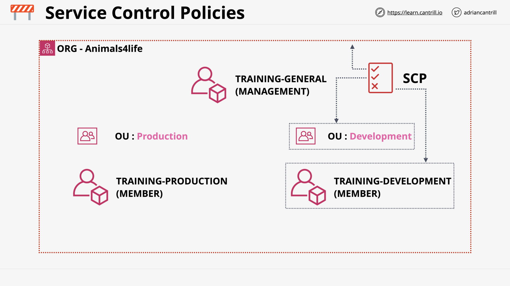
Service Control Policies (SCP)

_.png>)
SCP controls account permissions in an organization

> [!NOTE] What does Service Control Policies (SCP) do?
>
> SCP
>
> - restricts permissions for
>
>   - IAM users
>   - IAM roles
>   - including root user
>
>   in **member** accounts.
>
> - (do NOT grant permissions)

_.png>)
SCP - Deny List

> [!NOTE] SGP - Deny List Strategy
> With _deny list strategy_, all permissions are allowed unless explicitly denied.
>
> This is the _default_ behavior of AWS Organizations.
>
> - By default, AWS Organizations attaches an AWS managed policy called `FullAWSAccess` to all roots, OUs, and accounts.
> - You
>   - leave the default `FullAWSAccess` policy in place (that allow "all").
>   - then attach additional policies that explicitly deny access to the unwanted services and actions.

_.png>)
SCP - Allow List

> [!NOTE] SGP - Allow List Strategy
> With _allow list strategy_, all permissions are denied unless explicitly allowed.
>
> - By default, AWS Organizations attaches an AWS managed policy called `FullAWSAccess` to all roots, OUs, and accounts.
> - You
>   - remove the default `FullAWSAccess` policy
>   - then attach additional policies that explicitly allow access to the wanted services and actions

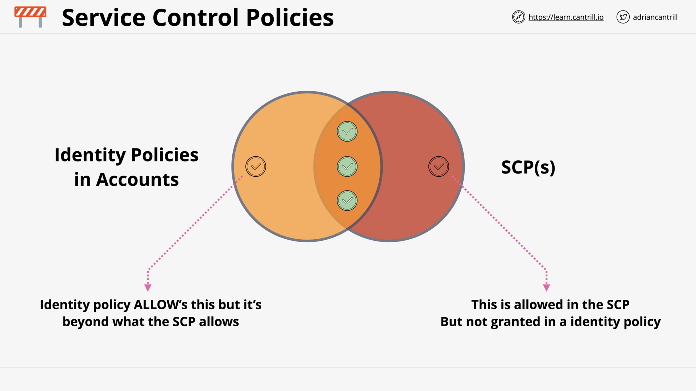
Identity Policies and SCPs

> [!NOTE] Can SCP restrict management account?

> SCPs don't affect users or roles in the management account. They affect only the member accounts in your organization.

> [!NOTE] Can SCP restrict root user?
>
> SCP can un-directly control the member account's root user (by control the account's permission)

## [_ALL_, _DEMO_] Using Service Control Policies (16:45)

## [_ASSOCIATE_] CloudWatch Logs (7:16)

CloudWatch Logs - Basic

<!--  -->

CloudWatch Logs - Architecture

> [!NOTE] What is Log Event?

> [!NOTE] What is Log Stream?

> [!NOTE] What is Log Group?

## [_ASSOCIATE_] CloudTrail (11:40)

> [!NOTE] What is CloudTrail Event/Trail?

> [!NOTE] How long is the default CloudTrail history?

> [!NOTE] In CloudTrail, what are Management Events / Data Events?

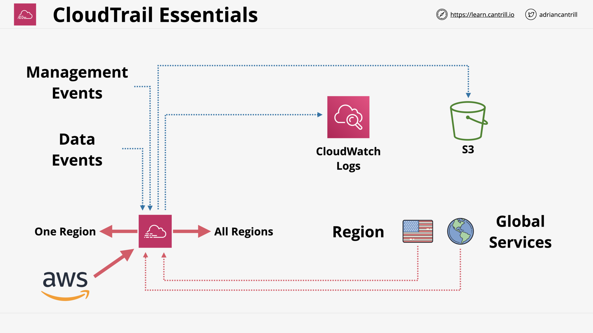

> [!NOTE] How to implement a central log store for AWS Organization?

> [!NOTE] Is CloudTrail realtime?

## [_ALL_, _DEMO_] Implementing an Organizational Trail (18:23)

## AWS Control Tower 101 (15:42)

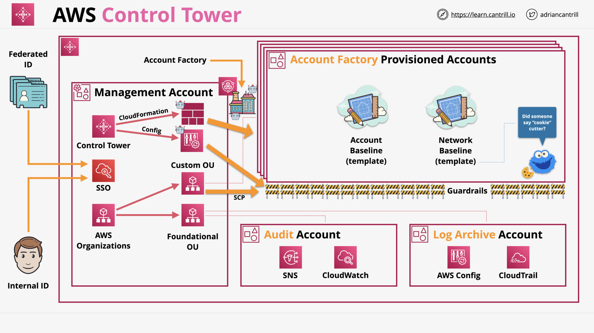

## IAM & Orgs Section Quiz
