# ADVANCED EC2

## Bootstrapping EC2 using User Data (10:25)

EC2 User Data

> [!NOTE] What is EC2 bootstrapping?
>
> The process of configuring an EC2 instance to perform automated install & configuration steps 'post launch' before an instance is brought into service.

> [!NOTE] How to bootstrap an EC2 instance?

> [!NOTE] What is EC2 user data?

> [!NOTE] When does EC2 execute user data?

> [!NOTE] What exactly execute EC2 user data?

> [!NOTE] How many times does the EC2 user data be executed?

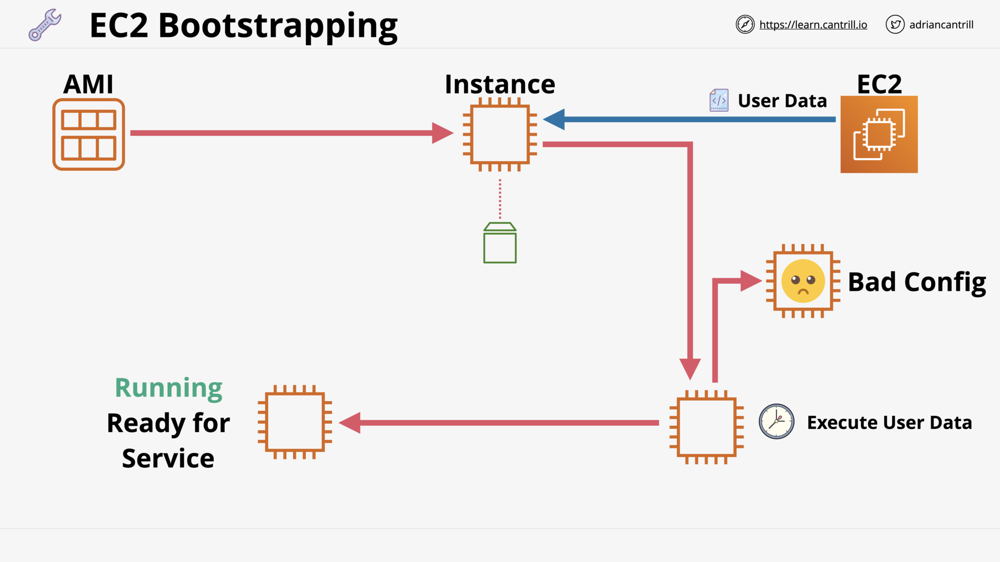
EC2 Bootstrapping

User Data - Key Points

> [!NOTE] What are drawbacks of EC2 user data?
>
> - It's opaque to EC2.
> - NOT secure.
> - Limited to 16KB.

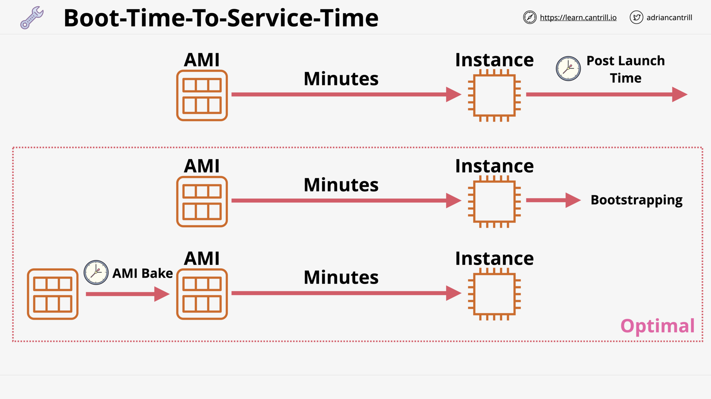
Boot-Time-To-Service-Time

## [_DEMO_] Bootstrapping Wordpress Installation - PART1 (15:00)

## [_DEMO_] Bootstrapping Wordpress Installation - PART2 (6:45)

## Enhanced Bootstrapping with CFN-INIT (11:52)

AWS::CloudFormation::Init

> [!NOTE] What is `cfn-init`?
>
> A powerful desired-state-like configuration engine which is part of the CFN suite of products.

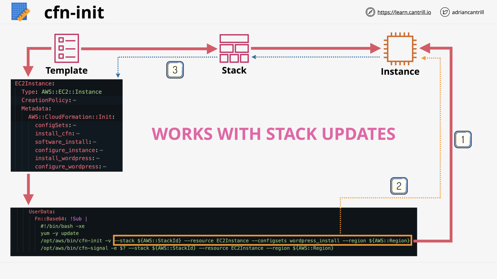
`cfn-init` works with stack updates

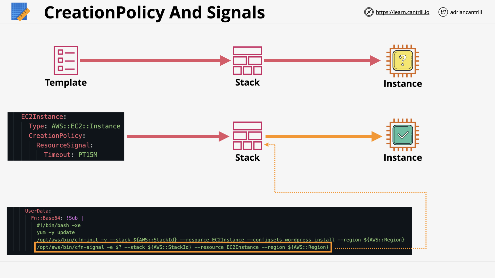
CreatePolicy & Signals

> [!NOTE] What does `CloudFormation`'s `CreatePolicy` do?
>
> Creation policies create a 'WAIT STATE' on resources .. not allowing the resource to move to `CREATE_COMPLETE` until signalled using the `cfn-signal` tool.

> [!NOTE] What does `cfn-signal` do?
>
> `cfn-signal` tells CloudFormation that the stack's resource is at the desired state (it's created).

## [_DEMO_] CFN-INIT and CFN Creation Policies (12:29)

## EC2 Instance Roles & Profile (4:18)

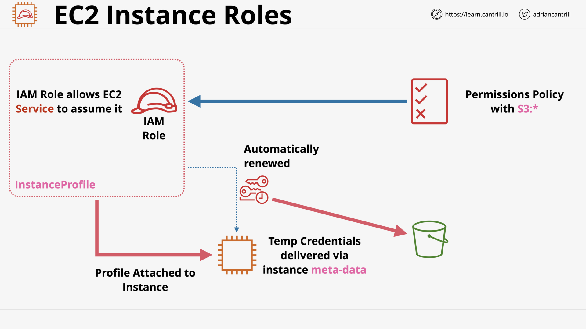
EC2 Instance Role & Instance Profile

EC2 Instance Profile's credential

> [!NOTE] Why use Instance Role/Profile?
>
> To grant permissions to applications running on Amazon EC2 instances via short-term credentials.
>
> [Using an IAM role to grant permissions to applications running on Amazon EC2 instances](https://docs.aws.amazon.com/IAM/latest/UserGuide/id_roles_use_switch-role-ec2.html)

## [_DEMO_] Using EC2 Instance Roles (13:31)

## SSM Parameter Store (6:16)

SSM Paremeter Store - Overview

> [!NOTE] What is SSM Parameter Store?
>
> [Parameter Store](https://docs.aws.amazon.com/systems-manager/latest/userguide/systems-manager-parameter-store.html), a capability of [AWS Systems Manager](https://docs.aws.amazon.com/systems-manager/latest/userguide/what-is-systems-manager.html), provides secure, hierarchical storage for configuration data management and secrets management.

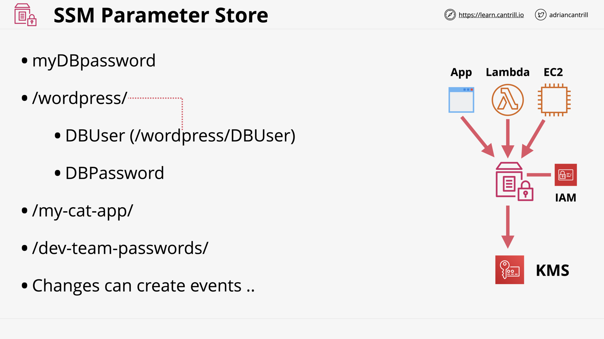
SSM Paremeter Store - Example

## [_DEMO_] Parameter Store (16:11)

## System and Application Logging on EC2 (6:15)

Logging on EC2

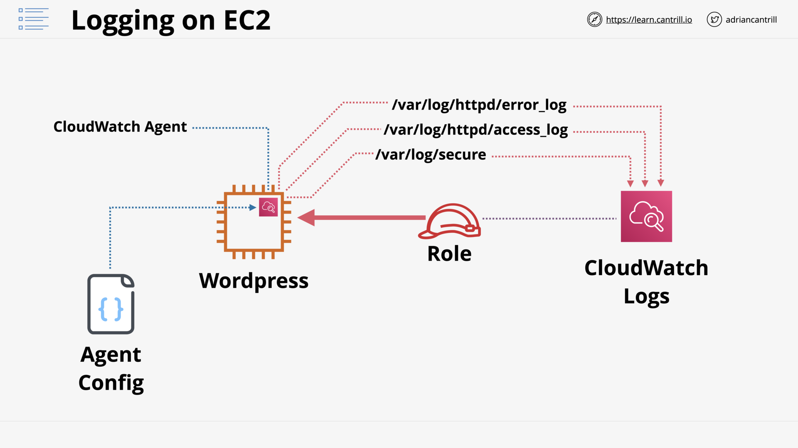
CloudWatch Agent - internal instance metrics and logging collection

## [_DEMO_] Logging and Metrics with CloudWatch Agent-PART1 (11:51)

## [_DEMO_] Logging and Metrics with CloudWatch Agent-PART2 (8:08)

## [EC2 Placement Groups](https://docs.aws.amazon.com/AWSEC2/latest/UserGuide/placement-groups.html) (14:29)

EC2 Placement Groups - Placement strategies

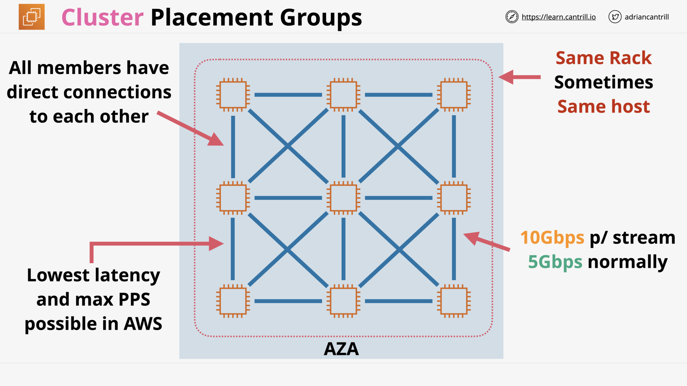
Cluster Placement Groups

Cluster Placement Groups - Pros and Cons

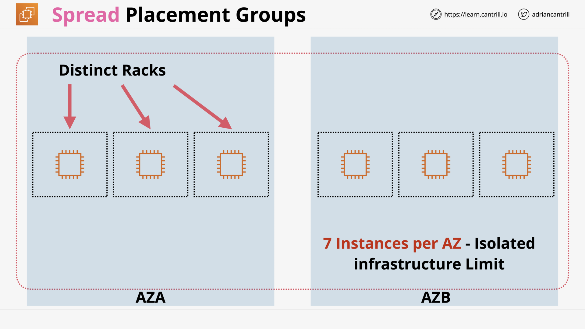
Spread Placement Groups

Spread Placement Groups - Pros and Cons

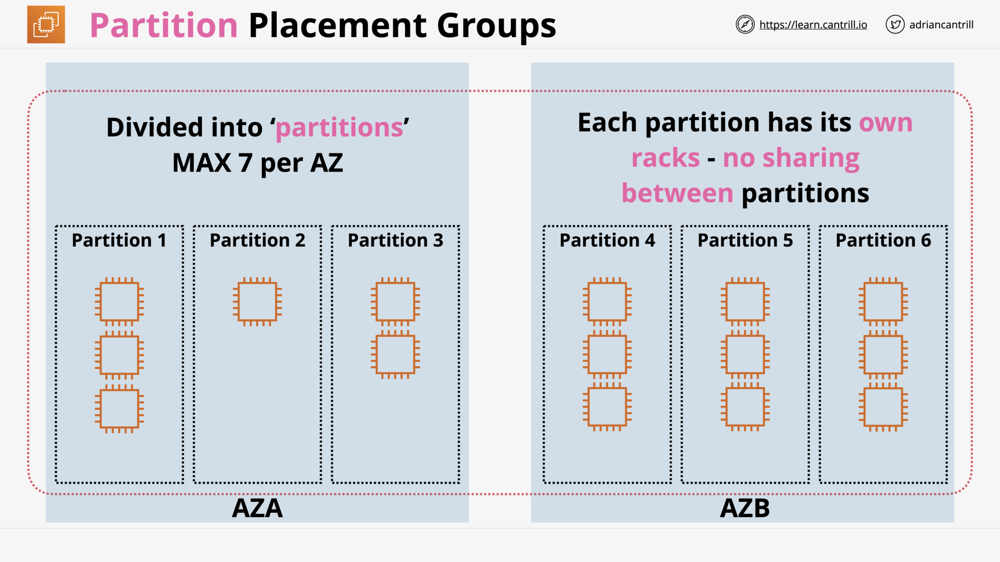
Partition Placement Groups

Partition Placement Groups - Pros and Cons

## Dedicated Hosts (8:56)

EC2 Dedicated Hosts

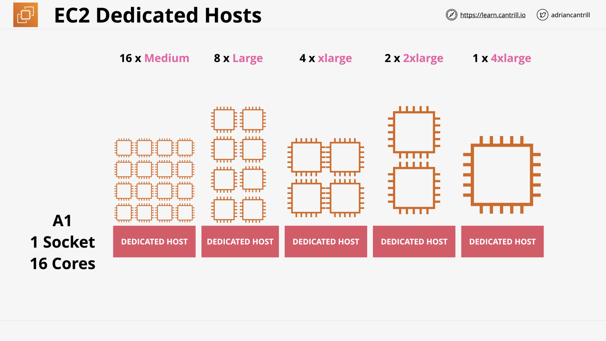
Instance capacity configurations - Single instance type support

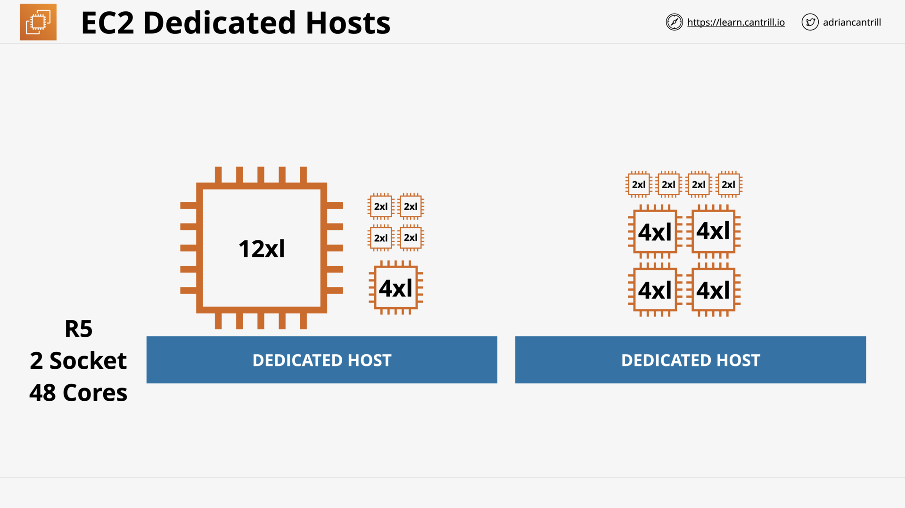
Instance capacity configurations - Multiple instance type support

EC2 Dedicated Hosts - Limitations & Features

## [Enhanced Networking](https://docs.aws.amazon.com/AWSEC2/latest/WindowsGuide/enhanced-networking.html) & [EBS Optimized](https://docs.aws.amazon.com/AWSEC2/latest/UserGuide/ebs-optimized.html) (6:57)

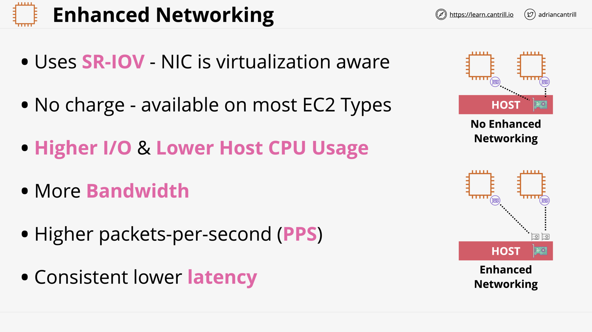

> [!NOTE] What is AWS Enhanced networking?
>
> The AWS implementation of SR-IOV.

> [!NOTE] What is SR-IOV?
>
> A standard allowing a physical host network card to present many logical devices which can be directly utilized by instances.

> [!NOTE] What is the benefit of SR-IOV?
>
> Lower host CPU usage, better throughput, lower and consistent latency.

> [!NOTE] What is EBS Optimized?
>
> A dedicated bandwidth for storage networking - separate from data networking.

## Advanced EC2 Section Quiz
