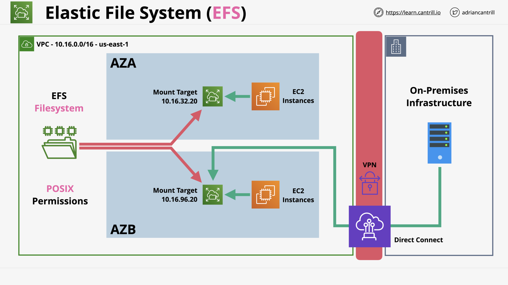
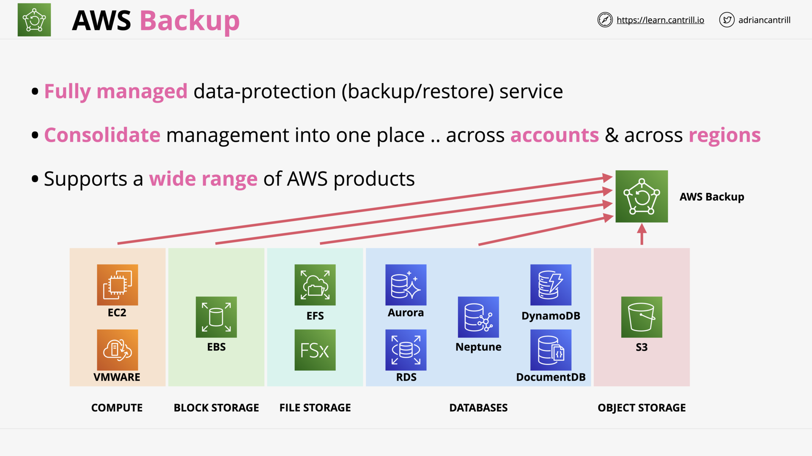

# NETWORK STORAGE & DATA LIFECYCLE

## EFS Architecture (9:05)

EFS - Overview

> [!NOTE] Which OS does AWS EFS support?
>
> AWS EFS is an implement of NFSv4, which can only be mounted in Linux.

> [!NOTE] How to access an AWS EFS?
>
> The EFS can be accessed:
>
> - inside a VPC.
> - from on-premises: via VPN or DX.

EFS - Architecture

EFS - Performance

> [!NOTE] Which configuration impact an [EFS performance](https://docs.aws.amazon.com/efs/latest/ug/performance.html)?
>
> - Storage Class:
>
>   - EFS `One Zone` / One Zone-IA
>   - **EFS `Standard`** / Standard-IA
>   - EFS `Archive`
>
> - Performance Mode:
>
>   - **`General Purpose` mode** (default - 99.9% of uses): Lowest latency
>   - `Max I/O` mode: Highly parallelized workloads that can tolerate higher latencies
>
> - Throughput Mode:
>
>   - `Bursting` mode: Throughput scale with storage
>   - Enhanced
>     - **`Elastic` mode** (default - recommend): Spiky/unpredictable workloads
>     - `Provisioned` mode: Known performace requirements; or throughput > 5% average-to-peak ratio

## [_DEMO_] Implementing EFS - PART1 (8:51)

## [_DEMO_] Implementing EFS - PART2 (11:32)

## [_DEMO_] Using EFS with Wordpress (16:00)

## AWS Backup (6:36)

AWS Backup supports a wide range of [AWS services](https://aws.amazon.com/backup-restore/services)

AWS Backup - Summary

## Network Storage Section Quiz
