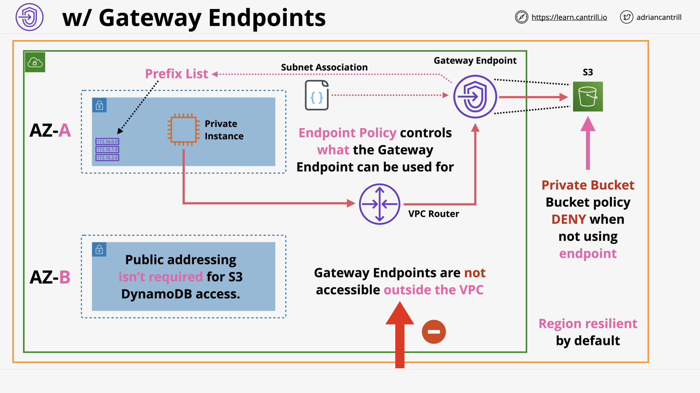

# ADVANCED VPC NETWORKING

## VPC Flow Logs (9:56)

VPC FLow Logs - Capture traffic metadata, NOT capture contents, NOT realtime

VPC FLow Logs - Architecture

VPC FLow Logs - Flow Log Records

## Egress-Only Internet Gateway (6:46)

Egress-Only Internet Gateway - Why?

> [!NOTE] What does Egress-Only Internet Gateway do?
>
> Allow outbound (and response) only access to the public AWS services and Public Internet for IPv6 enabled instances or other VPC based services.

Egress-Only Internet Gateway - Architecture

## VPC Endpoints (Gateway) (11:14)

__lea_—_F.png>)
VPC Gateway Endpoints: Provide private access to AWS Public Services via Prefix List and Route Table

VPC - Without Gateway Endpoints

VPC - With Gateway Endpoints

## VPC Endpoints (Interface) (11:26)

__lea_—.png>)
VPC Interface Endpoints - Provide private access to AWS Public Services via DNS

__lea_—.png>)
VPC Interface Endpoints - PrivateDNS

Without Interface Endpoints 🛑

With Interface Endpoints

With Interface Endpoints & PrivateDNS

## [_DEMO_] VPC Endpoints - Interface - PART1 (11:59)

## [_DEMO_] VPC Endpoints - Gateway - PART2 (9:59)

## [_DEMO_] Egress-Only Internet Gateway - PART3 (7:57)

## VPC Peering (9:04)

VPC Peering - Overview

VPC Peering - Architecture

## [_DEMO_] VPC Peering (22:38)

## Advanced VPC Section Quiz
