# INFRASTRUCTURE AS CODE (CLOUDFORMATION)

## CloudFormation Physical & Logical Resources (7:30)

Physical Resource / Logical Resource - Template - Stack

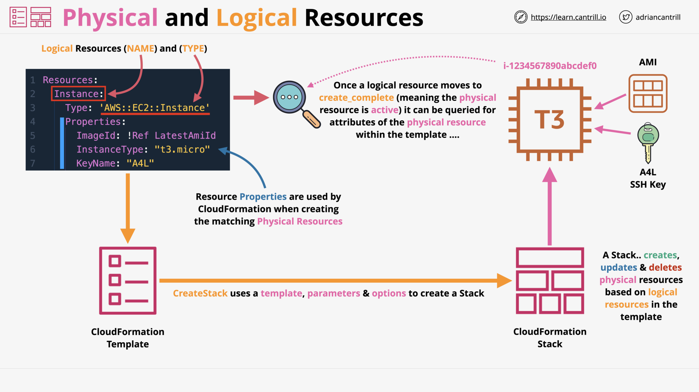
CloudFormation - Architecture

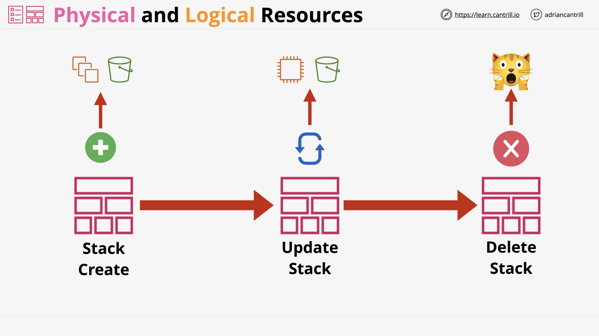
CloudFormation - Stack Create/Update/Delete

## [_DEMO_] Simple Non Portable Template - PART1 (10:28)

## [_DEMO_] Simple Non Portable Template - PART2 (11:28)

## CloudFormation Template and Pseudo Parameters (6:53)

Template/Pseudo Parameters - Overview

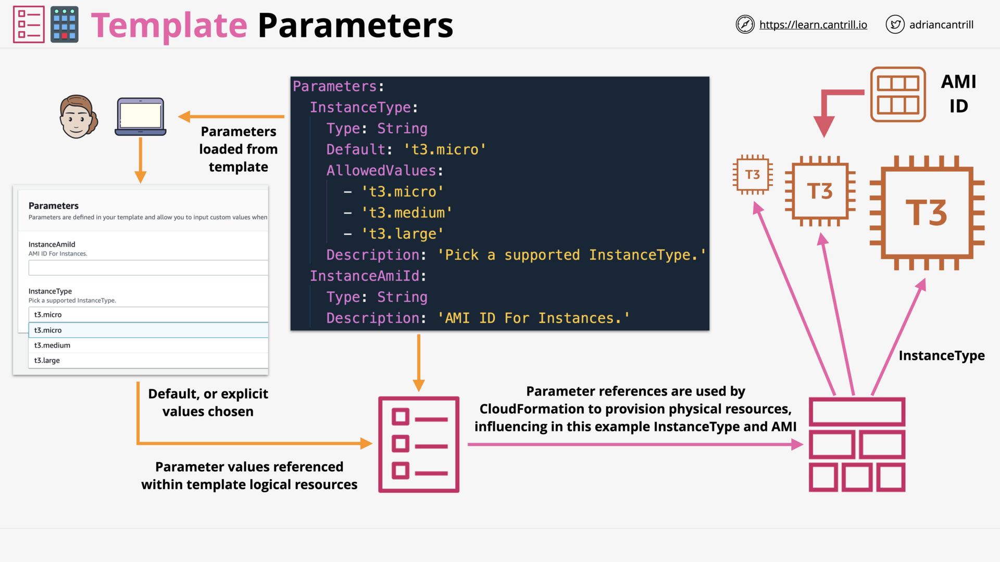
Template Parameters - Input for Cfn Template

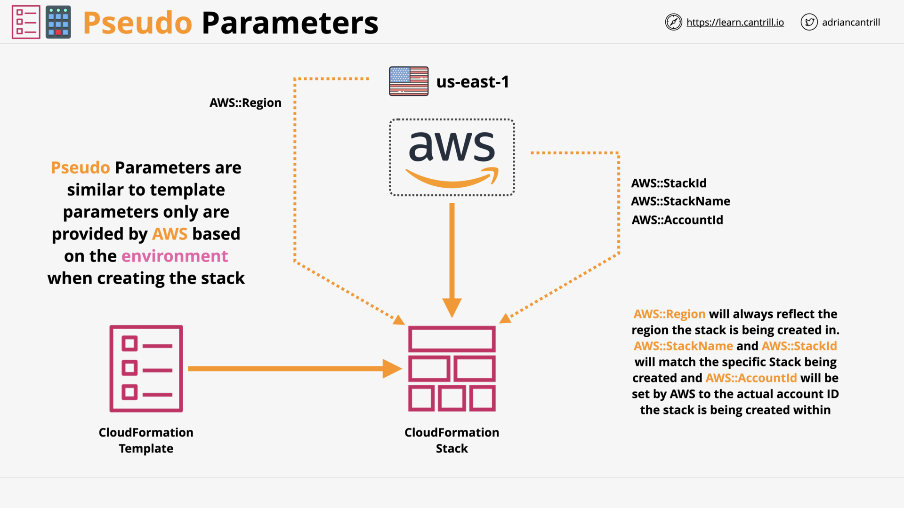
[Pseudo Parameters](https://docs.aws.amazon.com/AWSCloudFormation/latest/UserGuide/pseudo-parameter-reference.html) - Provided by AWS based on the **Stack** environment

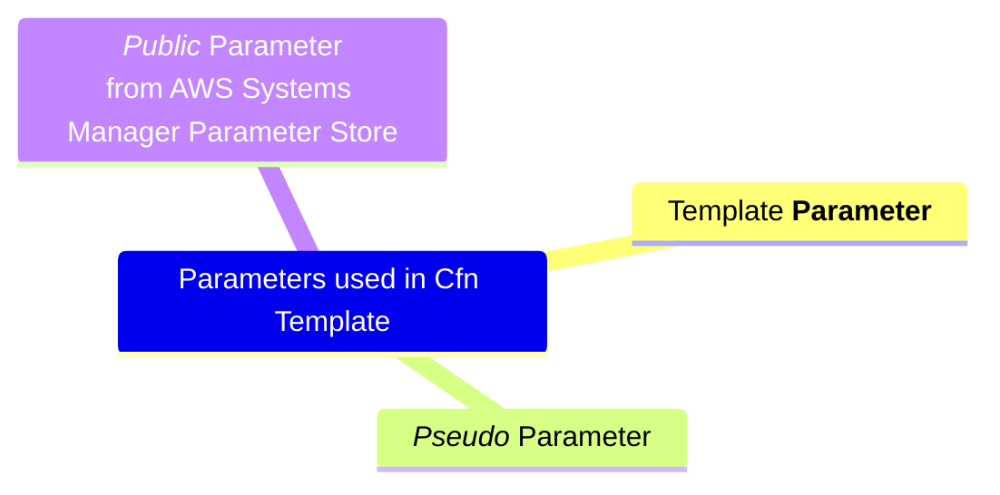
```mermaid
mindmap
  Parameters used in Cfn Template
    Template **Parameter**
    _Pseudo_ Parameter
    _Public_ Parameter<br/>from AWS Systems Manager Parameter Store
```

> [!NOTE] What are the difference between _Cfn - **Pseudo Parameters**_ and _AWS Systems Manager - **public parameters**_
>
> - _Cfn - **Pseudo Parameters**_: Parameters predefined by AWS CloudFormation
>
>   e.g.
>
>   - `AWS::AccountId`
>   - `AWS::Region`
>   - `AWS::StackId`
>   - `AWS::StackName`
>
>   See [Pseudo parameters reference - AWS CloudFormation](https://docs.aws.amazon.com/AWSCloudFormation/latest/UserGuide/pseudo-parameter-reference.html)
>
> - _AWS Systems Manager Parameter Store - **public parameters**_: Common artifacts published by some AWS services:
>
>   e.g.
>
>   - EC2: Information about AMIs:
>     - `ami-amazon-linux-latest`
>     - `ami-windows-latest`
>   - ECS: `/aws/service/ecs/optimized-ami/amazon-linux-2/recommended`
>   - EKS: `/aws/service/eks/optimized-ami/1.14/amazon-linux-2/recommended`
>   - AWS:
>     - Services
>     - Regions
>     - Availability Zone
>     - ...
>
>   See
>
>   - [Discovering public parameters in Parameter Store - AWS Systems Manager](https://docs.aws.amazon.com/systems-manager/latest/userguide/parameter-store-finding-public-parameters.html)
>   - [Reference existing resources and Systems Manager parameters with CloudFormation-supplied parameter types - AWS CloudFormation](https://docs.aws.amazon.com/AWSCloudFormation/latest/UserGuide/cloudformation-supplied-parameter-types.html#systems-manager-parameter-types-supported)

## CloudFormation Intrinsic Functions (14:28)

Cfn - [Intrinsic Functions](https://docs.aws.amazon.com/AWSCloudFormation/latest/UserGuide/intrinsic-function-reference.html)

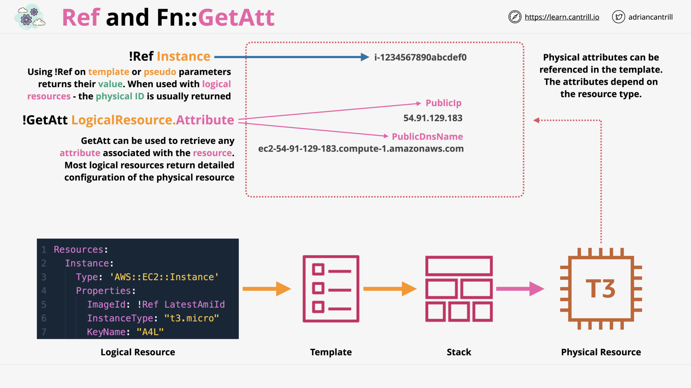
Cfn Intrinsic Functions: `Ref` & `Fn::GetAtt`

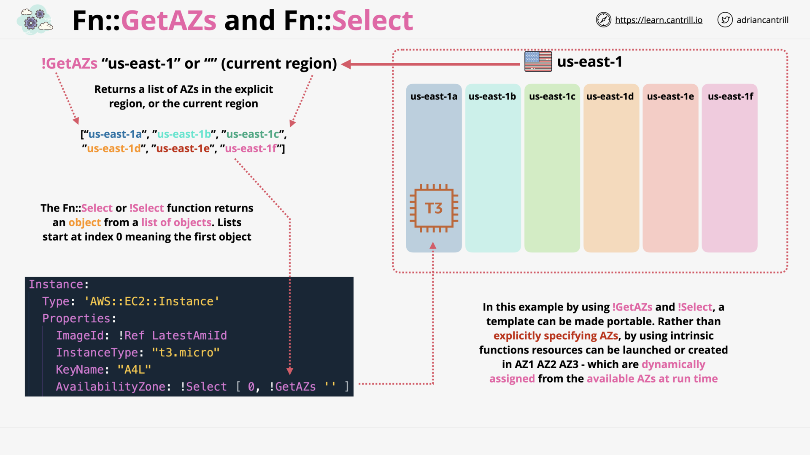
Cfn Intrinsic Functions: `Fn:GetAZs` & `Fn:Select`

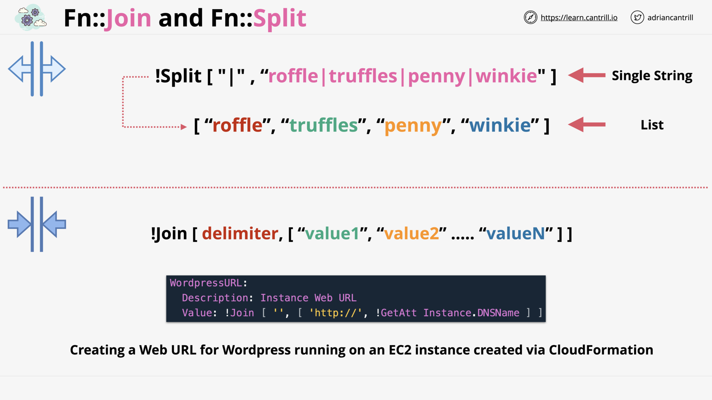
Cfn Intrinsic Functions: `Fn:Join` & `Fn:Split`

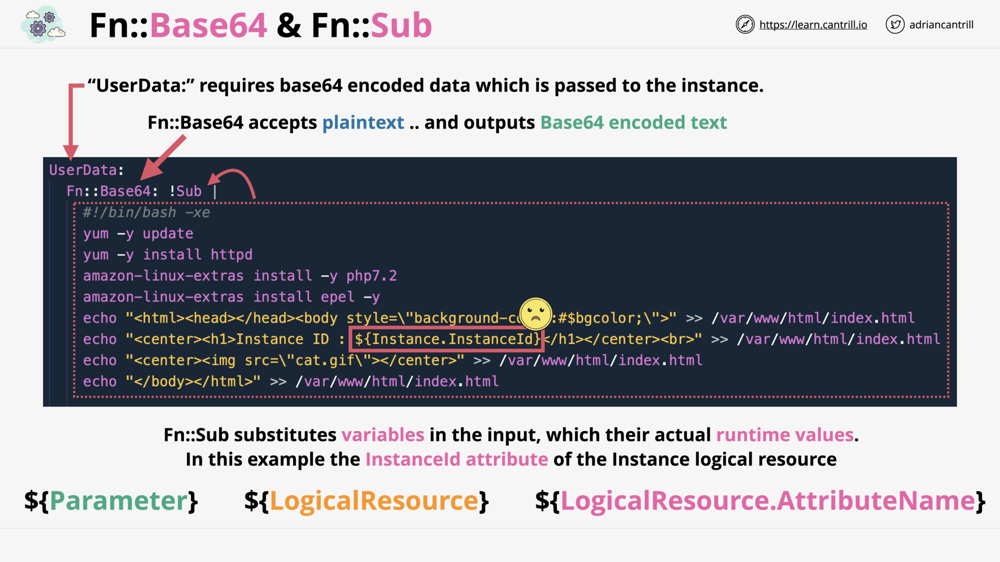
Cfn Intrinsic Functions: `Fn:Base64` & `Fn:Sub`

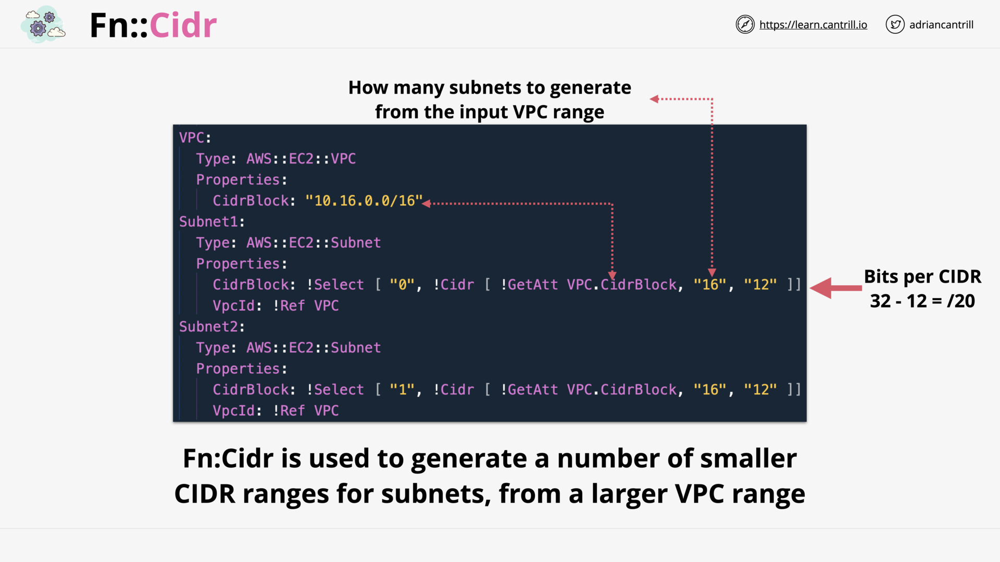
Cfn Intrinsic Functions: `Fn:Cidr`

> [!NOTE]
>
> | Function     | YAML Syntax (Short form)                                  | Example usage                                        | Return                                             |
> | ------------ | --------------------------------------------------------- | ---------------------------------------------------- | -------------------------------------------------- |
> | `Ref`        | `!Ref logicalName`                                        | `!Ref MyInstance`                                    | `i-123456789`[^1]                                  |
> | `Fn::GetAtt` | `!GetAtt logicalNameOfResource.attributeName`             | `!GetAtt MyInstance.PublicIp`                        | `ec2-1.2.3.4.compute-1.amazonaws.com`[^2]          |
> | `Fn::GetAZs` | `!GetAZs region`                                          | `!GetAZs ''`                                         | `[ "us-east-1a", "us-east-1b", "us-east-1c" ]`[^3] |
> | `Fn::Select` | `!Select [ index, listOfObjects ]`                        | `!Select [ "0", [ "apples", "grapes", "oranges" ] ]` | `"apples"`[^4]                                     |
> |              |                                                           | `!Select [ "0", !GetAZs '' ]`                        | `"us-east-1a"`                                     |
> | `Fn::Join`   | `!Join [ delimiter, [ comma-delimited list of values ] ]` | `!Join [ ":", [ a, b, c ] ]`                         | `"a:b:c"`                                          |
> | `Fn::Split`  | `!Split [ delimiter, source string ]`                     | `!Split [ ":" , "a:b:c" ]`                           | `[ a, b, c ]`                                      |
> | `Fn::Base64` | `!Base64 valueToEncode`                                   | `!Base64 AWS CloudFormation`                         | `QVdTIENsb3VkRm9ybWF0aW9u`[^5]                     |
> | `Fn::Sub`    | `!Sub String`                                             | `!Sub "SSH security group for ${AWS::StackName}"`    | `"SSH security group for STACK_NAME"`              |
> | `Fn::Cidr`   | `!Cidr [ ipBlock, count, cidrBits ]`                      | `!Cidr [ "10.16.0.0/16", 16, 12 ]`                   | 16 CIDRs with a subnet mask `/20`                  |
> |              |                                                           |                                                      |                                                    |
> |              | 
                                | 
                           | 
                         |

> [!NOTE]
>
> | Function     |                            | YAML Syntax                                                           |
> | ------------ | -------------------------- | --------------------------------------------------------------------- |
> | `Ref`        | Short form                 | `!Ref logicalName`                                                    |
> |              | Full form                  | `Ref: logicalName`[^6]                                                |
> |              |                            |                                                                       |
> | `Fn::GetAtt` | Short form                 | `!GetAtt logicalNameOfResource.attributeName`                         |
> |              | Full form                  | `Fn::GetAtt: [ logicalNameOfResource, attributeName ]`                |
> |              |                            |                                                                       |
> | `Fn::GetAZs` | Short form                 | `!GetAZs region`                                                      |
> |              | Full form                  | `Fn::GetAZs: region`                                                  |
> |              |                            |                                                                       |
> | `Fn::Select` | Short form                 | `!Select [ index, listOfObjects ]`                                    |
> |              | Full form                  | `Fn::Select: [ index, listOfObjects ]`                                |
> |              |                            |                                                                       |
> | `Fn::Join`   | Short form                 | `!Join [ delimiter, [ comma-delimited list of values ] ]`             |
> |              | Full form                  | `Fn::Join: [ delimiter, [ comma-delimited list of values ] ]`         |
> |              |                            |                                                                       |
> | `Fn::Split`  | Short form                 | `!Split [ delimiter, source string ]`                                 |
> |              | Full form                  | `Fn::Split: [ delimiter, source string ]`                             |
> |              |                            |                                                                       |
> | `Fn::Base64` | Short form                 | `!Base64 valueToEncode`                                               |
> |              | Full form                  | `Fn::Base64: valueToEncode`                                           |
> |              |                            | `Fn::Base64:` `  !Sub string`                                     |
> |              |                            |                                                                       |
> | `Fn::Sub`    | Short form                 | `!Sub String`                                                         |
> |              | Full form                  | `Fn::Sub: String`                                                     |
> |              |                            |                                                                       |
> | `Fn::Cidr`   | Short form                 | `!Cidr [ ipBlock, count, cidrBits ]`                                  |
> |              | Full form                  | `Fn::Cidr:` `  - ipBlock` `  - count` `  - cidrBits`  |
> |              |                            |                                                                       |
> |              | 
 | 
                                            |

> [!TIP] How to remember Full form and short form?
>
> - `Full form `: `Fn::FunctionName:`
> - `Short form`: `!   FunctionName `

See [Intrinsic function reference - AWS CloudFormation](https://docs.aws.amazon.com/AWSCloudFormation/latest/UserGuide/intrinsic-function-reference.html)

## CloudFormation Mappings (4:30)

Cfn Mappings (Template): [`Mappings` section](https://docs.aws.amazon.com/AWSCloudFormation/latest/UserGuide/mappings-section-structure.html)

> [!NOTE] Mappings and key level
>
> The `Mappings` section can have multiple mappings.
>
> - Each mapping is a `key` of the `Mappings` section.
> - Each mapping can have 2 level of keys.

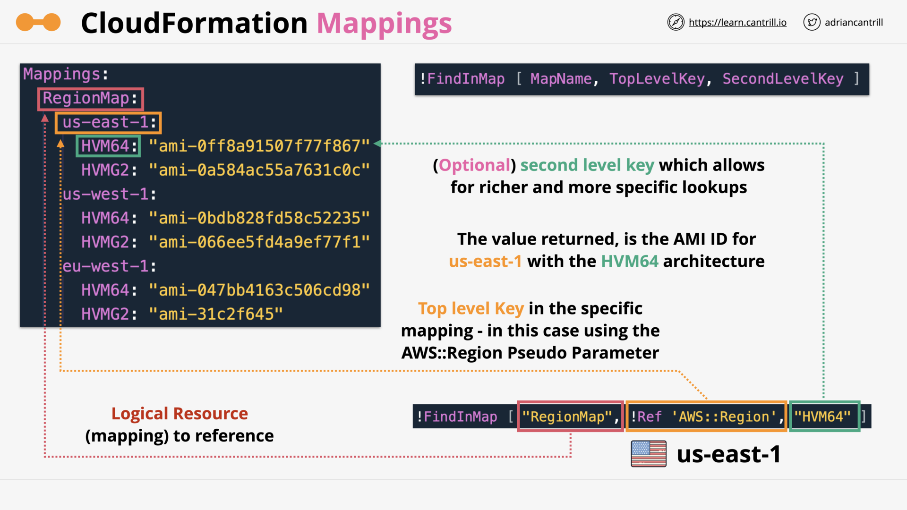
Cfn Mappings: [`Fn::FindInMap`](https://docs.aws.amazon.com/AWSCloudFormation/latest/UserGuide/intrinsic-function-reference-findinmap.html)

> [!NOTE] FindInMap syntax
>
> | Function        |            | YAML Syntax                                               |
> | --------------- | ---------- | --------------------------------------------------------- |
> | `Fn::FindInMap` | Short form | `!FindInMap [ MapName, TopLevelKey, SecondLevelKey ]`     |
> |                 | Long form  | `Fn::FindInMap: [ MapName, TopLevelKey, SecondLevelKey ]` |
> |                 |            | 
                                |

## CloudFormation Outputs (3:37)

Cfn [Outputs (Template)](https://docs.aws.amazon.com/AWSCloudFormation/latest/UserGuide/outputs-section-structure.html): Views in CLI/Console - Used by parent-stack, cross-stack

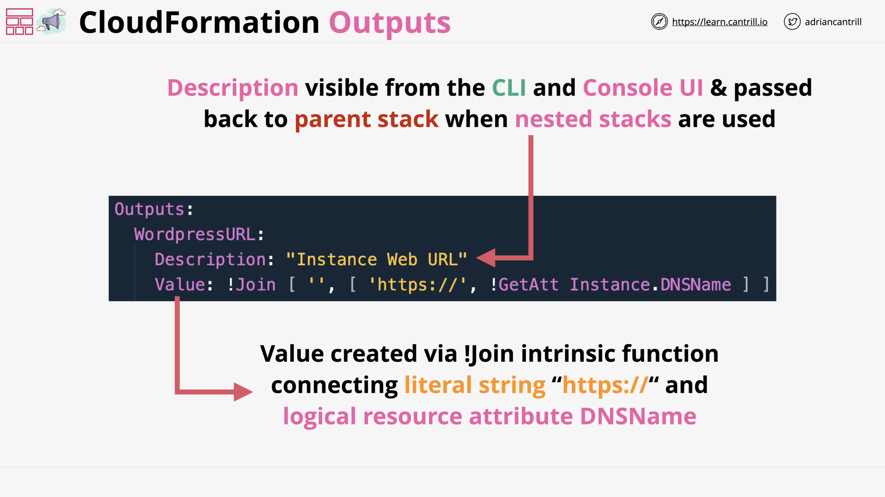
Cfn Outputs: Example

## [_DEMO_] Template v2 - Portable (13:34)

## CloudFormation Conditions (7:24)

Cfn Conditions (Template): Only create resources if conditions meet

> [!NOTE] How Cfn Condition work?
> You
>
> - create a condition in the `Conditions` section
> - associate that condition to logical resources
>   - to control if they are created or not

> [!NOTE] Why use Cfn Condition?
>
> With Cfn Condition, you can reuse a template that can create resources in different contexts.
>
> e.g. a `test` environment versus a `production` environment

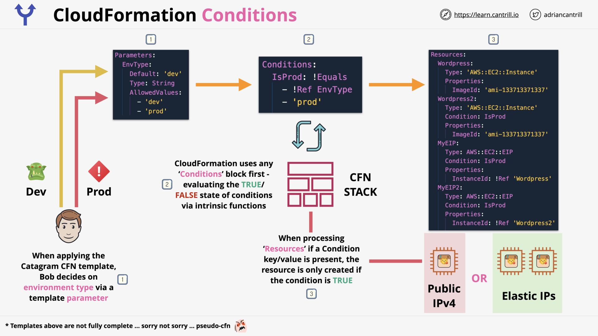
Cfn Conditions: Example

## CloudFormation DependsOn (7:14)

Cfn [DependsOn (Resource)](https://docs.aws.amazon.com/AWSCloudFormation/latest/UserGuide/aws-attribute-dependson.html): Explicitly define resources dependency order

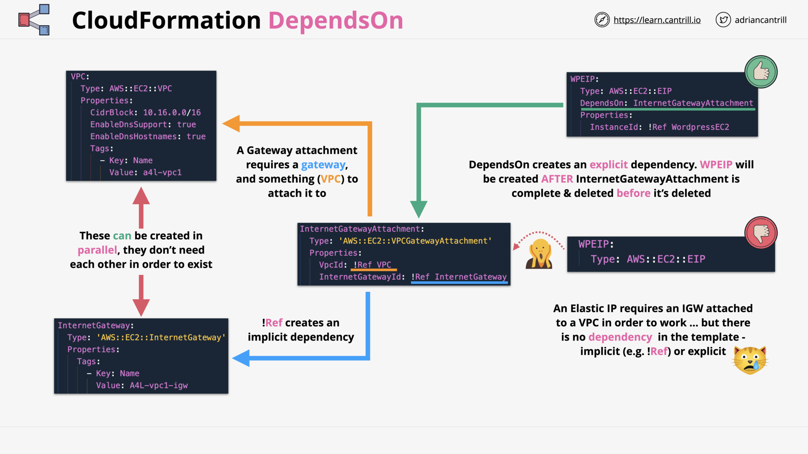
Cfn DependsOn: Example

## CloudFormation Wait Conditions, CreationPolicy & cfn-signal (11:52)

Cfn Provisioning - How do Cfn know that a resource successfully created/update?

> [!NOTE]
>
> By default, Cfn don't wait for the resources to be configured/bootstrap and be ready to used.
>
> 👉 The stack creation/updating will be finished before all of its resources are ready to used.

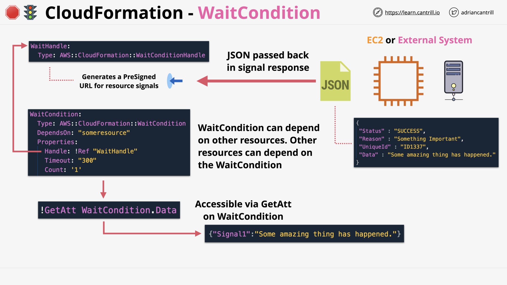
Cfn [Wait Conditions (Template)](https://docs.aws.amazon.com/AWSCloudFormation/latest/UserGuide/using-cfn-waitcondition.html): Tell Cfn to pause the creation of a stack and wait for a signal before it continues to create the stack

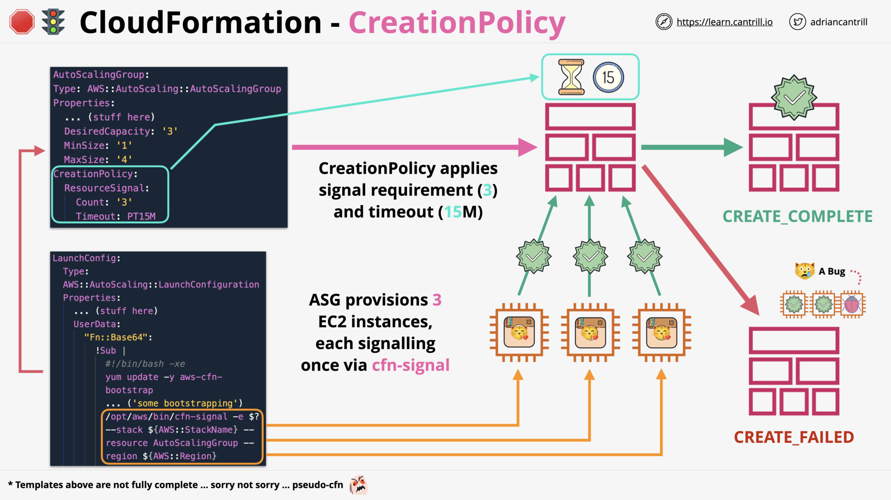
Cfn [Creation Policy (Resource)](https://docs.aws.amazon.com/AWSCloudFormation/latest/UserGuide/aws-attribute-creationpolicy.html): Tell Cfn to wait on resource configuration actions before stack creation proceeds.

> [!NOTE] When to use Wait Conditions & Create Policy?
> You
>
> - Create Policy for EC2 and ASG or simple use cases (most situations)
> - Wait Conditions in advance use cases.

[cfn-signal](https://docs.aws.amazon.com/AWSCloudFormation/latest/UserGuide/cfn-signal.html): Signals CloudFormation to indicate whether Amazon EC2 instances have been successfully created/updated

## CloudFormation Nested Stacks (13:55)

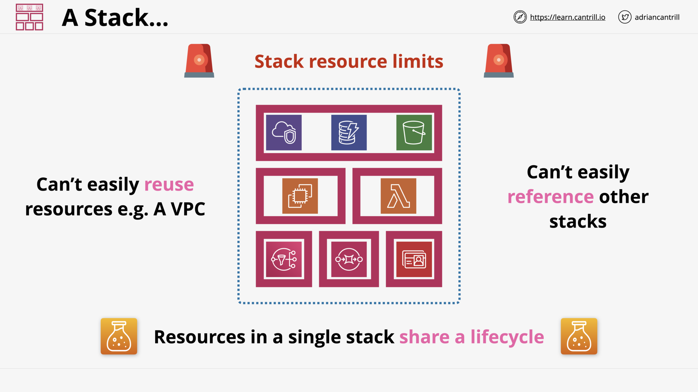
Single Stack - The Problem

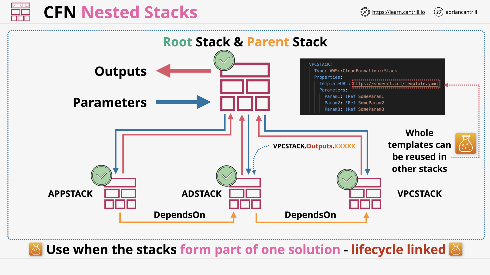
Cfn [Nested Stack](https://docs.aws.amazon.com/AWSCloudFormation/latest/UserGuide/using-cfn-nested-stacks.html): Stacks created as part of other stacks 👈️ Allow reusing template (code)

> [!NOTE] `Nested Stack`, `Root Stack`, `Parent Stack`?
>
> - _Nested Stack_: Stacks created as **part of other stacks**.
> - _Root Stack_: The **top-level stack** to which all the _nested stacks_ ultimately belong.
> - _Parent Stack_: Each nested stack has an immediate _parent stack_.
>
>   

Cfn Nested Stacks - When?

> [!NOTE] How are lifecycle of nested stacks?
>
> The root stacks and all of its nested stacks share the same lifecycle.

## CloudFormation Cross-Stack References (10:05)

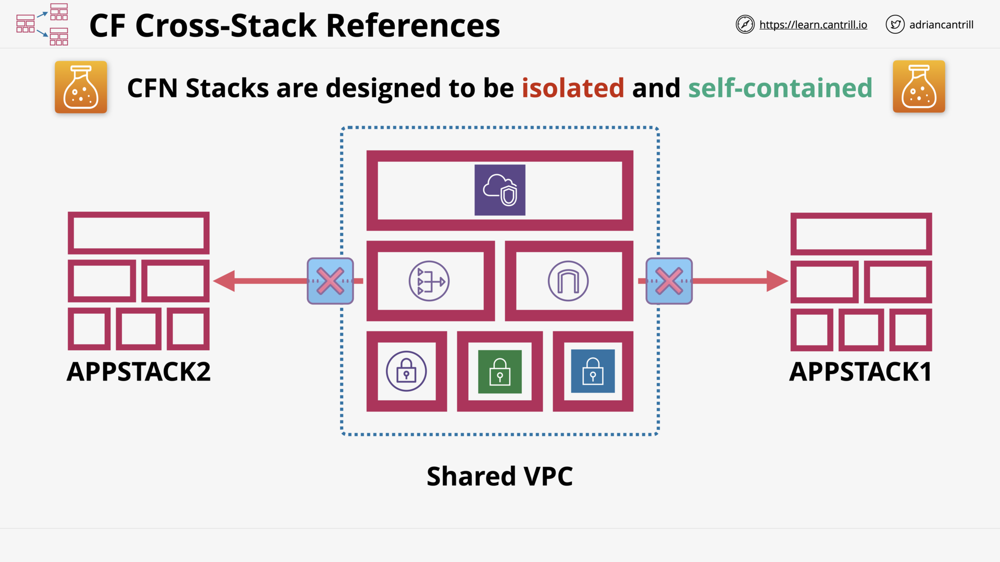
Cfn Stacks are isolated and self-contained

Cfn `Outputs` `Export`: Make a stack visible to other stacks ([Cross-Stack References](https://docs.aws.amazon.com/AWSCloudFormation/latest/UserGuide/walkthrough-crossstackref.html))

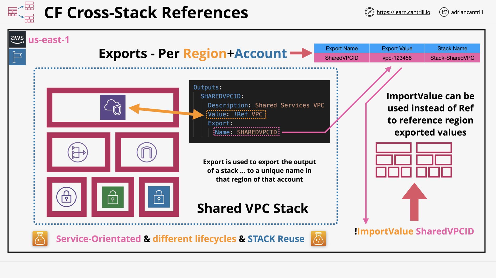
Cfn Cross-Stack References - `Fn::ImportValue:` Import another stack's Outputs Export

## CloudFormation Deletion Policy (5:24)

Cfn DeletionPolicy - What happen to physical resource when its logical resource deleted?

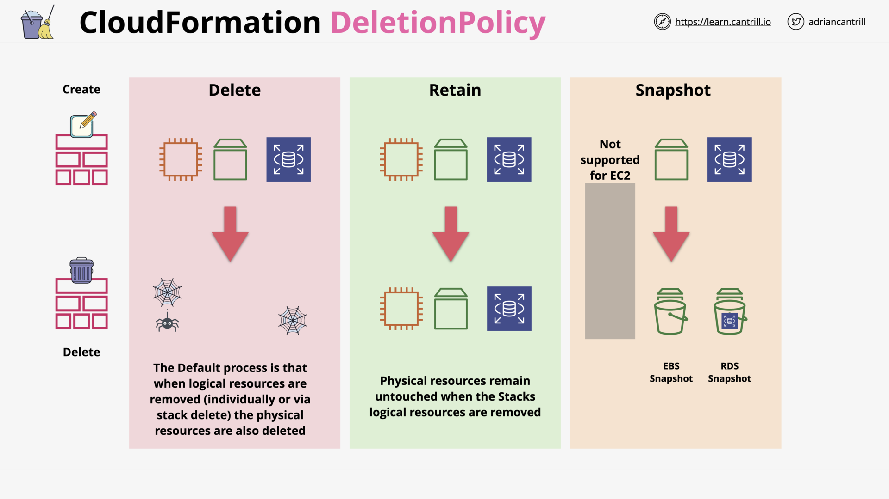
Cfn DeletionPolicy - Delete (Default) / Retain / Snapshot (If supported)

## CloudFormation Stack Sets (9:12)

Cfn StackSets - [Concepts](https://docs.aws.amazon.com/AWSCloudFormation/latest/UserGuide/what-is-cfnstacksets.html)

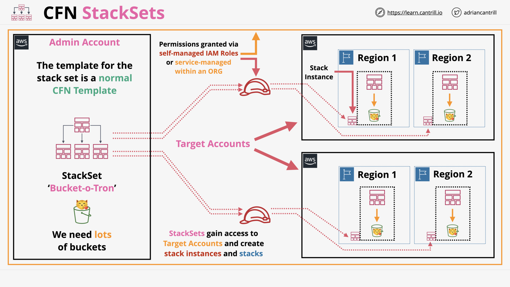
Cfn StackSets - Architecture

Cfn StackSets - Key Points

## CloudFormation Stack Roles (6:47)

Cfn Stack Roles - Overview

> [!NOTE] The identity creating the stack doesn't need permissions for resources.
>
> It only needs permissions for:
>
> - creating the stack
> - `PassRole` to give Cfn the role with permissions for creating resources.

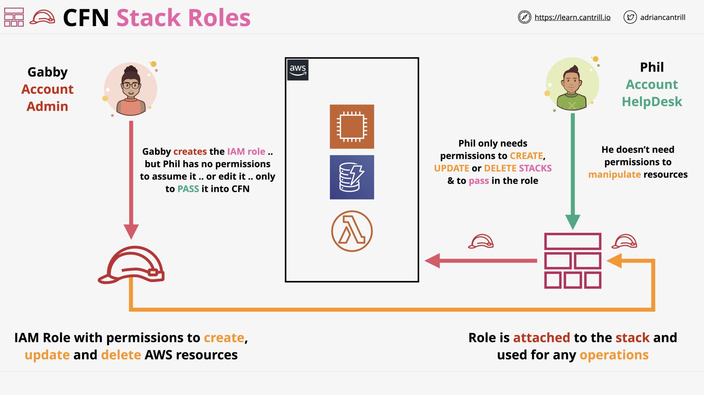
Cfn Stack Roles - Example

## CloudFormation Init (cfn-init) (8:48)

[cfn-init](https://docs.aws.amazon.com/AWSCloudFormation/latest/UserGuide/cfn-init.html): Overview

> [!NOTE] AWS::CloudFormation::Init vs cfn-init?
>
> - `AWS::CloudFormation::Init`: a part of the logical resource for EC2 (`Metadata` key)
> - `cfn-init`: a helper script in the `Properties`'s `UserData`, will run by the EC2 instance

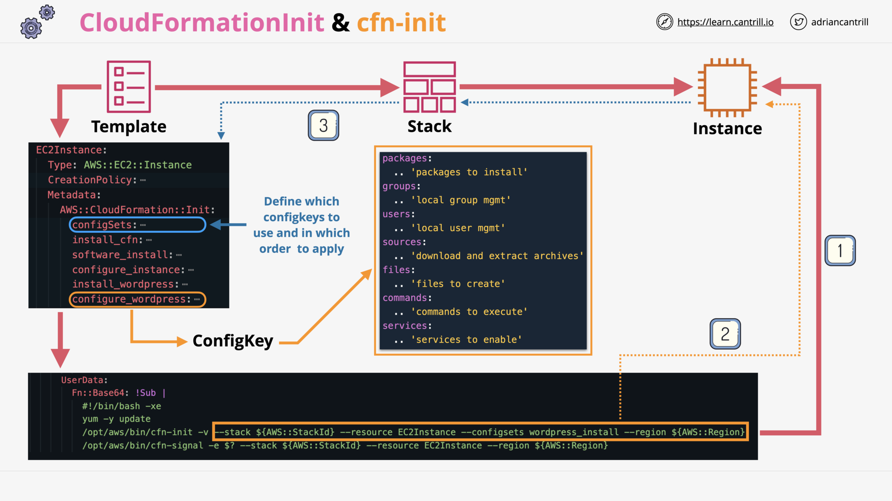
cfn-init: **config keys** - _configsets_

See:

- [AWS::CloudFormation::Init - AWS CloudFormation](https://docs.aws.amazon.com/AWSCloudFormation/latest/UserGuide/aws-resource-init.html#aws-resource-init-configsets)
- [cfn-init - AWS CloudFormation](https://docs.aws.amazon.com/AWSCloudFormation/latest/UserGuide/cfn-init.html)

## CloudFormation cfn-hup (4:13)

cfn-init: The problem

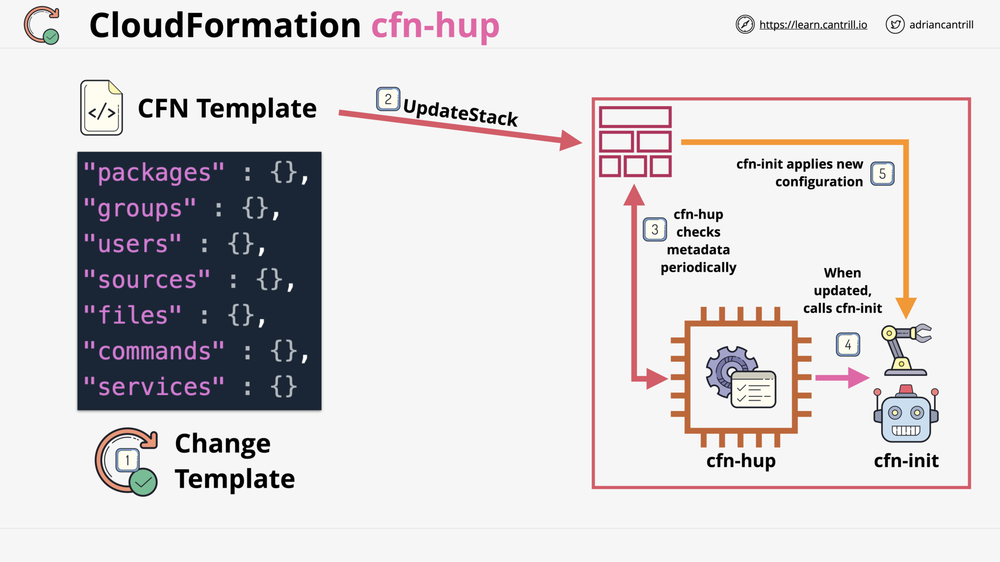
[cfn-hup](https://docs.aws.amazon.com/AWSCloudFormation/latest/UserGuide/cfn-hup.html): Rerun config when change detected

> [!NOTE] What cfn-hup stands for?
>
> **cfn** **h**ot **up**date.

See [Update behaviors of stack resources](https://docs.aws.amazon.com/AWSCloudFormation/latest/UserGuide/using-cfn-updating-stacks-update-behaviors.html)

## [_DEMO_] wait conditions, cfn-signal, cfn-init and cfn-hup-PART1 (12:51)

## [_DEMO_] wait conditions, cfn-signal, cfn-init and cfn-hup-PART2 (14:42)

## CloudFormation ChangeSets [NEW VERSION COMING SOON] (11:03)

Cfn ChangeSets: Preview changes before execute

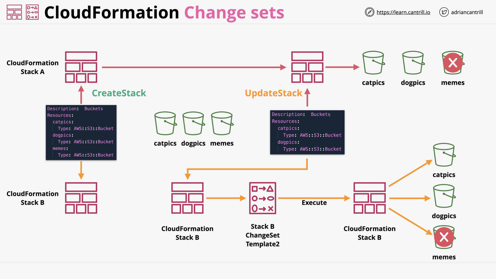
Cfn ChangeSets: Example

## CloudFormation Custom Resources (11:03)

Cfn Custom Resources: Let Cfn integrate with not-natively-support things

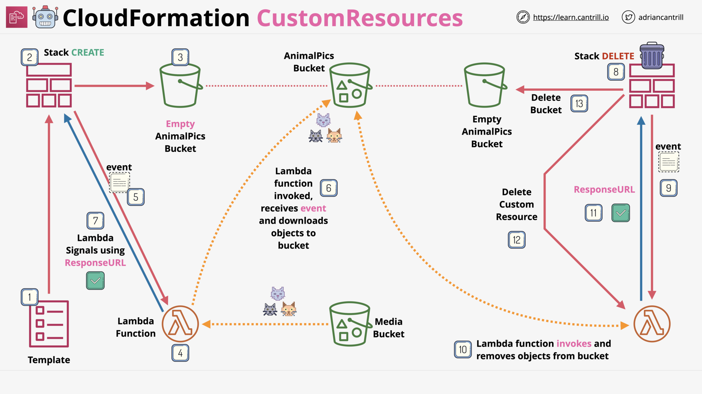
Cfn Custom Resources: Example

## [_DEMO_] CloudFormation Custom Resources-PART1 (9:12)

## [_DEMO_] CloudFormation Custom Resources-PART2 (13:27)

[^1]: Value of the physical ID of the resource or the value of the parameter
[^2]: Attribute's value
[^3]: The list of Availability Zones for the Region.
[^4]: The selected object (0-index)
[^5]: `echo -n 'AWS CloudFormation' | base64`
[^6]: For Ref, the full form is more simple than the short form
