# NOSQL DATABASES & DYNAMODB

## DynamoDB - Architecture (10:49)

DynamoDB Concepts

> [!NOTE] What is DynamoDB?

> [!NOTE] What is the selling point of DynamoDB?

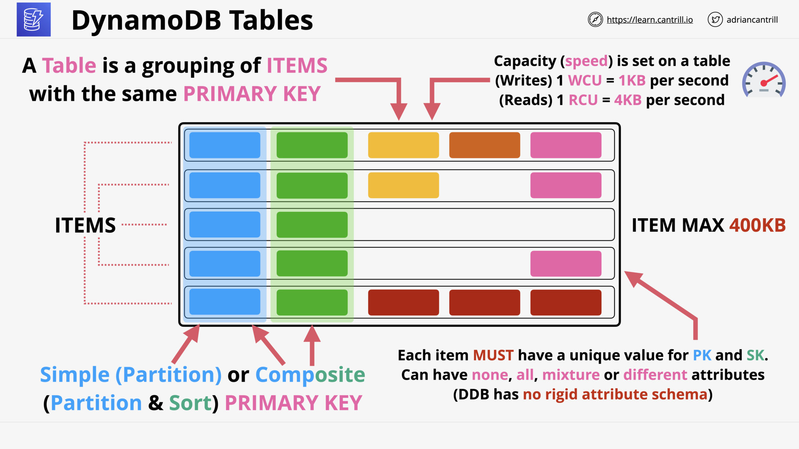
DynamoDB: [Tables - Items - Attributes](https://docs.aws.amazon.com/amazondynamodb/latest/developerguide/HowItWorks.CoreComponents.html#HowItWorks.CoreComponents.TablesItemsAttributes) -  [Primary Key (PK)](https://docs.aws.amazon.com/amazondynamodb/latest/developerguide/HowItWorks.CoreComponents.html#HowItWorks.CoreComponents.PrimaryKey): Partition Key & Sort Key (PK & SK)

> [!NOTE] What is a *primary key*?
>
> [*Primary key*](https://docs.aws.amazon.com/amazondynamodb/latest/developerguide/HowItWorks.CoreComponents.html#HowItWorks.CoreComponents.PrimaryKey) uniquely identifies each item in the table, so that no two items can have the same key.

> [!NOTE] What is a *partition key*?
>
> *Partition key* is the required part of *primary key*.
>
> - The *partition key* of an item is also known as its ***hash attribute***.
>
> - The term ***hash attribute*** derives from the use of an internal hash function in DynamoDB that evenly distributes data items across partitions, based on their *partition key* values.

> [!NOTE] What is a *sort key*?
>
> *Sort key* is an optional part of *primary key*.
>
> - The *sort key* of an *item* is also known as its ***range attribute***.
> - The term ***range attribute*** derives from the way DynamoDB stores items with the same partition key physically close together, in **sorted order** by the *sort key* value.

> [!NOTE] What is capacity of DynamoDB?

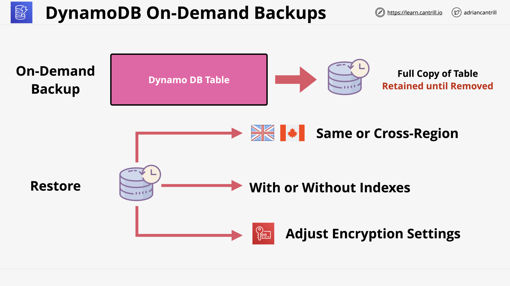
DynamoDB On-Demand Backups

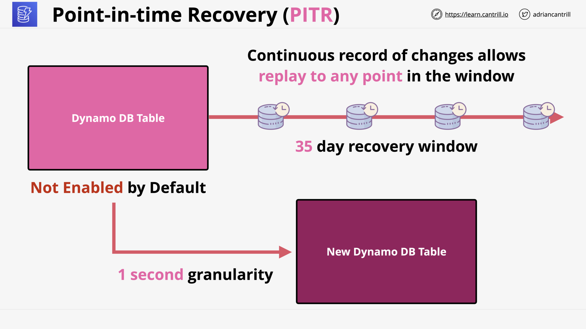
DynamoDB PITR

DynamoDB Considerations

> [!NOTE] How is DynamoDB billed?

## DynamoDB - Operations, Consistency and Performance - PART1 (13:06)

DynamoDB Reading & Writing: On-Demand / Provisioned

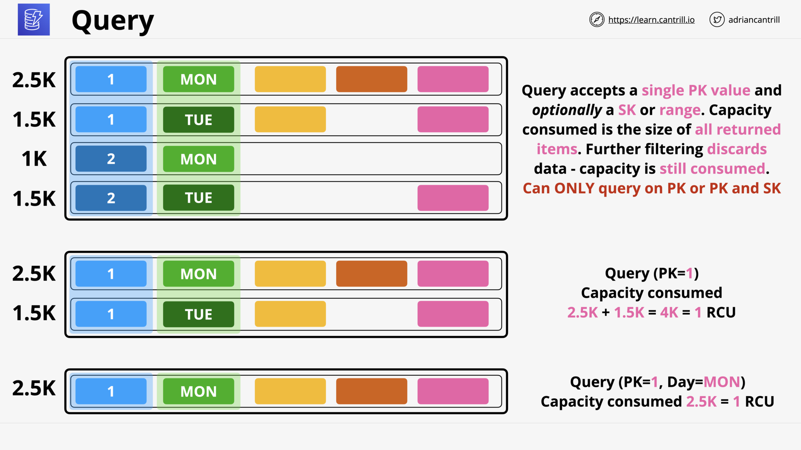
DynamoDB [Query](https://docs.aws.amazon.com/amazondynamodb/latest/developerguide/Query.html): Find items based on primary key values

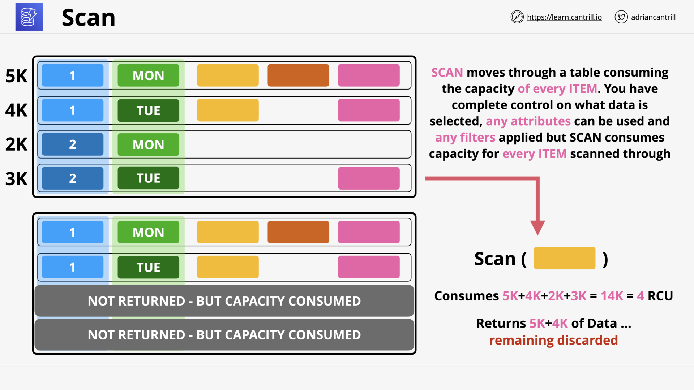
DynamoDB [Scan](https://docs.aws.amazon.com/amazondynamodb/latest/developerguide/Scan.html): Reads every item in a table or a secondary index.

## DynamoDB - Operations, Consistency and Performance - PART2 (11:24)

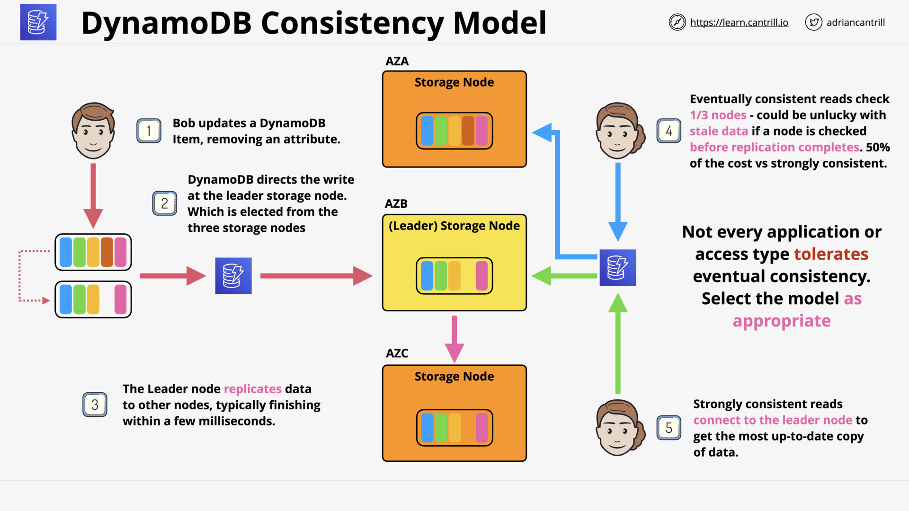
DynamoDB Consistency Model

DynamoDB - WCU Calculation

DynamoDB - RCU Calculation

## DynamoDB Local and Global [Secondary Indexes](https://docs.aws.amazon.com/amazondynamodb/latest/developerguide/HowItWorks.CoreComponents.html#HowItWorks.CoreComponents.SecondaryIndexes) (12:35)

DynamoDB [Secondary Indexes](https://docs.aws.amazon.com/amazondynamodb/latest/developerguide/SecondaryIndexes.html): Alternative views on table data

> [!NOTE] In DynamoDB, what is attribute projection?
>
> When you create an index:
>
> - You define an **alternate key for the index** (partition key and sort key).
> - You also define the attributes that you want to be *projected*,  or copied, from the *base table* into the index.
>
> Every secondary index is associated with exactly one table, from which it obtains its data.
>
> ([Source](https://docs.aws.amazon.com/amazondynamodb/latest/developerguide/SecondaryIndexes.html))

DynamoDB [Local Secondary Indexes (LSI)](https://docs.aws.amazon.com/amazondynamodb/latest/developerguide/LSI.html): Alternative Sort Key

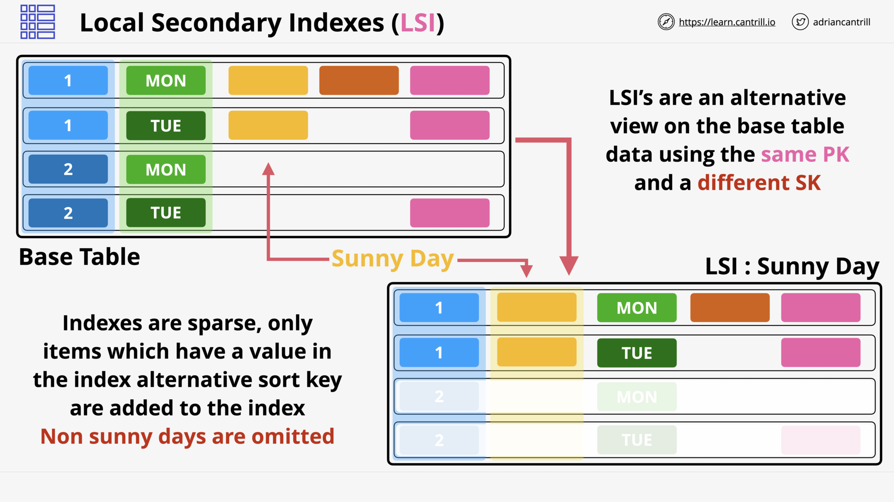
DynamoDB LSI: Using the base table's primary key

DynamoDB [Global Secondary Indexes (GSI)](https://docs.aws.amazon.com/amazondynamodb/latest/developerguide/GSI.html): Alternative Partition Key & Sort Key

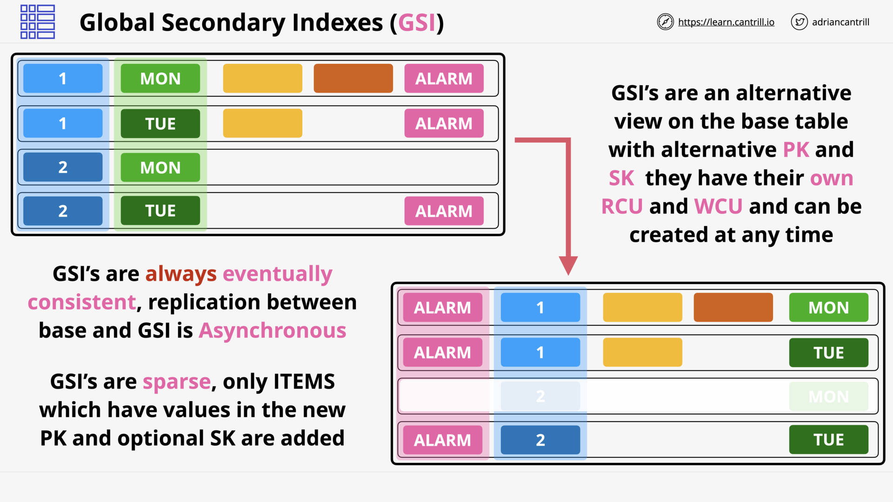
DynamoDB GSI: Always eventually consistent

LSI & GSI Considerations

> [!NOTE] When to use GSI & LCI?
>
> Amazon DynamoDB provides fast access to items in a table by specifying **primary key** values.
>
> However, many applications might benefit from having one or more secondary (or alternate) keys available, to allow **efficient access to data with attributes other than the primary key**.
>
> - GSI: Some applications might need to **perform many kinds of queries**, using a variety of **different attributes** as query criteria.
>
> - LSI: Some applications only need to query data using the base table's **primary key**. However, there might be situations where an alternative sort key would be helpful.

## DynamoDB - Streams & Lambda Triggers (9:10)

DynamoDB - Stream Concepts

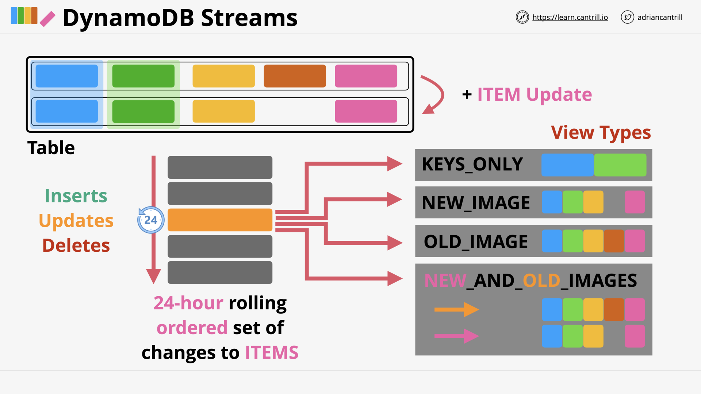
DynamoDB - Stream Architecture

DynamoDB - Trigger Concepts

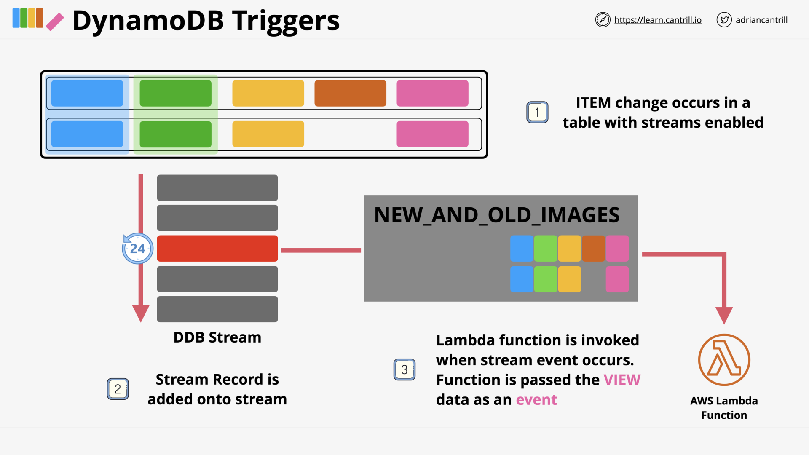
DynamoDB - Trigger Architecture

## DynamoDB - [Global Tables](https://docs.aws.amazon.com/amazondynamodb/latest/developerguide/GlobalTables.html) (5:09)

DynamoDB - Global Tables: Overview

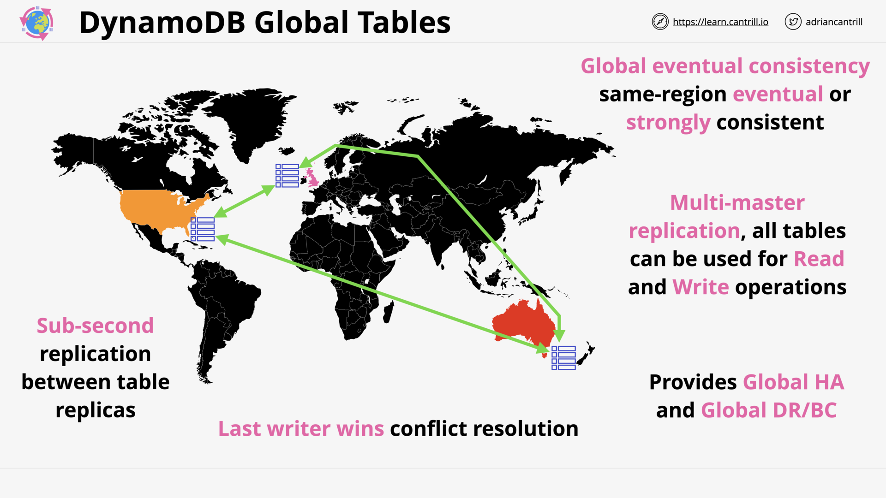
DynamoDB - Global Tables: Architecture

> [!NOTE] What are exactly a DynamoDB *global table*?
>
> A *global table* is a **collection of one or more *replica tables***, all owned by a single AWS account.
>
> A *replica table* (or *replica*, for short) is a single DynamoDB table that functions as a part of a *global table*.
>
> Source: [Global Tables - How it works?](https://docs.aws.amazon.com/amazondynamodb/latest/developerguide/V2globaltables_HowItWorks.html)

> [!NOTE] Which type are global table's replica tables?
>
> All replica tables are master/active, supports both *read* and *write* operations.
>
> Each replica stores the same set of data items.

## DynamoDB - Accelerator (DAX) (10:58)

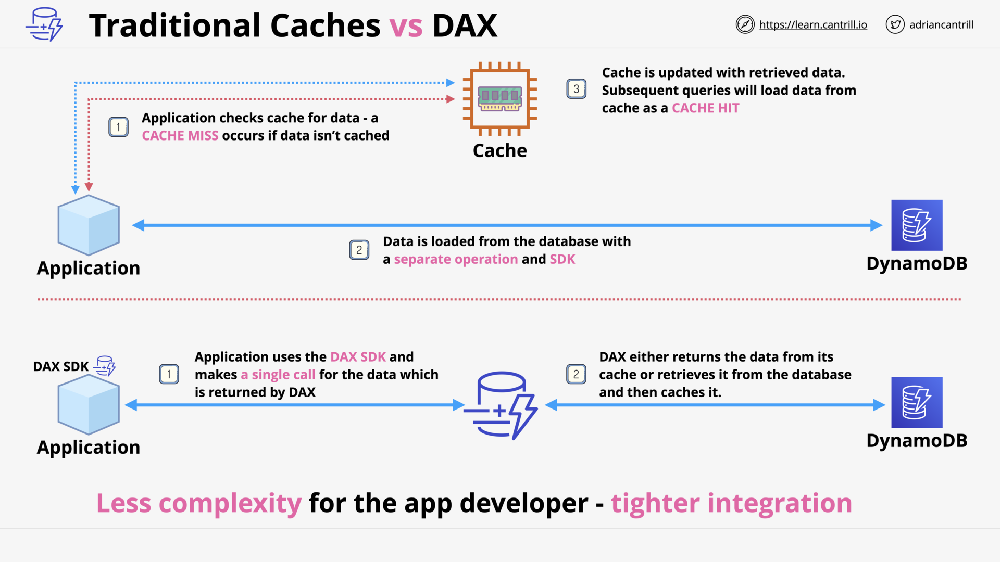
Traditional Caches vs DAX

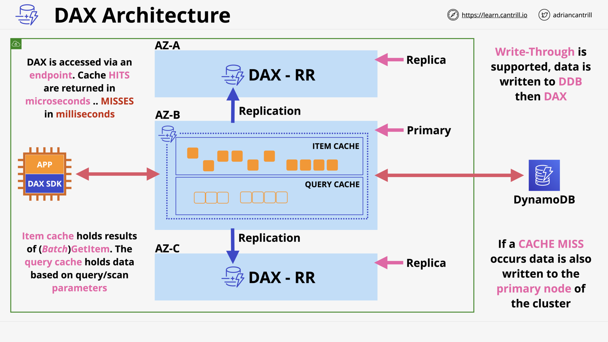
DAX - Architecture

DAX - Considerations

## DynamoDB - [TTL](https://docs.aws.amazon.com/amazondynamodb/latest/developerguide/TTL.html) (4:49)

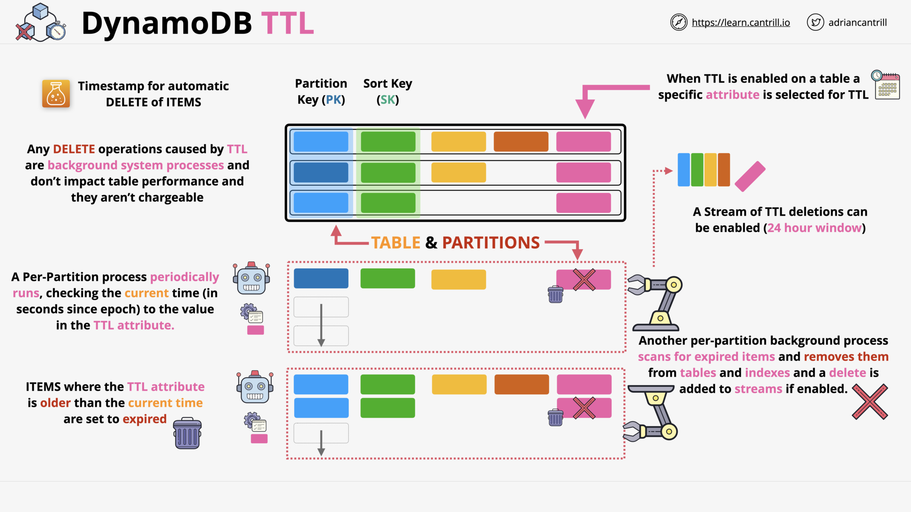
DynamoDB - TTL: Expiring items

## Amazon Athena (8:19)

Amazon Athena: Interactive SQL - Serverless Query Service

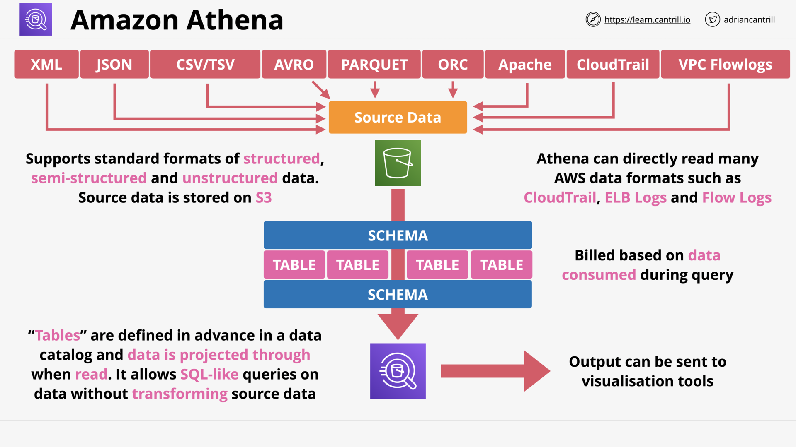
Amazon Athena - Architecture

Amazon Athena: Queries without ETL

## [*DEMO*] Athena Demo - PART1 (13:31)

Athena Demo - Architecture

## [*DEMO*] Athena Demo - PART2 (11:37)

## Elasticache (12:51)

Elasticache - Managed in-memory database: Cache data & Reduce database load

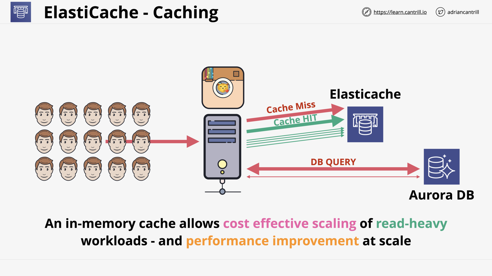
Elasticache - Caching

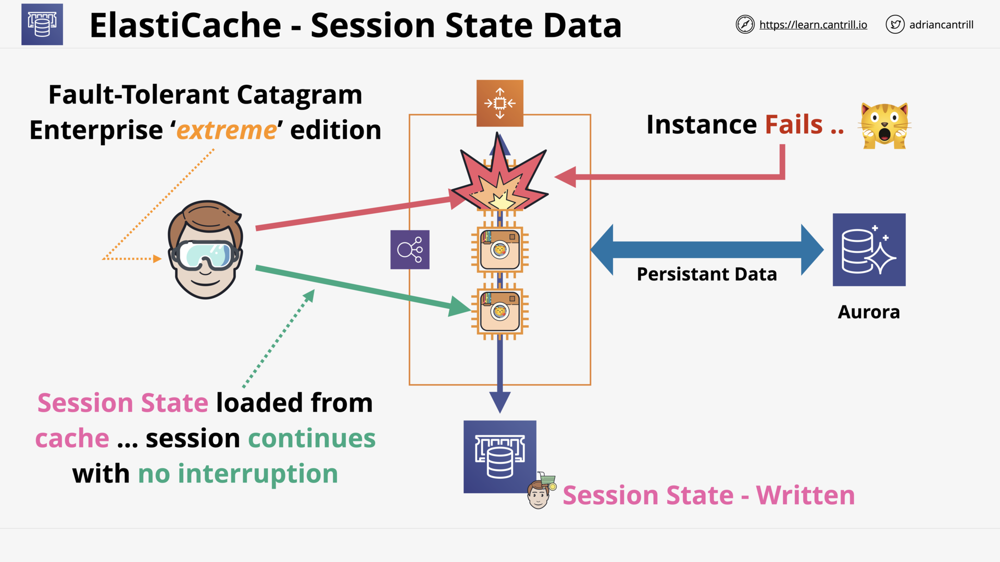
Elasticache - Session State Data

Elasticache - Redis vs MemcacheD

## Redshift Architecture (11:32)

Redshift: Column based, Petabyte-scale Data warehouse (OLAP)

Redshift: Server based

Redshift: Architecture

## Redshift DR and Resilience (3:40)

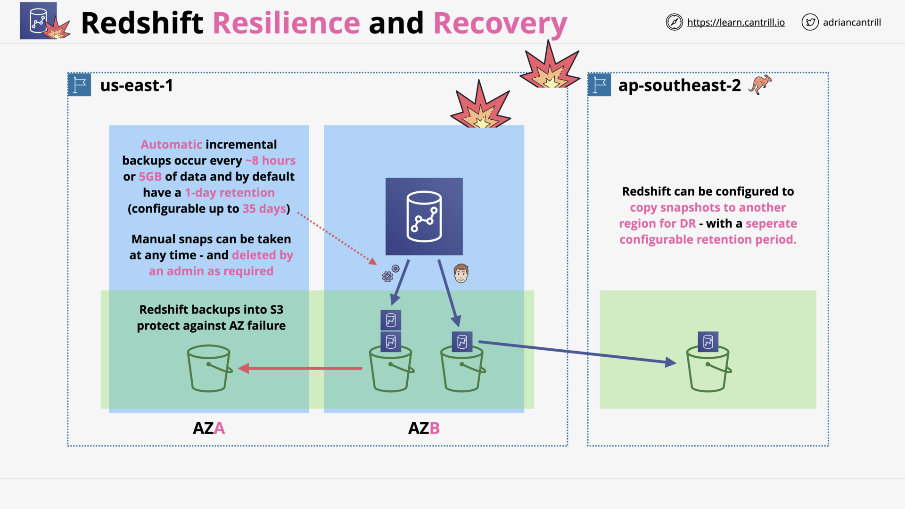
Redshift: DR & Resilience

## NoSQL Section Quiz
