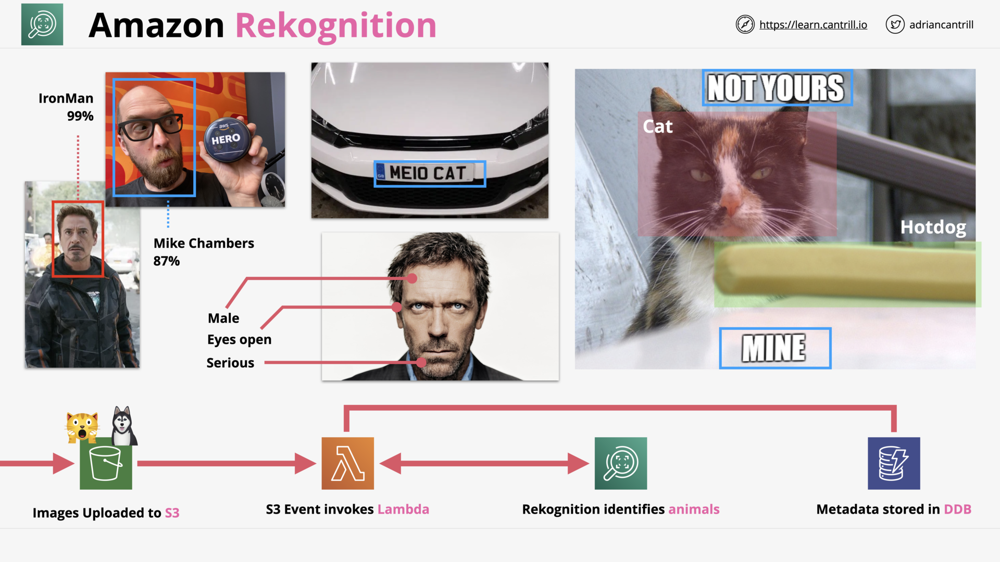

# MACHINE LEARNING 101

## [Amazon Comprehend](https://aws.amazon.com/comprehend/) (7:28)

Amazon Comprehend: Discover insights and relationships in text

> [!NOTE] [What is Amazon Comprehend?](https://docs.aws.amazon.com/comprehend/latest/dg/what-is.html)
>
> NLP for a document.

## [Amazon Kendra](https://aws.amazon.com/kendra/) (5:00)

Amazon Kendra: Reinvent enterprise search with ML

> [!NOTE] [What is Kendra?](https://docs.aws.amazon.com/kendra/latest/dg/what-is-kendra.html)
>
> NLP for a lot of documents.

Amazon Kendra Concepts: Index - Documents - Data source ([How Amazon Kendra works?](https://docs.aws.amazon.com/kendra/latest/dg/how-it-works.html))

## [Amazon Lex](https://aws.amazon.com/lex/) (5:51)

Amazon Lex: Build voice and text chatbots

> [!NOTE] [What is Amazon Lex?](https://docs.aws.amazon.com/lexv2/latest/dg/what-is.html)
>
> Bot with ML, e.g. Alexa

Amazon Lex Concepts: Bot - Language - Intent - Slot ([How Lex Works?](https://docs.aws.amazon.com/lexv2/latest/dg/how-it-works.html))

## [Amazon Polly](https://aws.amazon.com/polly/) (4:04)

Amazon Polly: Turn text into *life-like* speech

> [!NOTE] [What Is Amazon Polly?](https://docs.aws.amazon.com/polly/latest/dg/what-is.html)
>
> TTS with ML.

Amazon Polly: Speech Synthesis Markup Language ([SSML](https://docs.aws.amazon.com/polly/latest/dg/ssml.html))

> [!NOTE] [Polly - Demo](https://ai-service-demos.go-aws.com/polly)

## [Amazon Rekognition](https://aws.amazon.com/rekognition/) (4:18)

Amazon Rekognition: Analyze image and video

> [!NOTE] [What is Rekognition?](https://docs.aws.amazon.com/rekognition/latest/dg/what-is.html)
>
> Image & video processing with ML

Amazon Rekognition: How is work?

## [Amazon Textract](https://aws.amazon.com/textract/) (8:42)

Amazon Textract: Extract text and data from documents

> [!NOTE] [What is Amazon Textract?](https://docs.aws.amazon.com/textract/latest/dg/what-is.html)
>
> OCR with ML and Analysis

Amazon Textract: Detect and analysis

## Amazon Transcribe (4:55)

Amazon Transcribe: Automatic speech recognition

> [!NOTE] [What is Amazon Transcribe?](https://docs.aws.amazon.com/transcribe/latest/dg/what-is.html)
>
> Speech Recognition with ML.

Amazon Transcribe - Use Cases

## [Amazon Translate](https://aws.amazon.com/translate/) (4:32)

Amazon Translate: Natural and fluent language translation

> [!NOTE] [What is Amazon Translate?](https://docs.aws.amazon.com/translate/latest/dg/what-is.html)
>
> Text translate with ML.

Amazon Translate - Use Cases

## [Amazon Forecast](https://aws.amazon.com/forecast/) 101 (4:04)

Amazon Forecast: Increase forecast accuracy using machine learning

> [!NOTE] [What is Amazon Forecast?](https://docs.aws.amazon.com/forecast/latest/dg/what-is-forecast.html)
>
> Time-series forecasts that uses statistical and machine learning algorithms.

## [Amazon Fraud Detector](https://aws.amazon.com/fraud-detector/) (3:34)

Amazon Fraud Detector: Detect more online fraud faster

> [!NOTE] [What is Amazon Fraud Detector?](https://docs.aws.amazon.com/frauddetector/latest/ug/what-is-frauddetector.html)
>
> Fraud Detector with ML.

## [Amazon SageMaker](https://aws.amazon.com/sagemaker/) (5:39)

Amazon SageMaker: Build, train, and deploy machine learning models at scale

> [!NOTE] [What is Amazon SageMaker?](https://docs.aws.amazon.com/sagemaker/latest/dg/whatis.html)
>
> Fully managed machine learning service:
>
> - infrastructure, tools, and workflows...
>
> for  building, training, deploying machine learning models.
